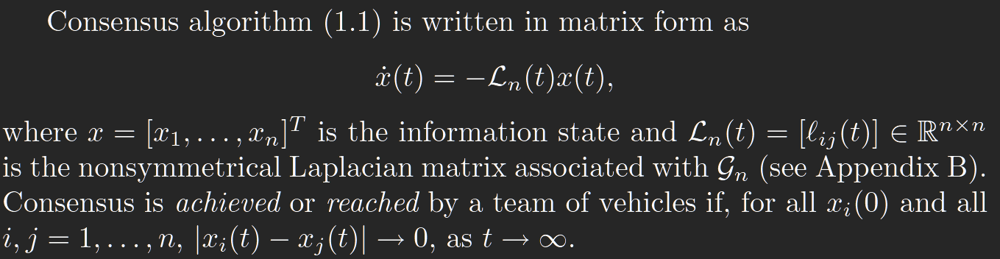
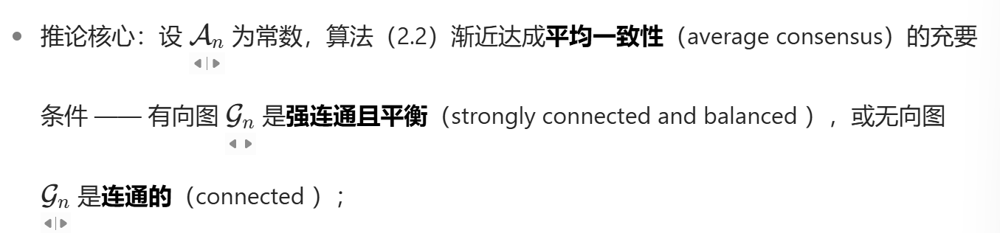
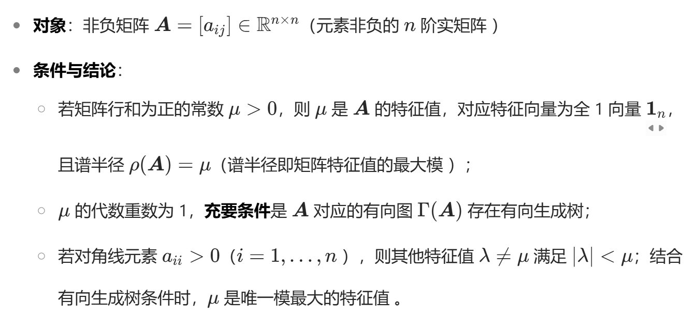
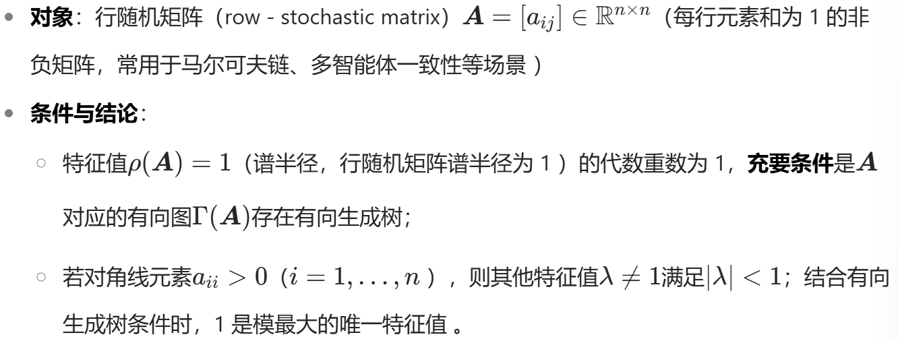
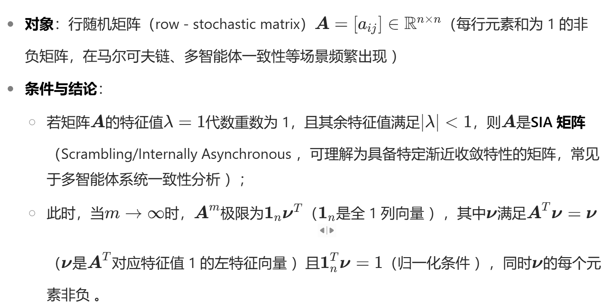
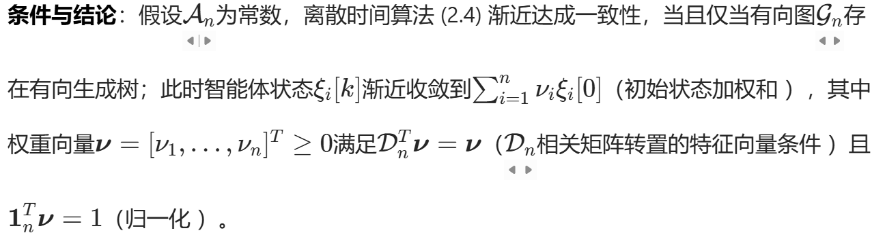
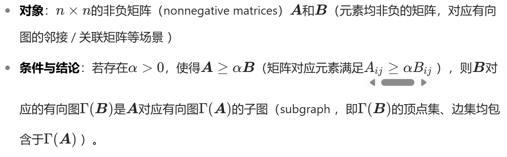

# 整体框架

**基础理论（第 1 章）→ 单积分器静态一致（第 2 章）→ 单积分器跟踪一致（第 3 章）→ 双积分器无参考一致（第 4 章）→双积分器参考跟踪（第 5 章）**

## 1.Overview of Consensus Algorithms in Cooperative Control

本章是全书理论框架的 “导论与文献基石”，核心任务是明确问题背景、定义核心概念并梳理研究现状。

1. **问题动机** 指出多智能体协同控制的核心瓶颈：通信带宽有限、功率约束严格，无法依赖中心化控制，因此必须通过 “信息一致性” 实现分布式协同 —— 即智能体需通过邻居交互达成关键信息（如 rendezvous 时间、编队中心位置）的一致。

2. 核心概念定义

   - **一致性（Consensus）**：所有智能体的信息状态（如位置、速度、姿态）收敛到同一值（或预设偏差）。
   - **信息状态（Information State）**：需达成一致的关键变量（如 rendezvous 时间、编队半径）。
   - **通信拓扑（Communication Topology）**：用有向图 $G_n=(V_n,E_n)$ 描述智能体间信息流向，核心指标包括 “有向生成树”（保证信息能传递到所有节点）、“强连通”（任意节点间有双向路径）。

3. 基础算法与收敛分析

   介绍两类最基础的一致性算法，并给出固定拓扑下的收敛条件：

   - **连续时间算法**：$\dot{x}_i(t)=-\sum_{j=1}^n a_{ij}(t)[x_i(t)-x_j(t)]$，需通信拓扑存在 “有向生成树”。
   - **离散时间算法**：$x_i[k+1]=\sum_{j=1}^n d_{ij}[k]x_j[k]$ ($d_{ij}$ 为行随机矩阵），需拓扑存在 “有向生成树” 且对角元 $d_{ii}>0$。

4. **文献综述** 梳理一致性算法在 rendezvous（ rendezvous ）、编队控制（Formation Control）、群集行为（Flocking）等领域的应用，指出当前研究的不足（如忽略通信延迟、假设拓扑固定）。

## 2.Consensus Algorithms for Single-integrator

本章聚焦 “信息状态服从单积分器模型（$\dot{\xi}_i=u_i$）” 的场景，是一致性算法的 “基础理论核心”，深入分析固定与动态拓扑下的收敛性。

1. 基础算法定义

   信息控制输入 $u_i$为设计为邻居信息状态偏差的负反馈：

   - 连续时间：

     $$u_i=-\sum_{j=1}^n a_{ij}(t)(\xi_i-\xi_j)$$

   - 离散时间：

     $$\xi_i[k+1]=\sum_{j=1}^n d_{ij}[k]\xi_j[k]$$（$d_{ij}$ 满足行随机且与拓扑匹配）

2. 固定拓扑下的收敛性

   - 核心定理：一致性渐近收敛的充要条件是 “通信拓扑存在有向生成树”。
     - 若拓扑强连通且平衡（入度 = 出度），则收敛到初始状态的 “平均一致性”（$\xi_i(t)\to\frac{1}{n}\sum_{j=1}^n \xi_j(0)$）。
     - 若拓扑仅存在有向生成树，收敛值为初始状态的 “加权平均”（权重由 Laplacian 矩阵的左特征向量决定）。

3. 动态拓扑下的收敛性

   针对拓扑因通信丢包、智能体移动导致的动态切换，提出关键条件：

   - 存在无穷多个 “均匀有界的连续时间区间”，每个区间内拓扑的 “并集” 存在有向生成树。
   - 仿真验证：通过 5 个智能体随机切换拓扑的案例，证明满足上述条件时仍能达成一致。

4. **扩展：相对状态偏差** 设计算法

   $$ u_i=\dot{\delta}_i-\sum_{j=1}^n a_{ij}[(\xi_i-\xi_j)-(\delta_i-\delta_j)]$$

   使 $\xi_i-\xi_j\to\Delta_{ij}(t)$（$\Delta_{ij}$ 为预设偏差），为编队控制中 “保持相对位置” 奠定基础。

## 3.Consensus Tracking with a Reference State

本章是第 2 章的 “扩展与应用导向”，解决 “信息状态需跟踪一个外部参考状态($\xi^r$）” 的问题，而非仅收敛到内部一致值。

1. **问题场景** 

   参考状态 $\xi^r$ 可能为常数（如固定 rendezvous 点）或时变（如动态编队中心），且仅部分智能体（子群领导者）能获取 $\xi^r$。

2. **常数参考状态** 设计跟踪算法：

   $u_i=-\sum_{j=1}^n a_{ij}(\xi_i-\xi_j)-a_{i(n+1)}(\xi_i-\xi^r)$

   ($a_{i(n+1)}$ 表示是否能获取参考）。 

   **收敛条件：**包含参考节点（虚拟领导者）的扩展拓扑 $G_{n+1}$ 存在有向生成树。

3. 时变参考状态针对$\xi^r(t)$**随时间变化**（如$\xi^r=\cos t$），基础算法（第 2 章）无法跟踪的问题，提出改进算法：

   - 核心思路：引入参考状态的导数 $\dot{\xi}^r$ 作为前馈补偿，设计 

     $$u_i=\frac{1}{\eta_i}\left[\sum_{j=1}^n a_{ij}\dot{\xi}_j+a_{i(n+1)}\dot{\xi}^r\right]-\frac{\gamma}{\eta_i}\left[\sum_{j=1}^n a_{ij}(\xi_i-\xi_j)+a_{i(n+1)}(\xi_i-\xi^r)\right]$$（$\eta_i=\sum_{j=1}^{n+1}a_{ij}$）。

   - 收敛条件：扩展拓扑 $G_{n+1}$ 存在有向生成树，且参考状态 $\xi^r$ 满足局部 Lipschitz 条件。

4. **扩展：有界控制输入** 用双曲正切函数$\tanh$替代线性反馈，设计 

   $$u_i=\frac{1}{\eta_i}\left[\sum_{j=1}^n a_{ij}\dot{\xi}_j+a_{i(n+1)}\dot{\xi}^r\right]-\frac{1}{\eta_i}\Lambda_i\tanh\left[\sum_{j=1}^n a_{ij}(\xi_i-\xi_j)+a_{i(n+1)}(\xi_i-\xi^r)\right]$$

   保证 $u_i$ 有界且不依赖初始状态。

## 4.Consensus Algorithms for Double-integrator Dynamics

本章将动态模型从 “单积分器” 升级为 “双积分器（$\dot{\xi}_i=\zeta_i,\dot{\zeta}_i=u_i$）”，更贴合实际智能体的运动（如位置 - 速度模型），是理论复杂度的 “关键跃升”。

1. **基础算法设计** 控制输入需同时考虑信息状态（$\xi_i$，如位置）和其导数（$\zeta_i$，如速度）的偏差：

   $u_i=-\sum_{j=1}^n a_{ij}(t)\left[(\xi_i-\xi_j)+\gamma(\zeta_i-\zeta_j)\right]$（$\gamma$>0 为速度耦合强度）

2. 固定拓扑下的收敛性

   - 核心差异：与单积分器不同，仅 “存在有向生成树” 不足以保证收敛，需额外满足 “$\gamma$足够大”。
     - 分析方法：通过 Laplacian 矩阵的特征值 $\mu_i$，推导闭环系统特征值 $\lambda_{i\pm}=\frac{\gamma\mu_i\pm\sqrt{\gamma^2\mu_i^2+4\mu_i}}{2}$，需所有非零特征值实部为负。
     - 结论：若拓扑强连通或无向连通，$\gamma>0$ 即可收敛；若拓扑仅存在有向生成树，需 $\gamma>\overline{\gamma}$（$\overline{\gamma}$ 由 $\mu_i$ 的虚部决定）。

3. 动态拓扑下的收敛性

   需满足两个条件：

   - 每个切换区间内拓扑存在有向生成树；
   - 切换 dwell time（ dwell time ）下界大于 $\sup_{\sigma\in P}\frac{a_\sigma}{\chi_\sigma}$（$a_\sigma,\chi_\sigma$ 为每个拓扑对应的稳定性参数）。

4. 扩展：无相对导数测量与有界控制

   - 无相对速度测量：基于无源性理论设计观测器 $\dot{\hat{x}}_i=F\hat{x}_i+\sum_{j=1}^n a_{ij}(\xi_i-\xi_j)$，重构速度信息。

   - 有界控制：用 $\tanh$ 函数替换线性项，设计 

     $$u_i=-\sum_{j=1}^n\left[a_{ij}\tanh(K_r(\xi_i-\xi_j))+b_{ij}\tanh(K_v(\zeta_i-\zeta_j))\right]$$

     保证控制输入有界。

## 5.Extensions to a Reference Model

**1. 问题陈述（Problem Statement）**

（1）场景定义

- **智能体模型**：延续第四章的双积分器动力学 ——$\dot{\xi}_i=\zeta_i$，$\dot{\zeta}_i=u_i$，其中$\xi_i\in\mathbb{R}^m$为信息状态（如位置），$\zeta_i\in\mathbb{R}^m$为状态导数（如速度），$u_i$为控制输入。
- **参考模型**：引入虚拟领导者（编号\(n+1\)），其状态$\xi^r=\xi_{n+1}$、$\zeta^r=\zeta_{n+1}$满足动态模型：$\dot{\xi}^r=\zeta^r$，$\dot{\zeta}^r=f(t,\xi^r,\zeta^r)$（f为局部 Lipschitz 函数，可表示匀速、匀加速或非线性运动，如$f(t,\xi^r,\zeta^r)=\sin t$。
- **核心目标**：设计分布式控制算法，使所有追随者（编号 1~n）的状态满足$\xi_i(t)\to\xi^r(t)$、$\zeta_i(t)\to\zeta^r(t)$（或跟踪参考模型衍生的目标），且仅部分追随者可直接获取参考模型信息。

（2）拓扑定义

- 用扩展有向图$G_{n+1}=(V_{n+1},E_{n+1})$描述 “追随者 - 追随者”“追随者 - 领导者” 的信息流向，其中$V_{n+1}=\{1,...,n,n+1\}$(n+1为虚拟领导者），$E_{n+1}$包含追随者间的交互边与追随者到领导者的信息边（仅能获取参考的追随者有此边）。
- 邻接矩阵$A_{n+1}$满足：$a_{i(n+1)}>0$（追随者i能获取参考），$a_{(n+1)j}=0$（领导者不接收任何信息），其余元素与第四章一致。

**2. 信息状态导数的参考一致性（Consensus with a Reference for Derivatives）**

本章先聚焦 “仅状态导数（$\zeta_i$）需跟踪参考$\zeta^r$，状态$(\xi_i)$仅需内部一致” 的场景，分 “有邻居导数耦合” 和 “无邻居导数耦合” 两种情况设计算法。

（2.1）有邻居导数耦合的算法

- **控制输入设计**：

  $$u_i=\dot{\zeta}^r-\alpha(\zeta_i-\zeta^r)-\sum_{j=1}^n a_{ij}\left[(\xi_i-\xi_j)+\gamma(\zeta_i-\zeta_j)\right]$$ 

  其中$\alpha>0$为参考跟踪增益（调节$\zeta_i$向$\zeta^r$收敛的速度），$\gamma>0$为邻居间速度耦合强度（延续第四章双积分器的耦合逻辑）。

- **收敛性分析**： 定义误差变量$\tilde{\xi}_i=\xi_i-\int_0^t \zeta^r(\tau)d\tau$（状态相对于参考积分的偏差）、$\tilde{\zeta}_i=\zeta_i-\zeta^r$（速度相对于参考的偏差），则误差系统可转化为第四章的双积分器一致形式：$\dot{\tilde{\xi}}_i=\tilde{\zeta}_i$，

  $$\dot{\tilde{\zeta}}_i=-\alpha\tilde{\zeta}_i-\sum_{j=1}^n a_{ij}\left[(\tilde{\xi}_i-\tilde{\xi}_j)+\gamma(\tilde{\zeta}_i-\tilde{\zeta}_j)\right]$$ 

  **核心结论**：若追随者拓扑$G_n$存在有向生成树且$\gamma>\overline{\gamma}$（$\overline{\gamma}$由第四章的特征值条件决定），则$\tilde{\xi}_i(t)\to$ 常数（内部一致）、$\tilde{\zeta}_i(t)\to0$（速度跟踪参考），最终$\xi_i(t)\to$ 一致值 +$\int_0^t \zeta^r(\tau)d\tau$、$\zeta_i(t)\to\zeta^r(t)$。

（2.2）无邻居导数耦合的算法

- **控制输入设计**： 移除速度耦合项，简化为$u_i=\dot{\zeta}^r-\alpha(\zeta_i-\zeta^r)-\sum_{j=1}^n a_{ij}(\xi_i-\xi_j)$ （适用于无法测量邻居速度的场景，如传感器仅能感知位置）
- **收敛性分析**： 误差系统特征值由$\lambda^2+\alpha\lambda-\mu_i=0$（$\mu_i$为$-L_n$的特征值）决定，需满足$\alpha>\overline{\alpha}$$(\overline{\alpha}=\max_{\text{Im}(\mu_i)>0}\left|\mu_i\right|\sqrt{\frac{2}{-\text{Re}(\mu_i)}}）$，保证所有特征值实部为负。 
- 核心结论：若$G_n$存在有向生成树且$\alpha$足够大，则$\xi_i(t)\to$内部一致、$\zeta_i(t)\to\zeta^r(t)$；若$G_n$为无向连通图，$\alpha>0$即可收敛（无需额外约束）。

### 3. 信息状态与导数的参考一致性（Consensus for States and Derivatives）

本节升级目标：智能体的**状态（\(\xi_i\)）和导数（\(\zeta_i\)）需同时跟踪参考模型**（如无人机编队跟踪动态领航者的位置和速度），分 “全访问参考”“领航 - 跟随”“部分访问参考” 三种策略。

#### （3.1）全访问参考模型（Full Access）

- **场景**：所有追随者可直接获取\(\xi^r\)、\(\zeta^r\)和\(\dot{\zeta}^r\)（如卫星编队中所有卫星均能接收地面站参考指令）。
- **控制输入设计**：\(u_i=\dot{\zeta}^r-\alpha\left[(\xi_i-\xi^r)+\gamma(\zeta_i-\zeta^r)\right]-\sum_{j=1}^n a_{ij}\left[(\xi_i-\xi_j)+\gamma(\zeta_i-\zeta_j)\right]\) （引入状态偏差项\(\xi_i-\xi^r\)，直接调节位置跟踪参考）
- **收敛性分析**： 定义误差\(\tilde{\xi}_i=\xi_i-\xi^r\)、\(\tilde{\zeta}_i=\zeta_i-\zeta^r\)，误差系统为：\(\dot{\tilde{\xi}}_i=\tilde{\zeta}_i\)，\(\dot{\tilde{\zeta}}_i=-\alpha(\tilde{\xi}_i+\gamma\tilde{\zeta}_i)-\sum_{j=1}^n a_{ij}\left[(\tilde{\xi}_i-\tilde{\xi}_j)+\gamma(\tilde{\zeta}_i-\tilde{\zeta}_j)\right]\) 核心结论：无论\(G_n\)拓扑如何（即使无交互），只要\(\gamma>\overline{\gamma}\)（由参考模型与拓扑共同决定），即可保证\(\tilde{\xi}_i(t)\to0\)、\(\tilde{\zeta}_i(t)\to0\)；若\(G_n\)有生成树，可加快收敛速度。

#### （3.2）领航 - 跟随策略（Leader-following）

- **场景**：仅一个追随者（领航者，如无人机编队中的长机）能获取参考模型，其余追随者仅能与邻居交互（拓扑为有向生成树，领航者为根）。

- 控制输入设计

  ：

  - 领航者（\(i=k\)）：\(u_k=\dot{\zeta}^r-K_{r}\left(\xi_k-\xi^r\right)-K_{v}\left(\zeta_k-\zeta^r\right)\)（直接跟踪参考，PD 控制）
  - 追随者（\(i≠k\)）：\(u_i=\dot{\zeta}_{i_\ell}-K_{r}\left(\xi_i-\xi_{i_\ell}\right)-K_{v}\left(\zeta_i-\zeta_{i_\ell}\right)\)（跟踪父节点\(i_\ell\)的状态，间接跟踪参考） （\(K_r,K_v\)为正定矩阵，保证跟踪误差收敛）

- **收敛性分析**： 由有向生成树的 “层级传递性”，追随者误差通过父节点逐层传递到领航者，最终所有误差收敛到 0。核心优势：无需全局信息，仅需父子节点交互，适用于大规模编队。

#### （3.3）部分访问参考的一般情况（General Case）

- **场景**：多个追随者可获取参考（非全访问），拓扑为任意有向图（需包含参考节点的生成树），是最贴近实际的场景（如部分无人机配备高精度导航模块，可获取参考）。
- **控制输入设计**：\(u_i=\frac{1}{\kappa_i}\left[\sum_{j=1}^n a_{ij}\dot{\zeta}_j+a_{i(n+1)}\dot{\zeta}^r\right]-\frac{1}{\kappa_i}\left[K_{r_i}\left(\xi_i-\bar{\xi}_i\right)+K_{v_i}\left(\zeta_i-\bar{\zeta}_i\right)\right]\) 其中\(\kappa_i=\sum_{j=1}^{n+1}a_{ij}\)（归一化权重），\(\bar{\xi}_i=\frac{\sum_{j=1}^n a_{ij}\xi_j+a_{i(n+1)}\xi^r}{\kappa_i}\)（局部协商的参考状态），\(\bar{\zeta}_i\)同理（局部协商的参考速度）。
- **收敛性分析**： 定义协商误差\(e_i=\sum_{j=1}^n a_{ij}(\xi_i-\xi_j)+a_{i(n+1)}(\xi_i-\xi^r)\)，则误差系统满足\(\ddot{e}_i=-K_{r_i}e_i-K_{v_i}\dot{e}_i\)（渐近稳定）。结合拓扑有向生成树的 “信息传递性”，最终\(\xi_i(t)\to\xi^r(t)\)、\(\zeta_i(t)\to\zeta^r(t)\)。 核心创新：通过 “局部协商参考”，将集中式跟踪转化为分布式一致，无需全访问参考，且允许信息环路（区别于领航 - 跟随的严格层级）。

### 4. 扩展：有界控制输入（Bounded Control Inputs）

针对实际智能体控制输入存在物理约束（如电机扭矩限制）的问题，本章将第三章 “有界控制” 的思路扩展到双积分器参考跟踪场景：

- **控制输入设计**：\(u_i=\frac{1}{\kappa_i}\left(\sum_{j=1}^n a_{ij}\dot{\zeta}_j+a_{i(n+1)}\dot{\zeta}^r\right)-\frac{1}{\kappa_i}\left[K_{r_i}\tanh(e_{\xi_i})+K_{v_i}\tanh(e_{\zeta_i})\right]\) 其中\(e_{\xi_i}=\sum_{j=1}^n a_{ij}(\xi_i-\xi_j)+a_{i(n+1)}(\xi_i-\xi^r)\)（状态协商误差），\(e_{\zeta_i}\)同理（速度协商误差），\(\tanh(\cdot)\)保证\(\left\|u_i\right\|_\infty\leq\) 常数（与初始状态无关）。
- **收敛性分析**： 构造 Lyapunov 函数\(V=\sum_{i=1}^n\left[\log\cosh(e_{\xi_i})+\frac{1}{2}\dot{e}_{\zeta_i}^2\right]\)，证明\(\dot{V}\leq0\)，且最大不变集仅包含\(e_{\xi_i}=0\)、\(e_{\zeta_i}=0\)，最终实现跟踪且控制输入有界。

# 数学补充

## 1.图的Laplace矩阵

### 定义：

图的Laplace矩阵L=D-W，其中：

- D:度矩阵，为对角矩阵，第i个对角元素是节点i的度数di;

- W:邻接矩阵，描述图中节点之间的连接关系，如果节点i和j相连，则Aij=1,否则为0。

  

  

  

  图的Laplace矩阵是半正定矩阵，其特征值均为非负实数

  ### 性质：

  1. L的行和为0；
  2. L有一个特征值为0；
  3. L有n个非负的特征值，n为图的顶点个数
  4. L是半正定矩阵

## 2.克罗内克积（Kronecker Product）

### 克罗内克积的性质：

结合律：$(\boldsymbol{A}\otimes\boldsymbol{B})\otimes\boldsymbol{C}=\boldsymbol{A}\otimes(\boldsymbol{B}\otimes\boldsymbol{C})$

分配律：$\boldsymbol{A}\otimes(\boldsymbol{B}+\boldsymbol{C})=\boldsymbol{A}\otimes \boldsymbol{B}+\boldsymbol{A}\otimes\boldsymbol{C}\quad\quad$ 

双线性：$(k\boldsymbol{A})\otimes\boldsymbol{B}=\boldsymbol{A}\otimes(k\boldsymbol{B})=k(\boldsymbol{A}\otimes\boldsymbol{B})$

转置：$(\boldsymbol{A} \otimes \boldsymbol{B})^{\top}=\boldsymbol{A}^{\top} \otimes \boldsymbol{B}^{\top}(A⊗B) $

混合乘积性：如果$\boldsymbol{A,B,C,D}$是四个矩阵，且矩阵乘积$\boldsymbol{AC}$和$\boldsymbol{BD}$存在，那么$(\boldsymbol{A}\otimes\boldsymbol{B})(\boldsymbol{C}\otimes\boldsymbol{D})=\boldsymbol{AC}\otimes\boldsymbol{BD}$这个性质称为“混合乘积性质”，因为它混合了矩阵乘积和克罗内克积。可以推出，$\boldsymbol{A}\otimes\boldsymbol{B}$是可逆的当且仅当$\boldsymbol{A}$和$\boldsymbol{B}$是可逆的，其逆矩阵为
$(\boldsymbol{A}\otimes\boldsymbol{B})^{-1}=\boldsymbol{A}^{-1}\otimes\boldsymbol{B}^{-1}$

### 克罗内克积的应用：

#### 1. 多智能体系统的状态建模

在多智能体系统中，每个智能体（如车辆、机器人）的动力学模型通常是低维的（如单积分器、双积分器），若有 N 个智能体，每个智能体的状态向量为 $\mathbf{x}_i \in \mathbb{R}^m$，则整个系统的**全局状态向量**可表示为 $\mathbf{X} = [\mathbf{x}_1^T, \mathbf{x}_2^T, \dots, \mathbf{x}_N^T]^T \in \mathbb{R}^{Nm}$。

此时，系统的一致性控制律（如你之前提到的算法 4.22）可通过克罗内克积简化：

- 设单个智能体的动力学矩阵为 $\mathbf{F} \in \mathbb{R}^{m×m}$（如双积分器的状态矩阵），则全局动力学矩阵可表示为 $\mathbf{I}_N \otimes \mathbf{F}$是 \(N×N\) 单位矩阵）；
- 设智能体间的通信拓扑邻接矩阵为 $\mathcal{A}_n \in \mathbb{R}^{N×N}$，则多智能体的交互项（如状态差异的加权和）可表示为 $(\mathcal{L} \otimes \mathbf{I}_m) \mathbf{X}$（$\mathcal{L}$是拉普拉斯矩阵，由邻接矩阵推导）。

通过克罗内克积，高维的全局系统方程可分解为 “拓扑结构$(\mathcal{A}_n/\mathcal{L}$) 与 “单个智能体动力学$\mathbf{F}$” 的组合，大幅简化稳定性分析（如利用克罗内克积的特征值性质分析全局系统的渐近稳定性）。

#### 2. 矩阵方程的求解

在控制理论中，常需求解高维李雅普诺夫方程（如$\mathbf{F}^T \mathbf{P} + \mathbf{P}\mathbf{F} = -\mathbf{Q}$）或 Sylvester 方程。若方程维度较高，直接求解计算量极大，此时可通过克罗内克积将**矩阵方程转化为线性方程组**：

- 对于李雅普诺夫方程 $\mathbf{A}\mathbf{X} + \mathbf{X}\mathbf{B} = \mathbf{C}$，利用克罗内克积的性质可转化为 $(\mathbf{I}_n \otimes \mathbf{A} + \mathbf{B}^T \otimes \mathbf{I}_m) \text{vec}(\mathbf{X}) = \text{vec}(\mathbf{C})$，其中 $\text{vec}(\cdot)$ 是 “矩阵向量化” 操作（将矩阵按列堆叠为向量），进而通过线性方程组求解 $\text{vec}(\mathbf{X})$，再恢复出矩阵 $\mathbf{X}$。

## 3.生成树（spanning tree)

一个连通图的生成树是一个极小的连通子图，它包含图中全部的n个顶点，但只有构成一棵树的n-1条边。

可以看到一个包含3个顶点的完全图可以产生3颗生成树。对于包含n个顶点的无向完全图最多包含n^n-2颗生成树。

## 4.Vicsek模型

​	无论鸟群还是鱼群，生物群体内部协调合作的一个首要条件就是个体之间实现同步运动，即速度一致，速度一致规则是群体之间实现协调合作的重要条件，Vicsek从统计力学的角度建立了一个简单又不失其本质的群体模型。

​	在基本Vicsek模型中，由N个自治的个体或者粒子组成离散的时间系统，用集合∑={1,2，⋅⋅⋅，N} 表示所有个体构成的集合，个体的初始位置和运动方向都是随机分布的。所有个体都在 L*L的平面区域自由移动。每一个时刻个体运动的速度是恒定的，运动方向则是依照其所有邻居运动角速度的矢量平均来进行更新，且方向更新过程中还会受到一个均值为零的噪声信号干扰。

​	群体中所有个体在二维平面上运动，个体具有**相同的感知能力**，每个个体智能感知到其邻域范围内邻居个体的信息。个体i的邻居由以个体自身的当前位置 x¯(t)ϵR2 为中心，与改革蹄的欧氏距离小于R即为感知范围。所有个体都具有相同的速度 ν0 ，个体i在t时刻的运动方向为 θ(t)ϵ(−π,π] ，则其速度矢量为 ν(t)=[ν0cosθ(t),sinθ(t)]T 。个体i在t+1时刻的位置进行更新 x(t+1)=x(t)+ν(t)，每个个体的运动方向按照下式进行更新 θ(t+1)=θ(t)+ξ(t) ，其中 θ(t) 为均匀分布的噪声信号，因此Vicsek模型的位置和运动方向更新公式如下：

​		可以简单理解为，刚开始就一群方向随机的粒子，每个周期，每个粒子都检查自己领域半径内粒子的大致方向，得到他们的平均方向。这个方向再加上一个噪声，就是下一时刻的方向。

## 5.Lipschitz条件

Lipschitz（利普希茨）条件是数学分析中用于描述函数性质的一个重要概念，在分析微分方程解的存在性和唯一性、函数的光滑程度等方面有着广泛应用，以下从定义、不同类型、应用场景几个方面为你介绍：

### 定义

设函数$f(x)$定义在区间I上，如果**存在**一个非负实数K ，使得对于区间I上的任意两个点$x_1$和$x_2$，都有不等式$\vert f(x_1) - f(x_2) \vert \leq K\vert x_1 - x_2\vert$成立，那么就称函数$f(x)$在区间I上满足 Lipschitz 条件，K称为 Lipschitz 常数。

直观理解，Lipschitz 条件限制了函数的变化速度，即函数值的变化量不会超过自变量变化量的某个固定倍数。比如，当\(K = 2\)时，自变量变化了1个单位，函数值的变化量不会超过2个单位。

### 不同类型

- **全局 Lipschitz**：上述定义就是函数在某个区间上全局满足 Lipschitz 条件，意味着在整个区间内函数变化速度都被K限制。
- **局部 Lipschitz**：对于函数$f(x)$，如果对于区间I内的任意一点$x_0$，都存在$x_0$的一个邻域$U(x_0)$，使得$f(x)$在$U(x_0)$上满足 Lipschitz 条件，那么就称$f(x)$在区间I上是局部 Lipschitz 的。 局部 Lipschitz 并不要求函数在整个区间上都以固定的速率变化，只需要在每个点的局部小邻域内满足 Lipschitz 条件即可。

### 应用场景

- **微分方程领域**：在研究常微分方程$\frac{dy}{dx} = f(x, y)$解的存在性和唯一性时，Lipschitz 条件是一个重要的判断依据。如果函数$f(x, y)$关于y满足 Lipschitz 条件，那么根据皮卡 - 林德勒夫定理（Picard-Lindelöf theorem） ，在一定的初始条件下，该微分方程在某个区间上存在唯一解。比如在研究物体在粘性介质中的运动方程时，通过判断相关函数是否满足 Lipschitz 条件，可以确定运动方程解的情况。
- **机器学习和优化算法**：在梯度下降等优化算法中，函数的 Lipschitz 连续性可以帮助分析算法的收敛速度。若目标函数是 Lipschitz 连续的，能够为算法的收敛性提供理论保障，并且可以基于 Lipschitz 常数对收敛速度进行估计 。例如在深度学习的一些优化算法中，利用 Lipschitz 条件来分析网络参数更新过程中损失函数的变化情况，进而改进算法性能。
- **信号处理**：在对信号进行处理和分析时，Lipschitz 条件可以用来描述信号的光滑程度。一个满足 Lipschitz 条件的信号，其变化不会过于剧烈，这对于信号的采样、滤波等操作有着指导意义 。比如在音频信号处理中，判断音频信号的 Lipschitz 性质，有助于选择合适的处理方法来提升音质。

# 1.Overview of Consensus Algorithms in Cooperative Control

## 1.1 Introduction

## 1.2 Literature Review: Consensus Algorithms

​		有关一致性算法的文献综述

### 1.2.1 Fundamental Consensus Algorithms

​		一致性算法基础

​		The basic idea of a consensus algorithm is to impose similar dynamics on the information states of each vehicle。

​		其中$a_{ij}(t)$是邻接矩阵$\mathcal A_n\in \mathcal R^{n×n}$的第{i,j}个元素。他用于表明第i个vehicle跟第j个vechicle是否有信息传递通道。算法的作用机制时利用这种由邻接矩阵刻画的交互关系，使得每个智能体的信息状态$x_i(t)$朝着其邻居智能体的信息状态发展，最终实现多智能体系统整体的状态一致性。

​		引入拉普拉斯矩阵$\mathcal L_{n}(t)$，它的对角元是邻接矩阵第i行的和（表示智能体i对外的总交互强度），非对角元是邻接矩阵对应元素的相反数(表示智能体i与j的交互关系)。

# 2 .Consensus Algorithms for Single-integrator
This chapter introduces consensus algorithms for single-integrator dynamics(单积分运动学模型）。

## 2.1 Fundamental Algorithms

定义$V_n={1,…,n}$是节点集，每个节点对应一辆车

定义式(2.1)是边集，边用来表示车辆间的信息相互连接关系。
$$
\begin{equation}\varepsilon_{n}  ⊆ V_{n} × V_{n}\end{equation}\tag{2.1}
$$
​							
$$
同时定义了与有向图\begin{equation}G_{n}相关联的邻接矩阵A_{n}=[a_{ij}]∈R^{n×n}和非对称拉普拉斯矩阵L 
_{n}
​
 =[ℓ_ 
{ij}
​
 ]∈R 
^{n×n}\end{equation}
$$
举例说明单向通信链路的作用场景：

- 在异构车队中，部分车辆有收发器（能收能发），而其他能力较弱的车辆只有接收器（只能收）时，单向通信链路就有用 。
- 车队中车辆的传输强度可能不一致 。
- 若通过局部感知进行信息交互，车辆配备的传感器视野有限，这可能导致有向的交互拓扑（因为视野限制，信息交互方向会受影响 ）。

非对称拉普拉斯矩阵$L_n$的作用

- 在有向图场景（车辆交互有单向信息流动）中，它能更精准刻画图的结构特性和信息传播的动力学过程。比如反映信息在车辆间单向传递时，整个车队信息交互的 “能量”“扩散” 等规律，帮助分析车辆群体在信息交互下的协同行为趋势 。
- 在多智能体（车辆）协同控制等应用里，常借助非对称拉普拉斯矩阵，分析车队协同运动（如编队、一致性等任务）时系统的稳定性、收敛性。通过研究其特征值、特征向量等，判断车辆群体在信息交互拓扑下，能否达成状态一致、编队保持等目标 。

信息状态$ξ_i$遵循单积分器动态式(2.2)，$u_i$ 是第i 个智能体（车辆等）的控制输入
$$
\begin{equation}ξ_i = u_i,     i = 1, . . . , n, \tag{2.2}\end{equation}
$$

#### 连续时间下的一致性算法为

$$
\begin{equation}u_i = -\sum_{j=1}^n a_{ij}(t)(\xi_i - \xi_j)\end{equation}，i=1,...,n,\tag{2.3}
$$

$$
\begin{equation}其中 a_{ij}(t)是时刻t 邻接矩阵(\mathcal{A}_n(t) \in \mathbb{R}^{n \times n}) 的元素，a_{ij}(t)>0 当且仅当 (j,i) \in \mathcal{E}_n（即智能体j 到i 有信息交互边 ）\end{equation}
$$

化为矩阵形式为
$$
\begin{equation}\dot{ξ} 
​
 =−[L 
{n}
​
 (t)⊗I_{m} 
​
 ]ξ\end{equation}\tag{2.4}
$$

- **一致性条件**：若对任意初始状态 ，当\(t ->∞) 时，$∥ξ_i(t)−ξ_j(t)∥=0$（所有智能体信息状态收敛到同一值 ），则达成一致性。

#### 离散时间一致性算法为

- **分布式特性**：两种算法都是**分布式**的 —— 每个智能体仅需邻居信息即可更新状态。

#### 连续时间一致性算法（2.2）渐进达成一致性的引理及证明

略。

#### 离散时间一致性算法（2.4）渐进达成一致性的引理及证明

略。

## 2.2  Consensus Under Fixed Interaction Topologies

​		在本节中，我们假设交互拓扑是时不变的，且（2.2）中的权重 $a_{ij}$ 和（2.4）中的 $d_{ij}$ 为常数，即（2.3）中的 $L_n$ 和（2.5）中的 Dn 为常数。我们将推导使用连续时间和离散时间一致性算法实现信息一致性的充要条件。

### 2.2.1 Consensus Using a Continuous-time Algorithm

引理2.4

则矩阵A具有以下性质：

1. 至少有一个零特征值，对应的特征向量是全1向量；
2. 所有非零特征值都位于复平面的开左半平面；
3. 矩阵A恰好有一个零特征值，当且仅当A对应的有向图Γ(A）存在有向生成树(directed spanning tree)。

证明：略

**Corollary** 2.5

对于有向图的非对称拉普拉斯矩阵$\mathcal L_n$，以下条件等价

- 矩阵$\mathcal L_n$有一个单重零特征值，对应的特征向量是全1向量$\mathcal 1_n$，且所有其他特征值都位于复平面的开右半平面（实部为正）；
- 该有向图存在有向生成树(directed spanning tree)。

**Lemma 2.6**

1. 对任意t≥0，矩阵指数$e^{-\mathcal L_nt}$是行随机矩阵(row-stochastic matrix)，且对角线元素为正。
2. $\mathcal L_n$的秩等于n-1，当且仅当它有单重零特征值；
3. 若$\mathcal L_n$有单重零特征值，且非负向量$v=[v_1,...,v_n]^T$满足$1^T_nv=1$、$\mathcal L^T_nv=0$，则当t->∞时，$e^{-\mathcal L_nt}->1_nv^T$。

**Theorem 2.8**

条件：$\mathcal A_n$为常数矩阵。算法(2.2)渐近达成一致性，充要条件是有向图$\mathcal G_n$存在有向生成树。

结果：当t->∞时，$ξ_i(t)->\sum^n_{i=1}v_iξ_i(0)$，其中$v=[v_1,...,v_n]^T≥0$，满足$1_nv^T=1、\mathcal L^T_nv=0$。

#### Consensus Equilibrium

**Corollary 2.9**

基于关于一致性算法收敛条件及渐进结果定理2.8 的推论

​	后续又将基于静态一致性（static consensus）和一致性均衡（consensus equilibrium）相关小节，总结出两个引理（lemmas 2.10 、lemmas 2.11），为后续理论推导做铺垫，常见于多智能体系统、分布式协同控制等领域的文献，用于界定算法收敛的图拓扑条件 。
​	其中，强连通、平衡、连通是图论中描述图结构的专业概念，是分析多智能体间信息交互与协同收敛的基础 。

引理 2.10

​		该引理关于矩阵特征值、系统一致性与图拓扑结构等价条件

引理 2.11

​		该引理关于多智能体系统中与有向图、一致性及节点特性相关的引理

#### Relative State Deviations (相对状态偏差)

​		说明一致性算法（2.2）可拓展，使智能体信息状态差收敛到期望(时变)偏差。给出用于相对状态偏差的算法 (2.8) 
$$
u_{i}=\dot{\delta}_{i}-\sum_{j=1}^{n} a_{i j}\left[\left(\xi_{i}-\xi_{j}\right)-\left(\delta_{i}-\delta_{j}\right)\right], \quad i=1, \ldots, n,(2.8)
$$
​		通过选择 δ_l 可让状态差收敛到期望，在**队形控制**（formation control）中有应用（维持车辆相对位置形成队形 ）；

推论 2.12

#### Dynamic Consensus (动态共识)

​		在公式（2.2)中会存在干扰项，使得（2.2）的公式发生改变为
$$
u_{i}=-\sum_{j=1}^{n} a_{i j}\left(\xi_{i}-\xi_{j}\right)+w_{i}, \quad i=1, \ldots, n, \tag  {2.9}
$$
​		其中w_i为干扰项

​		在一些特殊情况下，每一个车辆的信息状态由一样的时变输入$w^{f}(t)$给出。相关的共识算法变化为
$$
u_{i}=-\sum_{j=1}^{n} a_{i j}\left(\xi_{i}-\xi_{j}\right)+w^{f}, \quad i=1, \ldots, n , \tag{2.10}
$$

**定理 2.13**

**定理 2.14**

**备注 2.15**

​		定理 2.14 意味着，在该定理的假设条件下，利用 (2.9) 可知，(2.1) 是输入 - 状态稳定（ISS）的。

#### Illustrative Example (举例说明)

​                                                   

​		Fig. 2.1 展示了这些车辆之间相应的通信拓扑结构。注意有向生成树的存在。

​		假设每辆车辆都知晓参数化的轨迹，因此，参数τ和参数s代表能达到协调目标所需要的最小信息。对于每一个实例，τ和s可以实例化为$τ_i$和$s_i,i=1,...,6$。然后我们定义$ξ_i$=$[τ_i,s_i]^T, i=1,...6$。

​		基于Fig. 2.1的拓扑图，可以得到矩阵-L6

​                                                                

​		其中γ是一个系数，每个实例化的初始状态由以下式子给出。$τ_i(0) = 0.2i − 0.1$ and $s_i(0) = 0.2i, i = 1, . . . , 6$。

​		Figure 2.2 展示了分别取 γ = 1 和 γ = 5 时，使用连续时间算法（2.2）的一致性场景。可以看到，只有车辆 1 和车辆 2 的初始条件会影响平衡值，这与Figure 2.1 所示的通信拓扑结构一致，在Figure 2.1 中可以看出，只有车辆 1 和车辆 2 存在指向所有其他车辆的有向路径。Figure 2.3 展示了与删除Figure 2.1 中边 (2, 1) 后形成的通信拓扑结构相对应的相同一致性场景。可以看到，τ 和 s 的每个实例分别收敛到 $τ_1(0)$ 和 $s_1(0)$。在Figure 2.2 和Figure 2.3 中，γ = 5 时达成一致性的速度都比 γ = 1 时更快 。

图 2.4 分别展示了使用算法（2.10）、γ=1 和 γ=5 时的动态一致性场景。τ 和 s 的共同预设规划方案分别由 ̇τ = ¹⁄₅|sin (t)| 和 ̇s = ¹⁄₄|cos (t)| 给出。此处，在（2.10）中令 wf (t) = [¹⁄₅|sin (t)|, ¹⁄₄|cos (t)|]ᵀ。可以看出，系统渐近达成一致性，且 τᵢ和 sᵢ均遵循其预设规划方案。
$$
u_{i}=-\sum_{j=1}^{n} a_{i j}\left(\xi_{i}-\xi_{j}\right)+w^{f}, \quad i=1, \ldots, n , \tag{2.10}
$$

### 2.2.2 Consensus Using a Discretre-time Algorithm

​		基于离散时间算法的共识机制

#### Lemma 2.16

#### Remark 2.17

​		定理 C.5 表明，若非负矩阵A是不可约的，即A的有向图是强连通的，那么A的谱半径是单特征值。我们将说明，对于具有相同正行和的非负矩阵，不可约性条件过于严格。Lemma 2.16 明确表明，对于具有相同正行和的非负矩阵A，当且仅当A的有向图存在有向生成树时，A的谱半径（此时为行和）是单特征值。换言之，A可能是可约的，但仍保持其谱半径为单特征值。

​		此外，若A存在有向生成树且对角线元素为正，我们可以得到A的谱半径是模最大的唯一特征值 。

#### Corollary 2.18

#### 

​		代数重数为1，即该特征根有且只有一个的数值为1。

#### Lemma 2.19

		

#### Theorem 2.20

## 2.3 Consensus Under Dynamically Changing Interaction Topologies

多智能体系统在动态变化交互拓扑下的一致性。

#### Lemma 2.21 

#### Lemma 2.22

#### Lemma 2.23

#### Lemma 2.24

#### Lemma 2.25

#### Lemma 2.26

#### Lemma 2.27

#### Lemma 2.28

#### Lemma 2.29

#### Lemma 2.30

### 2.3.1 Consensus Using a Continuous-time Algorithm

​		连续时间算法在共识算法中的使用。

​		在这一节将证明：在特定条件下，利用连续时间算法 (2.2) 时。存在有向生成树这一条件，对于动态变化交互拓扑下的一致性达成而言是充分条件 。为了使这个问题在数学方面是可处理的（tractable)，我们引入了拖延时间（dwell time）这个概念。为了使系统可分析，我们给An(t)的切换加了限值，两次切换至少隔一段有限时间，且间隔时间内An不变。这样一来，An(t)和受它影响的Ln(t)就都是”分段恒定“的。

​		等式（2.3）因此可以被重写为
$$
\dot{\xi}(t)=-\left[\mathcal{L}_{n}\left(t_{i}\right) \otimes I_{m}\right] \xi(t), \quad t \in\left[t_{i}, t_{i}+\tau_{i}\right),\qquad\qquad (2.16)
$$
​		其中，τi就是拖延时间（dwell time)，t1、t2...就是有限的时间段。且有$t_{i+1}-t_{i}=τ_i$

​		定义 $\bar{\Theta}$ 为一个由**任意正实数**组成的**有限集合** 。$\Upsilon$ 是由 $\bar{\Theta}$ “生成” 的集合，且对加法和正整数乘法封闭，通过不断的加、乘正整数，结果还在$\Upsilon$里。假设一系列时间参数 $\tau_0, \tau_1, \tau_2, \dots$，每个$\tau_i$都属于刚刚定义的无限集合$\Upsilon$。只要$\bar{\Theta}$选的巧，我们能获得无限多可选的dwell time ，让系统更加灵活。

#### Theorem 2.31 

#### Corollary 2.32

​		简单说：固定时间间隔采样下，无向图多智能体系统用算法（2.2）时，只要 “一段段时间区间内，图的并集连通”，就能渐近一致；

#### Theorem 2,33 

​		简单说：当多智能体交互矩阵分段连续、非零权重有界、切换间隔不太小，且存在每一个区间内有向图$G_n(t)$的并集包含有生成树时，算法（2.2）能渐近一致。

#### Remark 2.34

​		"Leader-follower"是Theorem2.33的特殊情况。多智能体系统里，“领航者（leader)”是全局参考，其他"跟随者(follower)"追其状态。

​		若团队中某个智能体(vehicle)无入边，即没有其他智能体的信息能传给它，对应有向图里”没有指向它的边“），但整个有向图的并集包含有向生成树。可以推导出这个智能体必须是有向生成树的根(root)，也就是”团队领航者(team leader)“。

​		由于Theorem 2,33框架下，“无入边+图并集有生成树”的智能体就是领航者，其他智能体最终会跟它状态一致。也就是说，其他智能体（跟随者）的信息状态，会渐进收敛到领航者的信息状态。

#### Theorem 2.35 

​		基于一致性算法(2.9),且满足定理2.33的假设下。若智能体间外部输入/扰动的差$||w_i-w_j||$是一致有界的(即存在固定范围，不无限增大)，则智能体状态差$||ξ_i-ξ_j||$也一致有界。

#### Remark 2.36

​		Theorem 2.35 表明，在该定理的假设条件下，对于（2.9）而言，（2.1）是输入到状态稳定（ISS）的 。

### 2.3.2 Consensus Using a Discrete-time Algorithm

​		在本节中，将证明，在特定条件下，借助离散时间算法（2.4），**联合存在有向生成树** 对于动态变化交互拓扑下的一致性达成而言，是充分条件。

​		对于**有向切换交互拓扑(directed switching interaction topologies)**下的算法（2.4）如下

#### Theorem 2.37 离散时间多智能体一致性算法的收敛定理

#### Corollary 2.38 离散时间多智能体一致性算法的推论

#### Theorem 2.39 离散时间多智能体一致性算法的收敛定理

### 2.3.3 Simulation Results

​		在本节中，将分别使用离散时间算法discrete-time algorithm（2.4）和连续时间算法continuous-time algorithm（2.16），对**动态变化交互拓扑下的 5 个智能体（vehicles）** ，进行信息一致性的仿真实验 。

​		为了简化实验，将5个智能体（vehicles)的可能交互拓扑限定在集合$G_5^s=[{G_5(1),G_5(2),G_5(3),G_5(4),G_5(5)}]$

​                                                                                    		

​		对于离散时间算法(2.4)，我们假设拓扑在离散时刻 k（采样周期 0.5 秒 ）**随机切换**；

​		对于连续时间算法（2.16）：拓扑在随机时刻 \($t = t_k$) 随机切换。

​		$G^8_5$中的每个有向图都不具备有向生成树。然而，如Figure 2.6所示，这些图的并集具有有向生成树。由于$G^8_5$中有向图之间的切换是随机的，一致性条件通常会被满足。仿真结果表明，使用离散时间算法(2.4)和连续时间算法(2.16)均能够实现渐近一致性。

​		最初的位置信息被随机选择为0.2*i，i=1，. . . ，5。Figure 2.7 展示了共识算法在离散时间和连续时间两种情况的运行结果。在两种情况下都能达成共识(consensus)。

​		现在考虑一下“leader-following”情况。作为结果，没有从节点3到节点1的边。在这种情况下，有向图的并集仍然有一棵有向生成树。然而与之前的情况不同，对于节点1来说没有入边。Figure 2.8展示了在离散时间和连续时间条件下共识算法的结果

## 2.4 Notes

# 3.Consensus Tracking with a Reference State

​		这一章聚焦于单积分器动力学的共识跟踪算法，在这种情况下所有车辆的信息状态趋近于一个恒定或时变的一致参考状态。

​		研究顺序：首先提出并分析一类共识参考状态为常数的跟踪算法(即所有智能体需共同跟踪一个固定目标值)。再进一步提出了参数状态随时间变化的共识跟踪算法，其参考状态可能是外生信号（如预先设定的轨迹、外部指令等；）也可以是非线性模型演化结果。

​		在以下四种场景下，研究了 “智能体状态渐近跟踪时变参考状态” 的条件：

1. **有向固定交互拓扑（directed fixed topology）**：智能体间通信连接固定且有方向（如固定的有向图结构）；
2. **有向切换交互拓扑（directed switching topology）**：通信拓扑随时间动态切换（如前文提到的 “切换系统”）；
3. **有界控制输入（bounded control inputs）**：智能体的控制输入幅值受限于固定范围（避免控制量过大）；
4. **车辆信息反馈（vehicle information feedback）**：利用智能体自身状态信息构成反馈控制（如状态误差反馈）。

## 3.1 Problem Statement

对于算法(2.2)，多智能体系统的一致性平衡是初始状态的加权平均，即$ξ_{eq}=∑^n_{i=1}ν_iξ_i(0)$

​		其中权重$v_i$由交互拓扑(有向图)和边权$a_{ij}$决定，且满足$\sum v_i=1$。该算法的局限性在于，该平衡点是常数，且可能事先未知，仅仅一来初始状态和拓扑结构，无法主动设定目标值。

​		在需要“指定目标值”的应用中，一致性问题需要满足双重目标。1.内部一致性：所有智能体状态收敛到共同值$ξ(t)$;2.外部跟踪性：共同值$ξ(t)$收敛到参考状态$ξ_{ref}(t)$。

​		共识参考状态满足
$$
\dot{\xi}^{r}=f\left(t, \xi^{r}\right) \tag{3.1}
$$

**Remark 3.1**

​		当我们仅需要关注车辆(vehicles)1到n(followers)时，仍如第2章所述，使用$\mathcal G_n\triangleq(v_n,ε_n)$对这n辆跟随车的交互拓扑进行建模。而且，$\mathcal{A}_n \in \mathbb{R}^{n \times n}和\mathcal{L}_n \in \mathbb{R}^{n \times n}$也仍如第2章所述，分别是与$\mathcal G_n$相关联的邻接矩阵和非对称拉普拉斯矩阵。

## 3.2  Constant Consensus Reference State

​		在这一节中，我们考虑共识算法的参考位置$ξ_r$是常数的情况，也就是对于式子（3.1)中的$f(t,ξ^r)\equiv0$。共识跟踪算法在Constant Consensus Reference State下被展示为
$$
u_i=-\sum_{j=1}^{n} a_{ij}(ξ_i-ξ_j)-a_{i(n+1)}(ξ_i-ξ^r),\quad i=1,...,n,\tag{3.2}
$$
​		

**Theorem 3.2**

​		假设$A_{n+1}$是常数。对于具有恒定共识参考状态的共识跟踪问题，当且仅有$\mathcal G_{n+1}$是有向生成树时，可以用Algorithm(3.2)解决。

**Example 3.3** 

​		Theorem 3.2 可以用以下的例子来解释。

​		一个队列中有四个成员1,2,3,4，还有一个虚拟的队伍Leader vehicle5。Leader有一个常量共识参考位置$ξ^r\equiv1$。

​		Figures 3.1  a-d分别展示了子情况(a)-(d)中五辆车的交互拓扑，其中$ξ^r$表示虚拟车队领队。在子情况(a)中，我们令$a_{15}=1且a_{j5}=0,j=2,3,4$,这对应着仅车辆1可获取$ξ^r$的情况。只有与$ξ^r$有拓扑连接的车辆才能获取$ξ^r$的情况。

​		Figures 3.2 a-d分别展示了使用Algorithm(3.2)时所有车辆的信息状态。除了子情况(d)外，在每个子情况中$ξ_i$都收敛到$ξ^r$。还需注意，在子情况(a)、(b)、(c)中，节点$ξ^r$到所有其他节点都存在有向路径。然而，在子情况(d)中，从节点$ξ^r$到所有其他节点不粗按在有向路径。

#### 能否在期望值收敛的关键：

​		能否在期望值处进行收敛的条件在于，**从Leader出发的拓扑图，能否按照箭头的方向到达每一个节点**。

**Example 3.4** 

​		令$ξ^r=cos(t)$此时再考虑Example 3.3 中的四种情况。结果展示在Fig3.3中

​		以上四种情况没有一个子情况能够满足时变参考的情况。

​		再将Algorithm(3.2)进一步进行优化得到Algotithm(3.3)
$$
u_i=a_{i(n+1)}\dotξ^r-a_{i(n+1)}\alpha_i(ξ_i-ξ^r)-\sum_{j=1}^na_{ij}(ξ_i-ξ_j)\quad i=1,...,n,\tag {3.3}
$$
​		其中$\alpha_i$是正常数标量，$a_{ij}$是邻接矩阵$A_{n+1}$的第（i，j)个元素，附加假设为：若$(n+1,i)\in\varepsilon_{n+1}$,则$a_{i(n+1)}=1$;否则$a_{i(n+1)}=0$。

这个式子的核心是：第 i 个智能体的控制输入 $u_i$，由三部分共同决定：

- 对 “参考状态变化率 $\dot{\xi}^r$ 的跟踪项 $a_{i(n+1)}\dot{\xi}^r$；
- 自身状态 $\xi_i$ 与参考状态 $\xi^r$ 的 “误差调节项” $-a_{i(n+1)}\alpha_i(\xi_i - \xi^r)$（通过 $\alpha_i$ 调节，让自身状态向参考状态靠拢）；
- 与其他 n 个智能体的 “交互协调项” $\sum_{j=1}^n a_{ij}(\xi_i - \xi_j)$（通过和邻居状态差，实现多智能体间的同步或协作）。

它体现了单个智能体如何在‘跟踪参考目标’和‘与邻居交互协调’的共同作用下，调整自身行为

**Example 3.5**

​		Algorithm(3.3)被以下的例子阐述。依然让$ξ^r=cos(t)$，考虑到Examlple 3.3中的四个子案例。发现只有子案例(b)能够解决共识算法的跟踪问题。

对于在共识算法跟踪时变参考目标的研究，有如下理论。

**Theorem 3.6**

​		假设$A_{n+1}$是常数。如果$a_{i(n+1)}\equiv1,i=1,...,n$，带有**时变一致性参考状态**的一致性跟踪问题通过Algorithm(3.3)得以解决。 

**Remark 3.7**

​		Theorem 3.6 不依赖于跟随车之间的交互拓扑。即便跟随车之间不存在信息交互（即$\mathcal{A}_n = \boldsymbol{0}_{n \times n}$，只要所有跟随车都能获取${\xi}^r$和$\dot{\xi}^r$，Algorithm(3.3) 仍可解决带有**时变一致性参考状态**的一致性跟踪问题。不过，这一要求相当有局限性 。

### 3.3.1 Fundamental Consensus Tracking Algorithm

​		在小节，我们考虑$ξ^r和\dotξ^r$仅能被一部分跟随车获取的情况。

​		我们提出了一个共识跟踪算法为：
$$
\begin{aligned}
u_{i}= \frac{1}{\eta_{i}(t)} \sum_{j=1}^{n} a_{i j}(t)\left[\dot{\xi}_{j}-\gamma\left(\xi_{i}-\xi_{j}\right)\right] +\frac{1}{\eta_{i}(t)} a_{i(n+1)}(t)\left[\dot{\xi}^{r}-\gamma\left(\xi_{i}-\xi^{r}\right)\right], \quad i=1, \ldots, n,
\end{aligned}\tag{3.4}
$$
​	其中$a_{ij}$是$A_{n+1}$的邻接矩阵在t时刻的第(i，j)个元素。

- $\frac{1}{\eta_{i}(t)} \sum_{j=1}^{n} a_{i j}(t)\left[\dot{\xi}_{j}-\gamma\left(\xi_{i}-\xi_{j}\right)\right] $描述第 i 个智能体与其他 n 个智能体的**分布式交互**。通过邻接权重 $a_{ij}(t)$ 加权，结合 “其他智能体的状态变化率 $\dot{\xi}_j$ 和 “自身与其他智能体的状态偏差 $\xi_i - \xi_j$，实现智能体间的信息传递与状态协调。
- $\frac{1}{\eta_{i}(t)} a_{i(n+1)}(t)\left[\dot{\xi}^{r}-\gamma\left(\xi_{i}-\xi^{r}\right)\right]$描述第 i 个智能体与**参考智能体的交互**。通过邻接权重 $a_{i(n + 1)}(t)$ 加权，结合 “参考智能体的状态变化率 $\dot{\xi}^r$ 和 “自身与参考智能体的状态偏差 $\xi_i - \xi^r$，引导自身状态向参考状态跟踪。

​		需要注意的是，由于Algorithm(3.4)的跟踪特性，每辆车的信息控制输入**既依赖于其邻居的信息状态，也依赖于这些状态的导数**。在实际实现中，邻居信息状态的导数可以通过数值微分计算。例如，在最简单的情况下，Algorithm(3.4)右侧的$\dotξ_j$可通过$\frac{ξ_j[k]-ξ_j[k-1]}{T}$。其中K是离散时间系数，T是时间样本。

​		接下来，我们将分别给出在何种条件下每个控制输入存在唯一解，以及在何种条件下，在**有向固定交互拓扑(directed fixed interaction topology)**和**有向切换交互拓扑(directed switching interaction topology)**下能够实现一致性跟踪 。

在有向固定交互拓扑(directed fixed interaction topology)领域有以下理论。

**Theorem 3.8** 

​		假设$A_{n+1}$为常数矩阵，结合Algorithm(3,4)，此时系统中各智能体的控制输入$u_i(i=1,...,n)$的唯一存在性与共识跟踪问题的可解性，等价于有向图$G_{n+1}$的存在有向生成树。

​		证明：待补充

**Remark 3.9** 

​		我们本质上已使用分布式Algorithm（3.4）实现了与集中式算法（3.6）相同的目标。

**Example 3.10**

​		Theorem 3.8 可以用以下的例子阐述。我们再次假设有四辆车（follower)和一个虚拟领导者(leader)。Fig3.5 展示了交互的拓扑图，其中$a_{35}=a_{45}=1,a_{j5}=0,j=1,2$。我们考虑在两个子情况上使用（3.4）。

​	在子情况(a)中，使$ξ^r=cos(t)$。在子情况(b)中，假设$ξ^r$满足$f(t,ξ^r)=sin(t)sin(2ξ^r)$满足公式（3.1），其中$ξ^r(0)=0.5$。

​		根据Fig 3.6 所展示的图像，所有followers的信息位置，在子情况(a)收敛至设定的$cos(t)$，在子情况（b)收敛至公式（3.1）的解。

**Theorem 3.11** 

​		假设 $\mathcal{A}_{n + 1}(t) $是分段连续的，且 $\mathcal{A}_{n + 1}(t)$ 的每个非零（故为正）元素均从紧集 $[\underline{a}, \bar{a}]$ 中选取，其中 $\underline{a}$ 和 $\bar{a}$ 为正常数。设 $t_0$ 为初始时刻，$t_1, t_2, \ldots$ 为 $\mathcal{A}_{n + 1}(t)$ 的切换时刻。借助（3.4），$u_i(i = 1, \ldots, n)$存在唯一解，当且仅当有向切换图 $\mathcal{G}_{n + 1}(t)$ 在每个区间 $[t_i, t_{i + 1})(i = 0, 1, \ldots)$上都有一个有向生成树。此外，若有向切换图 $\mathcal{G}_{n + 1}(t)$ 在每个区间 $[t_i, t_{i + 1})(i = 0, 1, \ldots)$上都有一个有向生成树，则共识跟踪问题得解 。

**Remark 3.12**

​		相比于Algorithm(3,3)（其最终共识均衡为常数），Algorithm（3.4）的跟踪特性对有向切换交互拓扑的收敛性**要求更为严格**。与Algorithm（3.3）不同，Algorithm（3.3）要求时变共识参考状态对每个跟随者可达以实现共识跟踪。而Algorithm（3.4）仅要求时变共识参考状态对跟随者（follower)可达以实现共识跟踪，而Algorithm（3.4）仅要求时变共识参考状态对跟随者的一个子组是可达的。

**Remark 3.13** 

​		与leader-following 策略不同，在leader-following策略中，交互拓扑本身是一棵有向生成树，而Algorithm（3.4）考虑了车辆间可能存在信息流动的一般情况。我们已经表明，对于时变共识参考状态，复杂性源于邻居间的信息流。值得一提的是，将共识算法从恒定参考拓展到时变参考并非易事。对于仅涉及局部信息交互的多车辆系统，要将控制的内摸原理应用于具有时变共识参考状态的共识跟踪，并非轻而易举的事情。

**Example 3.14**

​		Theorem 3.11 可以用以下的例子阐释。设定$\mathcal{G}_5(t)$随机地从这些设定值选择${\mathcal{G}_{5(1)},...,\mathcal{G}_{5(4)}}$,就如同Fig 3.7 所展示的，每0.25s 进行一次切换。

​		若在时刻t有$(j，t)∈ε_{n+1}$，我们选择$a_{ij}(t)=1$，否则$a_{ij}(t)=0$。在（3.1）中，令$f(t,ξ^r)=sin(t)sin(2ξ^r)$，且$ξ^r(0)=1$。Fig 3.8展示了在有向切换交互拓扑下，每一个车辆（vehicle)追踪共识参考状态的情况。

### 3.3.2 Consensus Tracking Algorithm with Bounded Control Inputs

​		在有界的控制输入下的共识跟踪算法。

​		在这一小节，我们考虑一种明确考虑有界控制输入的共识跟踪算法。给定$x=[x_1,x_2,...,x_m]∈\mathcal R^m$，定义$tanh(x)=[tanh(x_1),...,tanh(x_m)]^T$。

​		我们提出了一个在有界控制输入下的共识跟踪算法。
$$
\begin{aligned}
u_{i}= \frac{1}{\eta_{i}}\left[\sum_{j=1}^{n} a_{i j} \dot{\xi}_{j}+a_{i(n+1)} \dot{\xi}^{r}\right] 
-\frac{1}{\eta_{i}} \Lambda_{i} \tanh \left[\sum_{j=1}^{n} a_{i j}\left(\xi_{i}-\xi_{j}\right)+a_{i(n+1)}\left(\xi_{i}-\xi^{r}\right)\right], \quad i=1, \ldots, n,
\end{aligned}\tag{3.8}
$$
其中$u_i$是第 i 个智能体（或系统节点）的控制输入。

- $\frac{1}{\eta_{i}}\left[\sum_{j=1}^{n} a_{i j} \dot{\xi}_{j}+a_{i(n+1)} \dot{\xi}^{r}\right] $这部分可看作是与系统中各节点（包括参考节点，索引为 \(n + 1\)）的状态变化率相关的项。其中 $a_{ij}$ 是邻接矩阵 $\mathcal{A}_{n+1}$ 的元素，反映了节点 i 与节点 j 之间的连接权重；$\dot{\xi}_j$ 是节点 j 状态 $\xi_j$ 的时间导数（状态变化率）；$\dot{\xi}^r$ 是参考状态 $\xi^r$ 的时间导数；$\eta_i \triangleq \sum_{j = 1}^{n + 1} a_{ij}$是对邻接矩阵第 i 行元素的求和，起到归一化等作用。
- $\frac{1}{\eta_{i}} \Lambda_{i} \tanh \left[\sum_{j=1}^{n} a_{i j}\left(\xi_{i}-\xi_{j}\right)+a_{i(n+1)}\left(\xi_{i}-\xi^{r}\right)\right]$这部分是利用双曲正切函数 $\tanh$ 来实现控制输入有界的关键项。$\Lambda_i \in \mathbb{R}^{M\times M}$是对称正定矩阵，保证相关运算的合理性与稳定性；$\sum_{j=1}^{n} a_{i j}\left(\xi_{i}-\xi_{j}\right)+a_{i(n+1)}\left(\xi_{i}-\xi^{r}\right)$是节点 i 与其他节点（包括参考节点）的状态偏差组合，双曲正切函数 $\tanh$ 的值域在 \((-1,1)\) 之间，通过这种非线性函数可以将控制输入限制在一定范围内，实现有界控制。

​		

接下来将阐述**在何种条件下，每个控制输入存在唯一有界解**，以及在何种条件下，**能在有向固定交互拓扑上实现共识跟踪**。

**Theorem 3.15** 

​		假定$\mathcal A_{n+1}$是常数矩阵，借助公式（3.8），对于$u_i(i=1,...,n)$存在唯一解，$||u_i||_∞$有界且与信息状态的初始条件无关，当且仅当有向图$\mathcal G_{n+1}$存在有向生成树时，共识跟踪问题得以解决。

**Example 3.16**

​		令公式(3.1)中$f(t,ξ^r)=sin(t)sin(2ξ^r)$，且$ξ^r(0)=1$。Fig 3.9 展示了有向图被用于Algorithm(3.4)和Algorithm (3.8)

​		Fig 3.10 和Fig 3.11分别展示了，在Algorithm(3.8)和Algorithm(3.4)下的共识跟踪算法的结果。其中子图(a)展示了$ξ_i$和$ξ^r$，子图(b)展示了$u_i$。

​		对于信息状态初始条件差异较大的情况，采用Algorithm(3.4)时需要相应更大的控制输入。然而，使用Algorithm(3.8)时，最大控制输入与初始条件无关。当然代价是Algorithm(3.8)的共识跟踪收敛速度比Algorithm(3.4)更慢。

### 3.3.3 Infomation Feedback to the Consensus Reference State

​		注意到在共识跟踪算法（3.4）和（3.8）下，这里没有从跟随（followers)端到共识参考端的反馈。若某辆车因干扰或瞬时故障而无法跟踪共识参考状态，公式参考状态将按标称速度演化。不会对车辆的干扰或瞬时故障进行补偿。需要对算法进行改良，以实现跟随者（follower)对共识参考位置的反馈。

​		其中一种策略是更新$ξ^r$
$$
\frac{d \xi^{r}}{d s}=f\left(s, \xi^{r}\right), \quad \frac{d s}{d t}=\frac{1}{1+z_{f}},\tag{3.9}
$$
​		其中$f(.,.)$在（3.1)中被定义，$\dot{\xi}^{r}=f\left(t, \xi^{r}\right)$。$z_f$表示一个非负的共识跟踪性能函数。

​		函数$z_f$必须满足以下性质：若共识达成良好，则$z_f$值小；否则$z_f$值大。举个例子，我们可以选择一个非负函数$z_f$，使得当$(k_f\sum_{i \in V_L}\sum_{j=1}^n a_{ij}\|\xi_i - \xi_j\|^2)$低于某一阈值的时候$z_f=0$，而当该值超过阈值并增大时$z_f$随之增长，其中$k_f$为正常数，$V_L$表示子群领导者。因此，当共识误差较小时，共识参考状态将按标称速度演化。在Algorithm(3.9)下，Theorems 3.8，3.11，3.15仍保持有效。

​		另一种处理策略是将(3.4)和(3.8)中的$a_{i(n+1)}$定义为
$$
a_{i(n+1)}=\frac{a^*_{i(n+1)}}{1+z_f},\tag{3.10}
$$
​		其中$a^*_{i(n+1)}$表示无反馈机制时$a_{i(n+1)}$的标称值。$z_f$为非负共识跟踪性能函数。该函数必须满足：$z_f\in[0,\overline{z_f}](\overline{z_f}为z_f的上界)$，且共识达成良好时$z_f$值小，反之则越大。采用反馈公式（3.10）时，Theorem 3.11 依然成立，因为若$a^*_{i(n+1)}=0$，$a_{i(n+1)}=0$。

**Example 3.17** 

​		接下来的例子会比较共识跟踪在有和没有信息反馈的结果。假设$\mathcal G_5$由Fig 3.7中的$\mathcal G_{5(2)}$中给出。另外假设车辆3在$t\in[5,7]$时发生故障，在这段时间内$u_3(t)\equiv0$。我们结合信息反馈策略（3.9)和（3.10），其中（3.9)中$z_f=50|ξ_4-ξ_3|$，（3.10）中$a_{45}=\frac{1}{1+z_f}$。子图(a)在Fig 3.12展示了（3.9)和（3.10）两种结果。子图(b)在Fig.3.12展示了在公式（3.4）中，不添加信息反馈时的结果。

## 3.4 Extension to Relative State Deviations

​		扩展到相对状态偏差

​		我们提出了以下共识算法，关于在时变共识参考位置的相对状态偏差。
$$
\begin{aligned}
u_{i}= \dot{\delta}_{i}+\frac{1}{\eta_{i}} \sum_{j=1}^{n} a_{i j}\left\{\dot{\xi}_{j}-\dot{\delta}_{j}-\gamma\left[\left(\xi_{i}-\xi_{j}\right)-\left(\delta_{i}-\delta_{j}\right)\right]\right\}
+\frac{1}{\eta_{i}} a_{i(n+1)}\left[\dot{\xi}^{r}-\gamma\left(\xi_{i}-\delta_{i}-\xi^{r}\right)\right],
\end{aligned} \tag{3.11}
$$
第 i 个智能体的控制输入 $u_i$，由三部分共同决定：

- 自身 “相对状态偏差相关量” 的动态项 $\dot{\delta}_i$；
- 与其他 n 个智能体之间的 “状态 - 偏差交互项” $\frac{1}{\eta_i}\sum_{j=1}^n a_{ij}\left\{\dot{\xi}_j - \dot{\delta}_j - \gamma[(\xi_i - \xi_j) - (\delta_i - \delta_j)]\right\}$（通过和邻居的状态、偏差的关联，实现多智能体间的协调）；
- 与时变参考状态 $\xi^r$ 的交互项 $\frac{1}{\eta_i}a_{i(n+1)}\left[\dot{\xi}^r - \gamma(\xi_i - \delta_i - \xi^r)\right]$（让智能体跟踪时变的参考目标，同时结合自身偏差调整）。

​		它是多智能体系统在**时变参考场景**下，通过 “智能体间交互” 和 “与参考源交互”，基于 “相对状态偏差” 实现 “状态共识 + 参考跟踪” 的控制策略。

**Theorem 3.18** 

​		假定$\mathcal A_{n+1}$是常数矩阵，当且仅当有向图$\mathcal G_{n+1}$存在有向生成树时，采用algorithm (3.11)后，随之t->∞，满足$\xi_i(t) \to \xi^r(t) + \delta_i(t)且\xi_i(t) - \xi_j(t) \to \Delta_{ij}(t)$。

**Example 3.19**

​		Theorem 3.18可以用以下的例子阐释。就像Example 3.10中，考虑到两种子情况使用algorithm (3.11)，我们选择$δ_i=1-i,i=1,..,4$。就如Fig 3,13所展示的$ξ_1(t) → ξ_r (t),ξ_2(t) → ξ_r (t)-1,ξ_3(t) → ξ_r (t)-2,ξ_4(t) → ξ_r (t)-3,当t->∞$

​	此时$ξ^r$在子情况(a)中是外部信号cos(t)，在子情况（b)中是非线性模型$ξ_r =sin(t) sin(2ξ^r)$的解。 

# 4.Consensus Algorithms for Double-integrator Dynamics

​		双积分动力学的一致性算法。

​		本章介绍了考虑信息状态及其导数运动的双积分器动力学一致性算法，扩展了单积分器动力学的算法。我们首先提出一种基本的一致性算法，并分别推导了在有向固定和切换交互拓扑下达成一致性的条件。与单积分器情况不同，我们表明，对于双积分器动力学的一致性求解，存在有向生成树是一个必要条件而非充分条件。我们专注于对允许双积分器动力学达成一致性的交互拓扑的形式化分析。鉴于其对协调系统稳定性的重要性，还呈现了对一致性项控制增益的分析，特别是信息状态相对于其导数的强度。然后，我们提出另外两种一致性算法，它们分别考虑了有界控制努力，并消除了对相对信息状态导数测量的要求。我们推导了这两种算法在无向固定交互拓扑下达成一致性的条件。

## 4.1 Consensus Algorithm		

考虑具有如下所示双积分动力学的信息状态。
$$
\dot ξ_i=ζ_i,\qquad \dotζ_i=u_i,\quad i=1,...,n,\tag{4.1}
$$
​		其中$ξ_i$是状态信息，$ζ_i$是状态信息的导数。在某些情况下，n 辆车辆中 ξi 和 ζi 的交互拓扑结构允许不同。$\mathcal{G}_n^A \triangleq \mathcal{V}_n, \mathcal{E}_n^A$，其中$\mathcal{V}_n = \{1, \ldots, n\}$是节点集，$\mathcal{E}_n^A \subseteq \mathcal{V}_n \times \mathcal{V}_n$是边集；以及$\mathcal{G}_n^B \triangleq (\mathcal{V}_n, \mathcal{E}_n^B)$，其中$\mathcal{V}_n$与上述节点集相同，$\mathcal{E}_n^B \subseteq \mathcal{V}_n \times \mathcal{V}_n$是边集，分别对n辆车中$\xi_i$和$\zeta_i$的交互拓扑结构进行建模。设$\mathcal{A}_n = [a_{ij}] \in \mathbb{R}^{n \times n}$和$\mathcal{B}_n = [b_{ij}] \in \mathbb{R}^{n \times n}$分别为与$\mathcal{G}_n^A$和$\mathcal{G}_n^B$相关联的邻接矩阵。另外，设$\mathcal{L}_n^A = [\ell_{ij}] \in \mathbb{R}^{n \times n}$即，当$i \neq j$时，$\ell_{ij} = -a_{ij}$；$\ell_{ii} = \sum_{\substack{j = 1 \\ j \neq i}}^n a_{ij}$和$\mathcal{L}_n^B = [\ell_{ij}] \in \mathbb{R}^{n \times n}$（即，当$i \neq j$时.$\ell_{ij} = -b_{ij}$；$\ell_{ii} = \sum_{\substack{j = 1 \\ j \neq i}}^n b_{ij}$分别为与$\mathcal{G}_n^A$和$\mathcal{G}_n^B$相关联的非对称拉普拉斯矩阵。当仅存在一种与n辆车相关联的交互拓扑结构时，如同第 2 章中那样，我们简单地使用$\mathcal{G}_n \triangleq (\mathcal{V}_n, \mathcal{E}_n)$对n辆车之间的交互拓扑结构进行建模。类似地，$\mathcal{A}_n$和$\mathcal{L}_n$分别为与$\mathcal{G}_n$相关联的邻接矩阵和非对称拉普拉斯矩阵。

​		对于（4.1）的情况，我们提出一致性算法：
$$
u_i=-\sum^n_{j=-1}a_{ij}(t)[(\xi_i-\xi_j)+γ(t)(ζ_i-ζ_j)],\qquad i=1,...,n \tag{4.2}
$$
​		控制输入 $u_i$ 的核心作用是：通过智能体间的状态差 $\xi_i - \xi_j$和状态信息的导数差$(\zeta_i - \zeta_j)$，结合时变的邻接权值 $a_{ij}(t)$与增益 $\gamma(t)$，让第 i 个智能体与其他智能体（包括参考节点）实现 “动态交互与协调”。

​		可以写为矩阵形式
$$
\left[
\begin{array}{c}
\dot{\xi} \\
\dot{\zeta}
\end{array}
\right]
=
\left( \Theta(t) \otimes I_m \right)
\left[
\begin{array}{c}
\xi \\
\zeta
\end{array}
\right]\tag{4.3}
$$

$$
\Theta(t) = 
\begin{bmatrix} 
0_{n \times n} & I_n \\
-\mathcal{L}_n(t) & -\gamma(t) I_n 
\end{bmatrix}\tag{4.4}
$$

### 4.1.1 Convergence Analysis Under Fixed Interaction Topologies

​		In this subsection, we focus on analyzing consensus algorithm (4.2) when $\mathcal A_n$ and $γ$ are constant.

​		To find the eigenvalues(特征值) of Θ, we can solve the equation $det(λI2n − Θ) = 0$,where $det(λI2n − Θ)$ is the characteristic polynomial(特征多项式) of Θ. Note that
$$
\begin{align*}
\det(\lambda I_{2n} - \Theta) &= \det\left( \begin{bmatrix} \lambda I_n & -I_n \\ \mathcal{L}_n & \lambda I_n + \gamma \mathcal{L}_n \end{bmatrix} \right) \\
&= \det\left[ \lambda^2 I_n + (1 + \gamma \lambda) \mathcal{L}_n \right].
\end{align*}\tag{4.5}
$$
​		为进一步分析特征值，还利用了 拉普拉斯矩阵 $\mathcal{L}_n$的行列式分解性质。
$$
det(λIn​+Ln​)=∏_{i=1}^{n}(λ−μi)\tag{4.6}
$$

​		通过分析矩阵 $\Theta$ 的特征值，判断系统是否能稳定。

​		对比公式 (4.5) 和 (4.6)，将 $\lambda^2 I_n + (1 + \gamma \lambda) \mathcal{L}_n$ 类比 $\lambda I_n + \mathcal{L}_n$，可得：
$$
det[λ^2I_n+(1+γλ)L_n]=∏_{i=1}^n[λ^2−(1+γλ)μ_i]
$$
​		要让 $\det(\lambda I_{2n} - \Theta) = 0$，需让每个因式 $\lambda^2 - (1 + \gamma \lambda) \mu_i = 0$，解得：
$$
\lambda_{i \pm} = \frac{\gamma \mu_i \pm \sqrt{\gamma^2 \mu_i^2 + 4 \mu_i}}{2}\tag{4.7}
$$
**Lemma 4.1**

​		算法 (4.2) 渐近地达成一致性，当且仅当$\Theta$恰好有两个零特征值，且所有其他特征值都具有负实部。具体而言，当t很大时，$\xi_i(t) \to \sum_{i = 1}^n p_i \xi_i(0) + t\sum_{i = 1}^n p_i \zeta_i(0)$，且$\zeta_i(t) \to \sum_{i = 1}^n p_i \zeta_i(0)$，其中$p = [p_1, \dots, p_n]^T \geq 0$，$\mathbf{1}_n^T p = 1$，且$\mathcal{L}_n^T p = 0$。

**Lemma 4.2**

**Corollary 4.3.** 

**Example 4.4.** 

​		当交互拓扑存在分离的子组（如Figure 4.1 所示的有向图，包含两个相互独立的子组，分别是由智能体 1 指向智能体 2、智能体 4 指向智能体 3 构成的子组）时，车辆团队无法达成一致性。原因是不同分离子组的信息状态及其导数互不影响。

​		从引理 2.4 证明的必要性部分可知，这种情况下$-\mathcal{L}_n$至少有两个零特征值，这进而意味着$\Theta$至少有四个零特征值。

​		采用共识算法（4.2）时信息状态$\xi_i$及其导数$\zeta_i(i = 1,\cdots,4）$的演变情况。

​		文中指出，车辆 1 和 2 能达成共识，车辆 3 和 4 也能达成共识，但整个团队无法达成共识，因为分离的子组之间没有信息交互。

**Example 4.5**

​	当交互拓扑中存在多辆只有出边的车辆时（如图 4.3 所示，车辆 1 和车辆 4 都只有出边），车辆团队无法达成共识。因为这些车辆的信息状态及其导数不受团队中任何其他车辆的影响。此时，$-\mathcal{L}_n$至少有两行全为零元素，所以$-\mathcal{L}_n$至少有两个零特征值，这进而意味着$\Theta$至少有四个零特征值。

​		Fig 4.4 展示了在Fig 4.3 所示的交互拓扑下，使用共识算法（4.2）时，信息状态$\xi_i$及其导数$\zeta_i(i = 1,\cdots,4)$的演变情况。要注意的是，只有车辆 1 和车辆 2 达成了共识。

- 对于车辆 1 和 2：车辆 1 的信息能传递给车辆 2，车辆 2 的状态变化也主要受车辆 1 影响（没有其他外部车辆对车辆 1 的状态产生影响，且车辆 2 向车辆 3 传递信息，对自身与车辆 1 的状态趋同影响不大），所以二者能通过直接的信息交互达成共识。
- 对于车辆 3：它同时接收来自车辆 2 和车辆 4 的信息。车辆 2 的信息来自车辆 1，车辆 4 的信息是 “独立” 的（没有其他车辆影响车辆 4 的状态），这就导致车辆 3 受到两个 “独立来源” 的信息影响，难以和单一来源（车辆 1、2 或者车辆 4）的状态完全趋同。
- 对于车辆 4：它只有指向车辆 3 的出边，自身状态不受其他车辆影响，也无法从其他车辆获取信息来调整自身状态以和其他车辆（如车辆 1、2、3）趋同。

**Example 4.6**

​		这段内容围绕多智能体系统的共识问题展开。当交互拓扑是无向且连通的（如Fig 4.5 所示）时，能渐近地达成共识。需要注意的是，在无向图的情况下，当且仅当相关联的图是连通的，$-\mathcal{L}_n$有一个单重零特征值，且所有其他特征值都是负的。

​		Fig. 4.6 展示了在Fig. 4.5 所示的交互拓扑下，使用共识算法（4.2）时，信息状态$\xi_i$及其导数$\zeta_i(i = 1,\cdots,4）$的演变情况。可以看到，所有车辆都达成了共识。

**Example. 4.7**

​		当交互拓扑本身是一棵有向生成树（如Fig 4.7 所示）时，通过置换变换，不难发现$-\mathcal{L}_n$可以写成上对角矩阵。由此可知，零是$-\mathcal{L}_n$的单重特征值，且$-\mathcal{L}_n$的所有其他特征值都是负的。因此，在有向生成树的情况下，能渐近地达成共识。

​		Fig. 4.8 展示了在Fig. 4.7 所示的交互拓扑下，使用共识算法（4.2）时，信息状态$\xi_i$及其导数$\zeta_i(i = 1,\cdots,4)$的演变情况。可以看到，所有车辆都达成了共识

**Example. 4.8**

​		无向连通拓扑和有向生成树可视为 “包含有向生成树” 的交互拓扑的特殊情况。当交互拓扑包含有向生成树时（如Fig 4.9 所示），即使共识算法由式（2.2）给出，也**可能无法达成共识**。然而，包含有向生成树是信息共识的**必要条件**。

​		**Fig 4.10 和Fig 4.11 的对比分析**：在Fig 4.9 所示的交互拓扑下，使用共识算法（4.2）时：

- 当参数 γ=1 时（Fig 4.10），信息状态 $ξ_i$ 及其导数 $ζ_i（i=1,⋯,4）$的演变结果显示**所有车辆达成共识**；
- 当参数 γ=0.4 时（Fig 4.11），信息状态 $ξ_i$ 及其导数 $ζ_i$ 的演变结果显示**未能达成共识**。

​		和之前收敛性不依赖$\gamma$的情况不同，对于除Exp. 4.6 和Exp. 4.7 之外、具有有向生成树的交互拓扑，当$\gamma$很小时，通常可能无法达成共识。

​		对比Fig. 4.7 和Fig. 4.9，从Fig. 4.9 中车辆 3 向车辆 1 传递信息这一点来看，Fig. 4.9 涉及的信息交互比Fig. 4.7 更多。然而，尽管在Fig. 4.7 给出的交互拓扑下，共识算法对于任何$(\gamma>0)$都收敛，但在Fig 4.9 给出的交互拓扑下，如果$\gamma$过小，共识算法（4.2）就不收敛。这在某种程度上与我们的直觉相矛盾，因为更多的信息交互本应促进团队协同，却可能导致整个团队的不稳定性。

接下来给出达成信息共识的一些必要条件：

**Theorem 4.9.**

If Algorithm (4.2) achieves consensus asymptotically, then directed graph $\mathcal Gn$ has a directed spanning tree.

1. 根据Lemma 4.1，若Algorithm（4.2）渐近达成共识，则矩阵$\Theta$恰好有两个零特征值。
2. 由此可推知，拉普拉斯矩阵$\mathcal{L}_n$具有**单重零特征值**（即零特征值的代数重数为 1）。
3. 结合Corollary 2.5，可进一步得出：交互拓扑图$\mathcal G_n$必然包含一棵**有向生成树**（directed spanning tree）。

Before showin a sufficient condition for information consensus, we need the following Lemma:

**Lemma. 4.10.**

最终证明：当满足条件$\alpha \geq 0$、$\text{Re}(\mu) < 0$、$\text{Im}(\mu) > 0$且$\gamma$满足不等式(4.9)时，$\rho_\pm$的实部$\text{Re}(\rho_\pm) < 0$

证明如下：暂略。

**Lemma. 4.11**

算法（4.2）能**渐近达成共识**的条件是：

- 有向图$\mathcal{G}_n$包含一棵**有向生成树**（directed spanning tree，这是多智能体共识的 “拓扑必要条件”，保证信息能在系统中充分传递）；
- 参数$\gamma$满足$(\gamma > \bar{\gamma}),$ $\bar{\gamma}$是一个与$-\mathcal{L}_n$的特征值相关的阈值，由后续公式定义。

$\bar{\gamma}$的取值分两种情况：

- **情况 1**：若$-\mathcal{L}_n$的所有(n-1\)个非零特征值都是负数，则$\bar{\gamma} \triangleq 0$（此时只要$\gamma > 0\)，算法就能渐近共识）。
- **情况 2**：否则（即存在非零特征值不满足 “实部为负”），\(\bar{\gamma}\)是对所有 “实部为负且虚部为正” 的特征值\(\mu_i\)，计算：

证明如下：暂略。

**Lemma. 4.12**

​		假设矩阵$\Theta$恰好有**两个零特征值**，且所有其他特征值的**实部为负**。$\zeta_i(0) = 0(i = 1,\dots,n)$，即所有智能体的初始导数为 0。

​		当$\zeta_i(0) = 0$对所有$(i = 1,\dots,n)$时，随着$t \to \infty$：

- 信息状态$\xi_i(t)$收敛到$\sum_{i=1}^n p_i \xi_i(0)$（即所有智能体的初始状态$\xi_i(0)$按权重$p_i$的加权和）；
- 导数$\zeta_i(t)$收敛到0（即导数长期衰减至 0）。

​		其中，权重向量$p = [p_1, \dots, p_n]^T$满足：

- $p \geq 0$（权重非负）；
- $\mathbf{1}_n^T p = 1$(权重和为 1，保证是 “加权平均” 形式）；
- $\mathcal{L}_n^T p = 0,\mathcal{L}_n$是图的拉普拉斯矩阵，该式表示p位于拉普拉斯矩阵的 “左零空间”，与共识特性相关）。

​		若初始导数满足$\zeta_i(0) = 0$，且i属于集合$\mathcal{I}_L$，$\mathcal{I}_L$是 “能向所有其他车辆提供有向路径” 的车辆集合，即这些车辆是拓扑中的 “主导节点” 或 “根节点”），则随着$t \to \infty$：

- 信息状态$\xi_i(t)$收敛到$\sum_{i \in \mathcal{I}_L} p_i \xi_i(0)$（仅对$\mathcal{I}_L$中的车辆初始状态做加权和）；
- 导数$\zeta_i(t)$仍收敛到0。

### 4.1.2 Convergence Analysis Under Switching Interaction Topologies

​		在交互拓扑切换的情况下，收敛性分析比固定交互拓扑的情况更为复杂。对于一阶一致性算法Algorithm(2.2)，我们在定理 2.33 中已经表明，如果存在无穷多个一致有界的连续时间区间，使得每个这样的区间上有向图的并集具有一棵有向生成树，那么在交互拓扑切换的情况下，一致性可以渐近实现。然而，如下例所示，该条件对于二阶一致性算法（4.2）的信息一致性通常是不充分的。

**Example 4,14**
$$
\mathcal{L}_{3(1)} = \begin{bmatrix} 1 & -1 & 0 \\ 0 & 0 & 0 \\ 0 & 0 & 0 \end{bmatrix}, \ \mathcal{L}_{3(2)} = \begin{bmatrix} 1 & -1 & 0 \\ 0 & 1 & -1 \\ -2 & 0 & 2 \end{bmatrix}, \ \text{and} \ \mathcal{L}_{3(3)} = \begin{bmatrix} 0 & 0 & 0 \\ 0 & 1 & -1 \\ 0 & 0 & 0 \end{bmatrix}.
$$
Also let $γ_1$ = $γ_2$ = $γ_3$ = 1. Let $Θ_i$ be defined as
$$
\Theta_i = \begin{bmatrix} 0_{3 \times 3} & I_3 \\ -\mathcal{L}_{3(i)} & -\gamma_i \mathcal{L}_{3(i)} \end{bmatrix},
$$

- 先指出$\mathcal{L}_{3(1)}$和$\mathcal{L}_{3(3)}$对应的有向图无有向生成树，$\mathcal{L}_{3(2)}$对应的有；且$\Theta_1$、$\Theta_3$零特征值数量与$\Theta_2$不同，非零特征值实部为负。

​		当以 5 秒为时间区间，$\mathcal{L}_{3(1)}$对应拓扑占 90%、$\mathcal{L}_{3(2)}$对应拓扑占剩余时间时，一阶算法能达成一致性

​		However, as shown in Fig. 4.14, consensus is not achieved using second-order algorithm (4.2). 

However, if we increase the gain $γ_2$ to 10,consensus is achieved asymptotically, as shown in Fig. 4.15.

Alternatively, if we reduce the length of each time interval to 1 second, consensus is achievedasymptotically, as shown in Fig. 4.16. 

​		 In addition, if we let the interaction topology be $Γ [L_{3(1)}]$ 50% of the time and be $Γ [L_{3(2)}]$ the rest of the time, consensus is achieved asymptotically, as shown in Fig. 4.17

 		Next, at each time interval of 5 seconds, we let the interaction topology be $Γ [L_{3(1)}]$ 90% of the time and be$ Γ [L_{3(3)}] $the rest of the time. Note that at each time interval of 5 seconds, the union of the interaction topologies $Γ [L_{3(1)}] ∪ Γ [L_{3(3)}]$ has a directed spanning tree. Also note that $Γ [L_{3(3)}] $is only a subgraph of $Γ [L_{3(2)}]$. In contrast to Fig. 4.14, Fig. 4.18 shows that consensus is achieved asymptotically even if $Γ [L_{3(3)}]$ has less information exchange than $Γ [L_{3(2)}]$.

​		在车辆之间的交互拓扑为无向且基于它们的物理邻近性的简单情形下，即当且仅当车辆\(i\)和\(j\)之间的距离低于某一阈值时，它们之间才存在信息交换，对于信息一致性，我们有如下引理：

**Lemma 4.15**

​		如果时变图$\mathcal{G}_n(t)$在每个时刻都是无向且连通的，那么algorithm(4.2)能渐近地达成一致性

​		**无向**（即智能体间的信息交互是双向的，比如智能体i能给智能体j传递信息，j也能给i传递信息）

​		**连通**（任意两个智能体之间都存在由信息交互连接构成的路径，没有孤立的智能体或相互隔绝的子组）

**Theorem 4.17**：

设$t_0, t_1, \cdots$为有向图$\mathcal{G}_n(t)$发生切换的时刻。再设$\tau$为驻留时间，满足对所有$(i = 0, 1, \cdots)$，都有$t_{i + 1}-t_i \geq \tau$。若对于每个$t \in [t_i, t_{i + 1})$，$\mathcal{G}_n(t)$都有一棵有向生成树；$\gamma$为常数，且对于每个$\sigma \in \mathcal{P}$都满足（4.10）；同时驻留时间$\tau$满足$\tau > \sup_{\sigma \in \mathcal{P}} \left\{ \frac{a_\sigma}{\chi_\sigma} \right\}$，那么算法（4.2）在有向切换交互拓扑下能渐近达成一致性，并且对扰动具有鲁棒性。

**驻留时间 τ** 指的是：在切换拓扑场景中，系统从一次拓扑切换到下一次切换之间必须保持的**最小时间长度**。

作用：

- **避免频繁切换导致的系统不稳定**
  若拓扑切换过于频繁（即驻留时间过短），系统可能因无法 “跟上” 拓扑变化而出现震荡或发散。τ 的约束确保了每个拓扑结构有足够时间发挥作用，让系统状态在切换前能向一致性方向充分演进。

- **为一致性收敛提供时间保障** 

  在定理 4.17 中，τ 需满足$\tau > \sup_{\sigma \in \mathcal{P}} \left\{ \frac{a_\sigma}{\chi_\sigma} \right\}$，其中$a_\sigma$和$\chi_\sigma$是与拓扑相关的参数。这一条件确保了每个拓扑区间内，系统状态能积累足够的收敛 “势能”，抵消切换可能带来的扰动，最终实现渐近一致性。

- **增强系统对扰动的鲁棒性**
  适当的驻留时间使系统在面对外部扰动时，有足够时间通过自身动态调整抵消扰动影响，从而在切换拓扑下仍能保持一致性收敛的稳定性。

## 4.2 Consensus with Bounded Control Inputs

Note that (4.2) does not explicitly take into account a bounded control effort. We propose a consensus algorithm for (4.1) with bounded control inputs as
$$
u_i = -\sum_{j=1}^{n} \left\{ a_{ij} \tanh\left[ K_r (\xi_i - \xi_j) \right] + b_{ij} \tanh\left[ K_v (\zeta_i - \zeta_j) \right] \right\}, \quad i = 1, \ldots, n, \tag{4.13}
$$
 		i 个智能体的控制输入 \(u_i\) 是通过对所有其他 n 个智能体，分别基于状态差 $(\xi_i - \xi_j)$ 和状态导数差 $(\zeta_i - \zeta_j)$，经双曲正切函数非线性处理后，再乘以相应权重 $a_{ij}$、$b_{ij}$ 并求和，最后取负得到的。

​	Suppose that $ς ∈ R_m$, $φ ∈ R_m$, $K ∈ R_{m×m}$, and $C = [cij ] ∈R_{n×n}$. If C is symmetrical, then
$$
\frac{1}{2} \sum_{i=1}^{n} \sum_{j=1}^{n} c_{ij} (\varsigma_i - \varsigma_j)^T \tanh\left[ K (\varphi_i - \varphi_j) \right] = \frac{1}{2} \sum_{i=1}^{n} \sum_{j=1}^{n} c_{ij} (\varsigma_i - \varsigma_j)^T \tanh\left[ K (\varphi_i - \varphi_j) \right]\tag{4.14}
$$

$$
\frac{1}{2} \sum_{i=1}^{n} \sum_{j=1}^{n} c_{ij} (\varsigma_i - \varsigma_j)^T (\varphi_i - \varphi_j) = \sum_{i=1}^{n} \sum_{j=1}^{n} c_{ij} \varsigma_i^T (\varphi_i - \varphi_j) \tag{4.15}
$$

证明如下：

**Theorem 4.19**

假设$\mathcal{A}_n$和$\mathcal{B}_n$为常数。若无向图$\mathcal{G}_n^A$和$\mathcal{G}_n^B$是连通的，那么Algorithm（4.13）能渐近地达成一致性。

**Remark 4.20**：

​		使用算法$u_i = -\sum_{j=1}^{n}[a_{ij}(\xi_i - \xi_j) + b_{ij}(\zeta_i - \zeta_j)](i = 1, \ldots, n)$时,李雅普诺夫函数 $V = \frac{1}{2}\sum_{i=1}^{n}\sum_{j=1}^{n}a_{ij}\Vert \xi_i - \xi_j \Vert^2 + \frac{1}{2}\sum_{i=1}^{n}\zeta_i^T \zeta_i$ 可用于证明：

​		在Theorem 4.19 的条件下，通过遵循与Theorem 4.19 类似的证明方法，该算法能渐近地达成一致性。

**Corollary 4.21**：假设$\mathcal{A}_n$为常数。若采用（4.21），且无向图$\mathcal{G}_n$是连通的，那么当$t \to \infty$时，有$\xi_i(t) \to \xi_j(t)$且$\zeta_i(t) \to 0$。
$$
u_i = -\sum_{j=1}^{n} a_{ij} \tanh\left[ K_r (\xi_i - \xi_j) \right] - \tanh\left( K_{vi} \zeta_i \right), \quad i = 1, \ldots, n, \tag{4.21} 
$$
​		 Note that in this case, only ξi need to be exchanged among vehicles

## 4.3 Consensus Without Relative State Derivative Measurements

​		算法（4.2）需要测量相邻车辆间相对信息状态的导数，而这里要提出一种**无需测量相对信息状态导数**的一致性算法，且基于无源性方法。
$$
\dot{\hat{x}}_i = F\hat{x}_i + \sum_{j=1}^{n} a_{ij}(\xi_i - \xi_j) \tag{4.22a}
$$

- $\dot{\hat{x}}_i$：是对估计状态$\hat{x}_i$的一阶导数（表示估计状态的变化率）。
- $F$：$F \in \mathbb{R}^{m \times m}$是**Hurwitz 矩阵**（其所有特征值的实部均为负，保证系统自身的渐近稳定性）
- $\sum_{j=1}^{n} a_{ij}(\xi_i - \xi_j)$：体现第i个智能体与其他n个智能体（用j遍历）的状态$\xi$差异的交互项，$a_{ij}$是权重系数，反映交互强度。

$$
y_i = PF\hat{x}_i + P\sum_{j=1}^{n} a_{ij}(\xi_i - \xi_j)\tag{4.22b}
$$

- $y_i$：可看作是与状态相关的输出量。
- $P$：$P \in \mathbb{R}^{m \times m}$是李雅普诺夫方程$F^T P + PF = -Q$的**对称正定解**，这里$Q \in \mathbb{R}^{m \times m}$是对称正定矩阵。

$$
u_i = -\sum_{j=1}^{n} a_{ij}(\xi_i - \xi_j) - y_i, \ i = 1, \ldots, n \tag{4.22c}
$$

- $u_i$：是第i个智能体的控制输入。
- 控制输入由两部分组成：一是与其他智能体状态差异相关的负项$-\sum_{j=1}^{n} a_{ij}(\xi_i - \xi_j)$，用于引导状态向一致方向调整；二是输出$y_i$的负项$-y_i$，结合无源性理论，保障系统的稳定性和一致性收敛。

**Remark 4.22**

​		在文献 [129, 130, 160, 235] 中,无源性方法（passivity approach）被用于单车辆的控制。而算法（4.22）则将这些文献中的无源性方法进行了扩展，使其能够应用于具有**双积分器动力学特性**（double-integrator dynamics）的多车辆系统，以实现多车辆间的一致性（即多车辆的关键状态趋于相同）。

**Theorem 4.23**

​		假设$\mathcal{A}_n$为常数。如果无向图$\mathcal{G}_n$是连通的，那么算法（4.22）能渐近地达成一致性。

# 5.Extensions to a Reference Model

This chapter extends the consensus algorithms for double-integrator dynamics in Chapter 4 to a reference model. 

### 本章概括

​		首先，我们考虑一类一致性算法：这类算法确保信息状态的导数（即信息状态随时间的变化率）能够跟踪某个参考信号。针对此类算法，我们既分析了 **“邻居间信息状态导数存在耦合”** 的策略，也分析了 **“邻居间信息状态导数无耦合”** 的策略。

​		随后，我们进一步考虑另一类一致性算法：这类算法确保信息状态本身及其导数，均能按照某个参考模型的动态特性演化。针对此类算法，我们重点分析了三种策略：

1. **完全访问参考模型策略**：智能体可获取参考模型的完整信息；
2. **领导者 - 跟随者策略**：指定部分智能体（领导者）作为参考，其余智能体（跟随者）通过跟踪领导者状态，间接实现与参考模型的一致；
3. **部分访问参考模型策略**：智能体仅能获取参考模型的部分信息，而非完整信息。

### 5.1 Problem state

团队包含和第 4 章相同的n个（实际）车辆，还额外加入了一个标记为\(n + 1\)的**虚拟车辆**，它作为团队唯一的（虚拟）领导者。其中，车辆\(n + 1\)被称为 “团队领导者”，车辆\(1, $\dots$, n\)是 “跟随者”。

- 虚拟领导者（车辆\(n + 1\)）具有信息状态$\xi_{n+1} \triangleq \xi^r \in \mathbb{R}^m$及其导数$\zeta_{n+1} \triangleq \zeta^r \in \mathbb{R}^m$。这里$\xi^r$和$\zeta^r$分别是跟随者车辆$i (i = 1, \dots, n)$的信息状态$\xi_i$和$\zeta_i$的**参考状态**。
- 跟随者的$\xi_i$和$\zeta_i$满足**双积分器动力学**（文中提及的式 (4.1)，双积分器是多智能体协同控制中常见的动力学模型，可描述如位置 - 速度这类存在 “积分” 关系的运动特性）。

参考状态$\xi^r$和$\zeta^r$满足参考模型：

$$
\dot{\xi}^r = \zeta^r, \quad \dot{\zeta}^r = f(t, \xi^r, \zeta^r)\tag{5.1}
$$
**Remark 5.1**：

​		当我们**仅需关注车辆 1 到n（即follower时）**时，仍像第 4 章那样，分别用$\mathcal{G}_n^A \triangleq (\mathcal{V}_n, \mathcal{E}_n^A)$和$\mathcal{G}_n^B \triangleq (\mathcal{V}_n, \mathcal{E}_n^B)$对n个跟随者之间$\xi_i$和$\zeta_i$的交互拓扑进行建模。此外，$\mathcal{A}_n \in \mathbb{R}^{n \times n}$（相应地，$\mathcal{B}_n \in \mathbb{R}^{n \times n}$）以及$\mathcal{L}_n^A \in \mathbb{R}^{n \times n}$（相应地，$\mathcal{L}_n^B \in \mathbb{R}^{n \times n}$）也仍像第 4 章那样，分别是与$\mathcal{G}_n^A$（相应地，$\mathcal{G}_n^B$）相关联的邻接矩阵和非对称拉普拉斯矩阵。

​		当与n个跟随者相关联的**交互拓扑只有一种**时，我们就像第 2 章那样，简单地用$\mathcal{G}_n \triangleq (\mathcal{V}_n, \mathcal{E}_n)$对n个跟随者之间的交互拓扑进行建模。类似地，$\mathcal{A}_n$和$\mathcal{L}_n$分别是与$\mathcal{G}_n$相关联的邻接矩阵和非对称拉普拉斯矩阵。

​		在本章中，与\(n + 1\)辆车相关联的交互拓扑只有**一种**。此外，我们假设该交互拓扑是**时不变**的，并且一致性算法中的所有权重都是**常数**。

### 5.2 Consensus with a Reference for Information State Derivatives

#### 5.2.1 Consensus with Coupling Between Neighbors’ Information State Derivatives

当**邻居的信息状态导数之间存在耦合时**(指一个智能体的信息状态导数，不是独立变化的，而是会受到其邻居智能体的信息状态导数的影响)，我们提出如下算法：
$$

u_i = \dot{\zeta}^r - \alpha(\zeta_i - \zeta^r) - \sum_{j=1}^{n} a_{ij}[(\xi_i - \xi_j) + \gamma(\zeta_i - \zeta_j)], \tag{5.2}
$$
其中$\alpha$和$\gamma$是正标量，$a_{ij}$是与图$\mathcal{G}_n$相关联的邻接矩阵$\mathcal{A}_n \in \mathbb{R}^{n \times n}$的第$(i,j)$个元素。注意，对于式$(5.2)$，$\xi^r$和$\zeta^r$对所有跟随者都是可获取的，这对应于$(n + 1, i) \in \mathcal{E}_{n+1}$(i = 1, $\dots$, n)的情况。

**Lemma 5.2**

- $p = [p_1, \dots, p_n]^T \geq 0$：向量p的所有元素非负。
- $\mathbf{1}_n^T p = 1$：向量p与全 1 向量$\mathbf{1}_n$的内积为 1（可理解为p满足 “归一化” 等条件）。
- $\mathcal{L}_n^T p = 0$：非对称拉普拉斯矩阵$\mathcal{L}_n$（与图$\mathcal{G}_n$关联）的转置与p相乘为零向量。
- 矩阵$\Sigma$的定义：

$$
\Sigma = \begin{bmatrix} 0_{n \times n} & I_n \\ -\mathcal{L}_n & -\alpha I_n - \gamma \mathcal{L}_n \end{bmatrix}\tag{5.3}
$$

当且仅当矩阵$\Sigma$满足以下两个条件时：

- 有一个**单重的零特征值**（即零是$\Sigma$的特征值，且代数重数为 1）；
- 所有其他特征值的**实部为负**；

矩阵指数函数$e^{\Sigma t}$当$t \to \infty$时的极限为：
$$

\lim_{t \to \infty} e^{\Sigma t} \to \begin{bmatrix} \mathbf{1}_n p^T & \frac{1}{\alpha} \mathbf{1}_n p^T \\ 0_{n \times n} & 0_{n \times n} \end{bmatrix}
$$
**Corollary 5.3**：

​		设p如引理 5.2 中所定义。在一致性算法(5.2)下，当且仅当式(5.3)中定义的$\Sigma$有一个单重的零特征值，且所有其他特征值的实部为负时，当$t \to \infty$，$\xi_i(t) \to \sum_{i = 1}^{n} p_i \xi_i(0) + \int_{0}^{t} \zeta^r(\tau) d\tau + \frac{1}{\alpha} \sum_{i = 1}^{n} p_i \zeta_i(0) - \frac{1}{\alpha} \zeta^r(0)$，且$\zeta_i(t) \to \zeta^r(t)(i = 1, \dots, n)$，均是渐近成立的。
