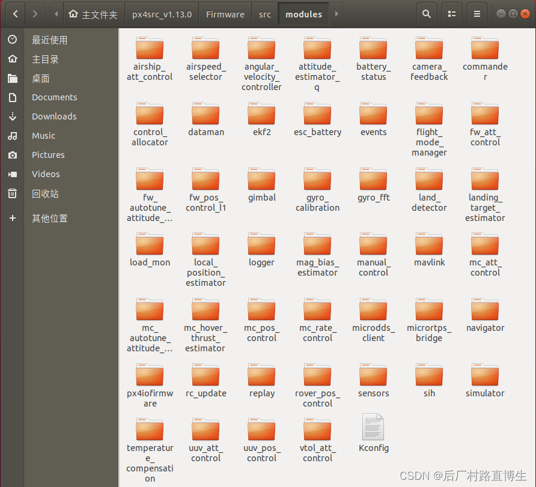

官方用户指南[PX4 Autopilot User Guide | PX4 Guide (main)](https://docs.px4.io/main/en/)

# Ubuntu22.04进行仿真

### 启动Gazebo SITL

```shell
make px4_sitl gazebo-classic
```

### 上传固件（刷写板）

```shell
make px4_fmu-v4_default upload
```

### 简单地示例代码

```c++
/**
 * @file px4_simple_app.c
 * Minimal application example for PX4 autopilot
 *
 * @author Example User <mail@example.com>
 */

#include <px4_platform_common/px4_config.h>
#include <px4_platform_common/tasks.h>
#include <px4_platform_common/posix.h>
#include <unistd.h>
#include <stdio.h>
#include <poll.h>
#include <string.h>
#include <math.h>

#include <uORB/uORB.h>
#include <uORB/topics/sensor_combined.h>
#include <uORB/topics/vehicle_attitude.h>

__EXPORT int px4_simple_app_main(int argc, char *argv[]);

int px4_simple_app_main(int argc, char *argv[])
{
	PX4_INFO("Hello Sky!");

	/*订阅传感器主题 */
	int sensor_sub_fd = orb_subscribe(ORB_ID(sensor_combined));
	/* limit the update rate to 5 Hz */
	orb_set_interval(sensor_sub_fd, 200);

	/* 初始化要发布的主题并公布主题 */
	struct vehicle_attitude_s att;
	memset(&att, 0, sizeof(att));
	orb_advert_t att_pub = orb_advertise(ORB_ID(vehicle_attitude), &att);

	/* one could wait for multiple topics with this technique, just using one here */
	px4_pollfd_struct_t fds[] = {
		{ .fd = sensor_sub_fd,   .events = POLLIN },
		/* there could be more file descriptors here, in the form like:
		 * { .fd = other_sub_fd,   .events = POLLIN },
		 */
	};

	int error_counter = 0;

	for (int i = 0; i < 5; i++) {
		/* wait for sensor update of 1 file descriptor for 1000 ms (1 second) */
		int poll_ret = px4_poll(fds, 1, 1000);

		/* handle the poll result */
		if (poll_ret == 0) {
			/* this means none of our providers is giving us data */
			PX4_ERR("Got no data within a second");

		} else if (poll_ret < 0) {
			/* this is seriously bad - should be an emergency */
			if (error_counter < 10 || error_counter % 50 == 0) {
				/* use a counter to prevent flooding (and slowing us down) */
				PX4_ERR("ERROR return value from poll(): %d", poll_ret);
			}

			error_counter++;

		} else {

			if (fds[0].revents & POLLIN) {
				/* obtained data for the first file descriptor */
				struct sensor_combined_s raw;
				/* copy sensors raw data into local buffer */
				orb_copy(ORB_ID(sensor_combined), sensor_sub_fd, &raw);
				PX4_INFO("Accelerometer:\t%8.4f\t%8.4f\t%8.4f",
					 (double)raw.accelerometer_m_s2[0],
					 (double)raw.accelerometer_m_s2[1],
					 (double)raw.accelerometer_m_s2[2]);

				/* set att and publish this information for other apps
				 the following does not have any meaning, it's just an example
				*/
				att.q[0] = raw.accelerometer_m_s2[0];
				att.q[1] = raw.accelerometer_m_s2[1];
				att.q[2] = raw.accelerometer_m_s2[2];

				orb_publish(ORB_ID(vehicle_attitude), att_pub, &att);
			}

			/* there could be more file descriptors here, in the form like:
			 * if (fds[1..n].revents & POLLIN) {}
			 */
		}
	}

	PX4_INFO("exiting");

	return 0;
}
```

### 事件接口

```c++
#include <px4_platform_common/events.h>
```

```c++
events::send(events::ID("event_name"), events::Log::Info, "Test Message");
```

最小示例

```c++
uint8_t arg1 = 0;
float arg2 = -1.f;
/* EVENT
 * @description
 * This is the detailed event description.
 * - value of arg1: {1}
 * - value of arg2: {2:.1}
 */
events::send<uint8_t, float>(events::ID("event_name"),
	{events::Log::Error, events::LogInternal::Info}, "Event Message", arg1, arg2);
```

## 飞行任务

### 任务创建

#### 1.新建任务文件夹

```shell
mkdir PX4-Autopilot/src/modules/flight_mode_manager/tasks/MyTask
```

MyTask:按照需求自己设定名字

#### 2.在 *MyTask* 目录中使用前缀 “FlightTask” 为新的飞行任务创建空源代码和 *cmake* 文件：

- CMakeLists.txt
- FlightTaskMyTask.hpp
- FlightTaskMyTask.cpp

```shell
gedit FlightTaskMyTask.hpp
```

把以下内容写入CMakeLists.txt，此代码来源于 Orbit/CMakeLists.txt

```c++
############################################################################
#
#   Copyright (c) 2018 PX4 Development Team. All rights reserved.
#
# Redistribution and use in source and binary forms, with or without
# modification, are permitted provided that the following conditions
# are met:
#
# 1. Redistributions of source code must retain the above copyright
#    notice, this list of conditions and the following disclaimer.
# 2. Redistributions in binary form must reproduce the above copyright
#    notice, this list of conditions and the following disclaimer in
#    the documentation and/or other materials provided with the
#    distribution.
# 3. Neither the name PX4 nor the names of its contributors may be
#    used to endorse or promote products derived from this software
#    without specific prior written permission.
#
# THIS SOFTWARE IS PROVIDED BY THE COPYRIGHT HOLDERS AND CONTRIBUTORS
# "AS IS" AND ANY EXPRESS OR IMPLIED WARRANTIES, INCLUDING, BUT NOT
# LIMITED TO, THE IMPLIED WARRANTIES OF MERCHANTABILITY AND FITNESS
# FOR A PARTICULAR PURPOSE ARE DISCLAIMED. IN NO EVENT SHALL THE
# COPYRIGHT OWNER OR CONTRIBUTORS BE LIABLE FOR ANY DIRECT, INDIRECT,
# INCIDENTAL, SPECIAL, EXEMPLARY, OR CONSEQUENTIAL DAMAGES (INCLUDING,
# BUT NOT LIMITED TO, PROCUREMENT OF SUBSTITUTE GOODS OR SERVICES; LOSS
# OF USE, DATA, OR PROFITS; OR BUSINESS INTERRUPTION) HOWEVER CAUSED
# AND ON ANY THEORY OF LIABILITY, WHETHER IN CONTRACT, STRICT
# LIABILITY, OR TORT (INCLUDING NEGLIGENCE OR OTHERWISE) ARISING IN
# ANY WAY OUT OF THE USE OF THIS SOFTWARE, EVEN IF ADVISED OF THE
# POSSIBILITY OF SUCH DAMAGE.
#
############################################################################

px4_add_library(FlightTaskOrbit
	FlightTaskOrbit.cpp
)

target_link_libraries(FlightTaskOrbit PUBLIC FlightTaskManualAltitudeSmoothVel SlewRate)
target_include_directories(FlightTaskOrbit PUBLIC ${CMAKE_CURRENT_SOURCE_DIR})
```

修改代码表示新的任务

```c++
px4_add_library(FlightTaskMyTask
    FlightTaskMyTask.cpp
)

target_link_libraries(FlightTaskMyTask PUBLIC FlightTask)
target_include_directories(FlightTaskMyTask PUBLIC ${CMAKE_CURRENT_SOURCE_DIR})
```

修改hpp文件如下

```c++
#pragma once

#include "FlightTask.hpp"

class FlightTaskMyTask : public FlightTask
{
public:
  FlightTaskMyTask() = default;
  virtual ~FlightTaskMyTask() = default;

  bool update();
  bool activate(const trajectory_setpoint_s &last_setpoint) override;

private:
  float _origin_z{0.f};
};
```

根据需要更新 cpp 文件。此示例提供了 **FlightTaskMyTask.cpp** 的简单实现，它仅指示调用了 task 方法

```c++
#include "FlightTaskMyTask.hpp"

bool FlightTaskMyTask::activate(const trajectory_setpoint_s &last_setpoint)
{
  bool ret = FlightTask::activate(last_setpoint);
  PX4_INFO("FlightTaskMyTask activate was called! ret: %d", ret); // report if activation was successful
  return ret;
}

bool FlightTaskMyTask::update()
{
  PX4_INFO("FlightTaskMyTask update was called!"); // report update
  return true;
}
```

#### 3.将新任务添加到要在 [PX4-Autopilot/src/modules/flight_mode_manager/CMakeLists.txt](https://github.com/PX4/PX4-Autopilot/blob/main/src/modules/flight_mode_manager/CMakeLists.txt#L41) 中构建的任务列表中。

```c++
 list(APPEND flight_tasks_all
   Auto
   Descend
   ...
   ManualPositionSmoothVel
   Transition
   {MyTask}//根据自己任务的名字更改
 )
```

#### 4.更新 Flight Mode 以确保调用任务。通常使用参数来选择何时应使用特定的飞行任务。

若为多旋翼 Position 模式 则找到src/modules/mc_pos_control/multicopter_position_mode_params.c

在其中增加一个选项，如果参数具有以前未使用的值（如 5），则用于选择 “MyTask”

```c++
...
 * @value 0 Direct velocity
 * @value 3 Smoothed velocity
 * @value 4 Acceleration based
 * @value 5 My task
 * @group Multicopter Position Control
 */
PARAM_DEFINE_INT32(MPC_POS_MODE, 5);
```

#### 5.在开关中为参数 [FlightModeManager.cpp](https://github.com/PX4/PX4-Autopilot/blob/main/src/modules/flight_mode_manager/FlightModeManager.cpp#L266-L285) 为新选项添加一个 case，以启用任务 when 具有正确的值。`_param_mpc_pos_mode`

```c++
switch (_param_mpc_pos_mode.get()) {
  ...
  case 3:
     error = switchTask(FlightTaskIndex::ManualPositionSmoothVel);
     break;
  case 5: // Add case for new task: MyTask
     error = switchTask(FlightTaskIndex::MyTask);
     break;
  case 4:
```

#### 6.测试任务

构建 SITL 模拟 （gazebo-classic）

```c++
make px4_sitl gazebo-classic
```

打开 QGroundControl 

在控制台中，起飞并切换到 Position 模式：

```c++
pxh> commander takeoff
pxh> commander mode posctl
```

# Matlab:Simulink

# 源码学习

## boards ：

各个品牌、版本的飞控板的编译脚本，其中px4文件夹装的是pixhawk的原生固件的编译脚本。

## Documentation ：

开发者文档目录，包括代码说明等

## integrationtests：

## launch ：

launch文件夹是仿真环境用到的文件，在gazebo中生成世界，配置ros节点等

## msg ：

msg文件夹存放uORB消息主题，实现PX4各进程之间通信用这些message。可以在文件夹内定义message。

## platforms ：

系统平台实现的文件，包括PX4采用的Nuttx操作系统的源代码


## posix-configs

## ROMFS ：

**ROM file system的缩写，是文件系统文件夹，里面存放的飞控系统的启动脚本，负责系统初始化。**


内部的 **px4fmu_common** 文件夹中的 init.d 是关于 px4 系统初始上电启动的启动脚本，即一系列的启动过程和系统配置。其中较为重要的部分在如下目录下：\ROMFS\px4fmu_common\init.d

如文件rcS、rc.logging、rc.mc_apps、rc.sensors等

rcS：最先启动的脚本，负责挂载SD卡、启动uORB、配置系统参数等。

rc.logging：日志配置和启动代码。

rc.sensors：sensors驱动启动代码。

rc.mc_apps：启动上层应用（src/modules中的模块均在此启动），如 attitude_estimate 、 attitude_control 、position_estimate 和 position_control 等。

## src：

src是源代码目录，是PX4的核心，非常重要。


### drivers:

pixhawk 硬件系统中使用的所有传感器的驱动代码，包括陀螺仪、加速度计、磁力计、气压计、GPS、光流等，也包括pwm输出、px4io控制、不同遥控器通信协议等功能的驱动。

### example:

examples文件夹是官方给出的简单例程，帮助新手开发者入门进行二次开发。

### include:

include文件夹是其他代码需要用到的头文件和库。

## lib:

标准库，有矩阵运算、PID控制、传感器校准等。

### modules:



modules文件夹是功能模块文件夹，也是二次开发主要的文件夹，包括姿态解算，姿态控制，位置估计，位置控制，指令控制，落地检测，传感器初始化等。

attitude_estimator_q：使用 mahony 互补滤波算法实现姿态结算。

commander：整个系统的过程实现，包括起飞前各传感器的校准、安全开关是否使能、飞行模式切换、pixhawk硬件上指示灯颜色定义等。

ekf2：使用扩展卡尔曼滤波器算法实现姿态和位置结算。

fw_att_control：固定翼飞机的姿态控制。

fw_pos_control_l1：固定翼飞机的位置控制器。

land_detector：使用land飞行模式降落的落地监测部分。

local_position_estimator：LPE 算法实现位置解算。

logger：关于 log 日志的读写函数。

mavlink：和地面站通信的通信协议。

mc_att_control：姿态控制的算法实现，主要就是姿态的内外环 PID 控制，外环角度控制、内环角速度控制。

mc_pos_control：位置控制的算法实现，主要就是位置的内外环 PID 控制，外环速度控制、内环加速度控制。

navigator：任务，失效保护和RTL导航仪。

sensors：关于各种传感器的相关函数。

vtol_att_control：垂直起降姿态控制器。

### systemcmds:

系统指令文件夹，都是飞控终端支持的命令的源码，如top命令，reboot命令等。

### templates:

存放功能模块的代码模板，可以用于参考。

## Tools：

Tools文件夹下是一些工具，比如下载工具、仿真环境等。


# uORB话题订阅发布机制理解

​       uORB(Micro Object Request Broker，微对象请求代理器)是PX4/Pixhawk系统中非常重要且关键的一个模块，它肩负了整个系统的数据传输任务，所有的传感器数据、GPS、PPM信号等都要从芯片获取后通过uORB进行传输到各个模块进行计算处理。实际上uORB是一套跨「进程」 的IPC通讯模块。在Pixhawk中， 所有的功能被独立以进程模块为单位进行实现并工作。而进程间的数据交互就由为重要，必须要能够符合实时、有序的特点。

​       Pixhawk使用的是NuttX实时ARM系统，uORB实际上是多个进程打开同一个设备文件，进程间通过此文件节点进行数据交互和共享。进程通过命名的「总线」交换的消息称之为「话题」(topic)，在Pixhawk 中，一个话题仅包含一种消息类型，通俗点就是数据类型。每个进程可以「订阅」或者「发布」话题，可以存在多个发布者，或者一个进程可以订阅多个话题，但是一条总线上始终只有一条消息。

## 应用框架


## uORB文件夹说明


## 常用函数：

### **发布话题 先公告，再发布：**

```c++
orb_advert_t orb_advertise(const struct orb_metadata *meta, const void *data);

 功能：公告发布者的话题；
/*说明：在发布话题之前是必须的；否则订阅者虽然能订阅，但是得不到数据；
参数：
    meta:uORB元对象，可以认为是话题id，一般是通过ORB_ID(话题名)来赋值;
    data:指向一个已被初始化，发布者要发布的数据存储变量的指针；
返回值：
	错误则返回ERROR;成功则返回一个可以发布话题的句柄；如果待发布的话题没有定义或声明则会返回-1，然后会将errno赋值为ENOENT; */
eg:
    struct vehicle_attitude_s att;
    memset(&att, 0, sizeof(att));
    int att_pub_fd = orb_advertise(ORB_ID(vehicle_attitude), &att);

```

```c++
int orb_publish(const struct orb_metadata *meta, orb_advert_t handle, const void *data);
功能：发布新数据到话题；
/*参数：
    meta:uORB元对象，可以认为是话题id，一般是通过ORB_ID(话题名)来赋值;
    handle:orb_advertise函数返回的句柄；
    data:指向待发布数据的指针；
返回值：
	OK表示成功；错误返回ERROR；否则则有根据的去设置errno;
*/
eg: 
    orb_publish(ORB_ID(vehicle_attitude), att_pub_fd, &att);

```

### **订阅话题 先关注，检查更新，再拷贝:**

```c++
int orb_subscribe(const struct orb_metadata *meta);
功能：订阅话题（topic）;
/*说明：即使订阅的话题没有被公告，但是也能订阅成功；但是在这种情况下，却得不到数据，直到话题被公告；
参数：
    meta:uORB元对象，可以认为是话题id，一般是通过ORB_ID(话题名)来赋值；
返回值：
    错误则返回ERROR;成功则返回一个可以读取数据、更新话题的句柄；如果待订阅的话题没有定义或声明则会返回-1，然后会将errno赋值为ENOENT; */
eg:
    int fd = orb_subscribe(ORB_ID(topicName));

```

```c++
int poll(struct pollfd fds[], nfds_t nfds, int timeout);
功能：监控文件描述符（多个）；
/*说明：timemout=0，poll()函数立即返回而不阻塞；timeout=INFTIM(-1)，poll()会一直阻塞下去，直到检测到return > 0；
参数：
    fds:struct pollfd结构类型的数组；
    nfds:用于标记数组fds中的结构体元素的总数量；
    timeout:是poll函数调用阻塞的时间，单位：毫秒；
返回值：
    >0:数组fds中准备好读、写或出错状态的那些socket描述符的总数量；
    ==0:poll()函数会阻塞timeout所指定的毫秒时间长度之后返回;
    -1:poll函数调用失败；同时会自动设置全局变量errno；*/
```

```c++
int orb_check(int handle, bool *updated);
功能：订阅者可以用来检查一个话题在发布者上一次更新数据后，有没有订阅者调用过ob_copy来接收、处理过；
/*说明：如果话题在在被公告前就有人订阅，那么这个API将返回“not-updated”直到话题被公告。可以不用poll，只用这个函数实现数据的获取。
参数：
    handle:话题句柄；
    updated:如果当最后一次更新的数据被获取了，检测到并设置updated为ture;
返回值：
    OK表示检测成功；错误返回ERROR;否则则有根据的去设置errno; */
eg:
    if (PX4_OK != orb_check(sfd, &updated)) {
        return printf("check(1) failed");
    }
    if (updated) {
        return printf("spurious updated flag");
    }

    //or

    bool updated;
    struct random_integer_data rd;

    /* 检查自上次以来，话题是否更新了*/
    orb_check(topic_handle, &updated);

    if (updated) {
        /* make a local copy of the updated data structure */
        orb_copy(ORB_ID(random_integer), topic_handle, &rd);
        printf("Random integer is now %d\n", rd.r);
    }

```

```c++
int orb_copy(const struct orb_metadata *meta, int handle, void *buffer);
功能：从订阅的话题中获取数据并将数据保存到buffer中；
/*参数：
    meta:uORB元对象，可以认为是话题id，一般是通过ORB_ID(话题名)来赋值;
    handle:订阅话题返回的句柄；
    buffer:从话题中获取的数据；
返回值：
    返回OK表示获取数据成功，错误返回ERROR;否则则有根据的去设置errno;*/
eg:
    struct sensor_combined_s raw;
    orb_copy(ORB_ID(sensor_combined), sensor_sub_fd, &raw);

```

### 其他函数：

```c++
int orb_set_interval(int handle, unsigned interval);
功能：设置订阅的最小时间间隔；
```

```c++
orb_advert_t orb_advertise_multi(const struct orb_metadata *meta, const void *data, int *instance, int priority);
功能：设备/驱动器的多个实例实现公告，利用此函数可以注册多个类似的驱动程序；
    说明：例如在飞行器中有多个相同的传感器，那他们的数据类型则类似，不必要注册几个不同的话题；
/*参数：
    meta:uORB元对象，可以认为是话题id，一般是通过ORB_ID(话题名)来赋值;
    data:指向一个已被初始化，发布者要发布的数据存储变量的指针；
    instance:整型指针，指向实例的ID（从0开始）；
    priority:实例的优先级。如果用户订阅多个实例，优先级的设定可以使用户使用优先级高的最优数据源；
返回值：
    错误则返回ERROR;成功则返回一个可以发布话题的句柄；如果待发布的话题没有定义或声明则会返回-1，然后会将errno赋值为ENOENT; */
```

```c++
int orb_subscribe_multi(const struct orb_metadata *meta, unsigned instance);
功能：订阅话题（topic）;
说明：通过实例的ID索引来确定是话题的哪个实例；
/*参数：
    meta:uORB元对象，可以认为是话题id，一般是通过ORB_ID(话题名)来赋值;
    instance:话题实例ID;实例ID=0与orb_subscribe()实现相同；
返回值：
    错误则返回ERROR;成功则返回一个可以读取数据、更新话题的句柄；如果待订阅的话题没有定义或声明则会返回-1，然后会将errno赋值为ENOENT;*/
eg:
    int sfd1 = orb_subscribe_multi(ORB_ID(orb_multitest), 1);

```

