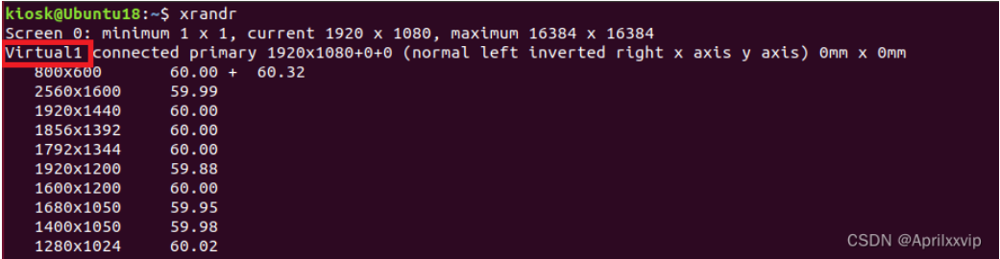
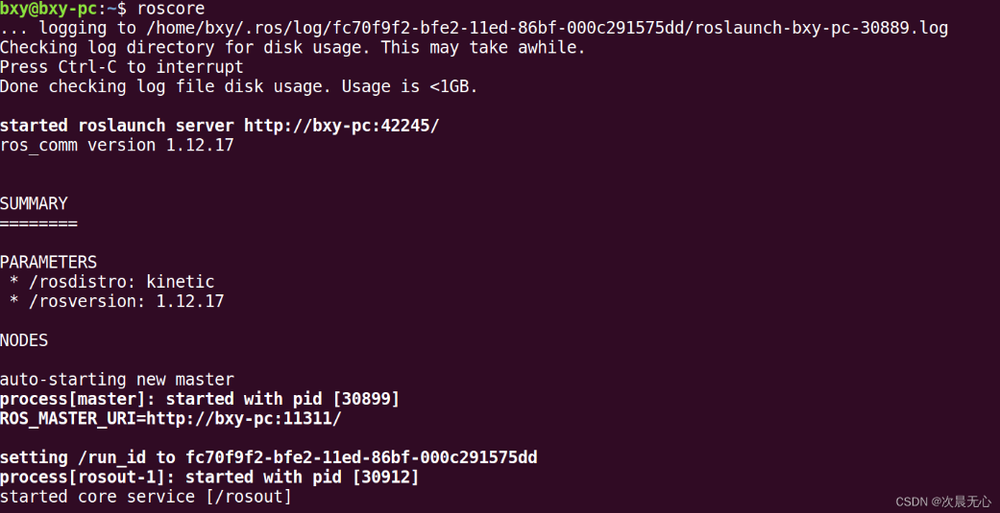
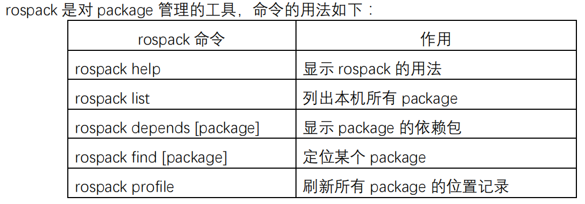
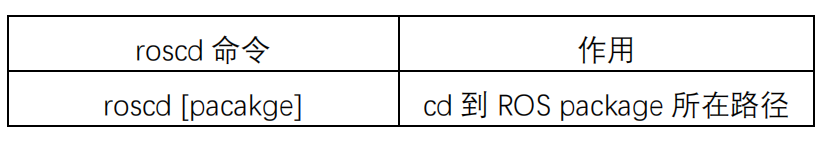
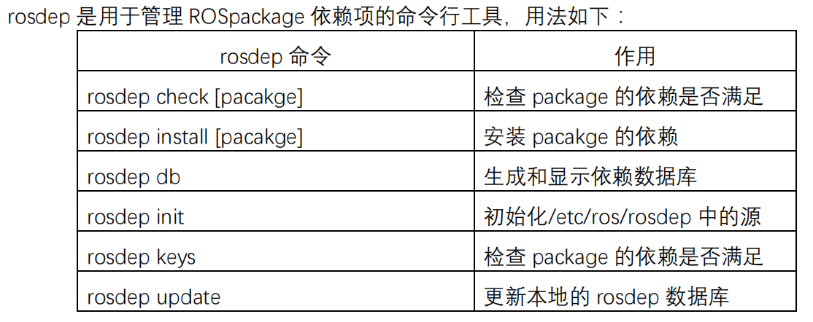
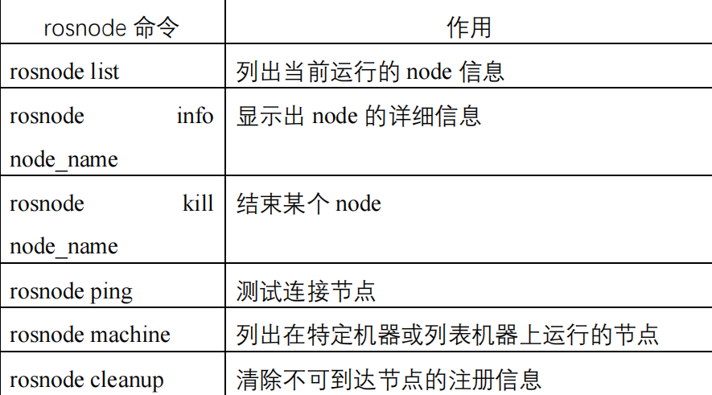
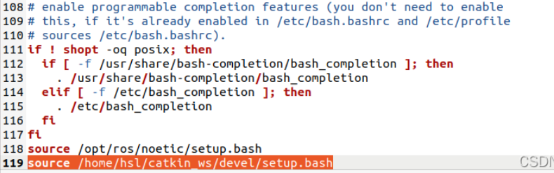
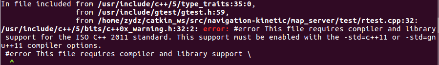

# 实用指令

## 更改分辨率的方式

1.打开终端（Ctrl+Alt+T)，输入命令 xrandr ，获取当前显示系统的输出设备名称和已有的分辨率。我的输出设备是红框内的 Virtual1 。



2.输入命令 cvt 1920 1080 ，获取该分辨率的有效扫描频率。

3.新建输出分辨率：输入命令 

`xrandr --newmode "1920x1080_60.00" 173.00 1920 2048 2248 2576 1080 1083 1088 1120 -hsync +vsync` ， newmode 后输入的是上一步获取到的 modeline 后的信息。
4.添加输出分辨率到当前设备：输入命令 xrandr --addmode Virtual1 "1920X1080_60.00" 。

5.把当前设备的分辨率改为新添加的分辨率：输入命令 

xrandr --output Virtual1 --mode "1920x1080_60.00"

 按下Enter键后屏幕分辨率就改成1920x1080了。以上只是临时改变屏幕分辨率，还需以下步骤永久设置屏幕分辨率。

## 查看内存分配

```shell
baobab
```

## 切换Python的版本

设置Python2及Python3优先级

```shell
sudo update-alternatives --install /usr/bin/python python /usr/bin/python2 100
sudo update-alternatives --install /usr/bin/python python /usr/bin/python3 200
```

查看目前使用的Python版本

```shell
python --version
```

手动切换：由Python3切换到Python2

```shell
sudo update-alternatives --config python
```


# VIM使用方法


按 Esc 键进入 “Normal mode”。然后，您可以键入 : 进入 “Command-line mode”。在屏幕底部会出现一个冒号（:），您可以在其中输入以下命令之一。要执行命令，请按下 Enter 键。

`:q` 退出（简称为 :quit）
`:q!` 退出而不保存（简称为 :quit!）
`:wq` 写入并退出
`:wq!` 写入并退出，如果文件缺少写权限，则尝试强制写入
`:x` 写入并退出；类似于 :wq，但仅在修改后写入（简称为 :exit）
`:qa` 退出所有（简称为 :quitall）
`:cq` 退出，不保存，带有非零退出代码以指示失败（简称为 :cquit）
您还可以通过在 “Normal mode” 中键入 ZZ 来直接退出 Vim（等同于 :x）或键入 ZQ 仅退出（等同于 :q!）。（注意大小写在这里很重要。ZZ 和 zz 不表示相同的事情。）

# DOCKER

## Docker思想

​	没有集装箱之前运输货物,东西零散容易丢失,有了集装箱之后货物不容易丢失,我们可以把货物想象成程序,目前我们要把程序部署到一台新的机器上,可能会启动不起来,比如少一些配置文件什么的或者少了什么数据,有了docker的集装箱可以保证我们的程序不管运行在哪不会缺东西。

## Docker指令

```shell
#1、命令汇总
docker version            #显示docker的版本信息
docker info               #显示docker的系统信息，包括镜像和容器的数量
docker --help             #帮助命令
docker 子命令 --help       #子命令的帮助命令

#2、容器命令
docker run imageName[:tag]                                     #新建容器并启动
docker ps                                                      #列出所有运行的容器
docker ps -a                                                   #列出所有容器
docker exec -it containerId或containerName /bin/bash           #进入容器内部
exit/Ctrl+P+Q                                                  #退出容器
docker stop start restart kill containerId或containerName      #启停容器
docker rm containerId或containerName                           #删除指定容器
docker rm -f containerId或containerName                        #强制删除启动的容器
docker rm -f $(docker ps -aq)                                  #强制删除所有容器
docker rm $(docker ps -q -f status=exited)        			   #删除所有未运行的容器
docker inspect containerId或containerName                      #查看容器信息
docker logs containerId或containerName                         #查看容器日志
docker top containerId或containerName                          #查看容器中进程信息
docker cp containerId或containerName：容器内路径 宿主机路径        #从容器中拷贝文件到宿主机
docker cp 宿主机路径 containerId或containerName：容器内路径        #从宿主机拷贝文件到容器
docker diff containerId或containerName                         #容器运行后文件发生的变化
docker commit containerId或containerName imageName[:tag]       #提交容器成为一个新的镜像

#3.
```


# ROS

## 安装ros（以16.04为例）

```shell
sudo sh -c '. /etc/lsb-release && echo "deb http://mirrors.tuna.tsinghua.edu.cn/ros/ubuntu/ `lsb_release -cs` main" > /etc/apt/sources.list.d/ros-latest.list'
```

```shell
sudo apt install curl
```

```shell
curl -s https://raw.githubusercontent.com/ros/rosdistro/master/ros.asc | sudo apt-key add -
```

```shell
sudo apt-get update
```

```shell
sudo apt-get install ros-kinetic-desktop-full
```

```shell
echo "source /opt/ros/kinetic/setup.bash" >> ~/.bashrc
source ~/.bashrc
```

```shell
sudo apt-get install ros-kinetic-navigation
```

```shell
sudo apt install python-rosdep python-rosinstall python-rosinstall-generator python-wstool build-essential
```

```shell
sudo apt install python-rosdep
```

```shell
sudo rosdep init
rosdep update
```

```shell
## 测试ROS是否安装成功
roscore
```

出现这个便证明安装成功



## ROS部分指令

### rospack



### roscd



### **rosls**


### rosdep



一个较常使用的命令是 

```shell
rosdep install --from-paths src --ignore-src --rosdistro=kinetic -y
```

用于安装工作空间中 src 路径下所有 package 的依赖项（由 pacakge.xml 文件指定）。

## ROS通讯部分

​		在 ROS 系统中，最小的进程单元就是节点（node），节点就是一个进程（process），只不过在ROS 中它被赋予了专用的名字。一个软件包里可以有多个可执行文件，可执行文件在运行之后就成了一个进程，即节点。从程序角度来说，一个节点就是一个可执行文件（通常为 C++编译生成的可执行文件、Python 脚本）被执行，加载到了内存中；从功能角度来说，通常一个 node 负责者机器人的某一个单独的功能。ROS 中操作节点的命令为 rosnode，它的详细用法如下：

	启动节点管理器的命令为：

```shell
roscore
```

​		启动节点的命令是 rosrun，每一次运行节点之前，都要先启动节点管理器，这样才能够让节点启动和注册。也就是说，运行 rosrun 命令之前，需要确保 roscore 已经启动，否则 rosrun 命令会报错并等待直到 roscore 启动。rosrun 命令的用法为：

```shell
rosrun pkg_name node_name
```

​	通常一个机器人运行操作时要开启很多个节点，对于一个复杂的机器人的启动操作并不需要每个节点依次运行 rosrun 命令，ROS 提供了一个能一次性启动 master 和多个 node 的命令，即 roslaunch命令，它的用法为：

```shell
 roslaunch pkg_name file_name.launch
```

## ROS报错处理


​		

​		第一行报错解决方式，其实是因为最开始执行`echo "source /opt/ros/noetic/setup.bash" >>~/.bashrc`已经把该路径写入环境中了。
​		解决方法：

```shell
cd ~
gedit .bashrc
```

​		翻到最后部分，把错误的路径source /opt/ros/noetic/setup.bash和多余的路径source /opt/ros/melodic/setup.bash删掉，留一个source /opt/ros/melodic/setup.bash即可，点击右上角保存，然后退出，重新执行4和5步。这里如果不执行第4步还是会出现上述同样的问题。
​		第二行报错解决方式，首先打开主目录，按下ctrl+H，显示隐藏文件，然后打开.bashrc文件，下拉到底部，删除下面图片中的选中位置，仅保留source /opt/ros/noetic/setup.bash



​	重新打开终端，问题解决。



找到对应包里面的CMakeLists.txt文件，向其中添加如下代码：

```shell
SET(CMAKE_CXX_FLAGS "-std=c++0x")
```

