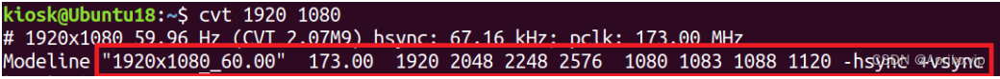

# 更改分辨率的方式

1.打开终端（Ctrl+Alt+T)，输入命令 xrandr ，获取当前显示系统的输出设备名称和已有的分辨率。我的输出设备是红框内的 Virtual1 。


2.输入命令 cvt 1920 1080 ，获取该分辨率的有效扫描频率。

3.新建输出分辨率：输入命令 

`xrandr --newmode "1920x1080_60.00" 173.00 1920 2048 2248 2576 1080 1083 1088 1120 -hsync +vsync` ， newmode 后输入的是上一步获取到的 modeline 后的信息。
4.添加输出分辨率到当前设备：输入命令 xrandr --addmode Virtual1 "1920X1080_60.00" 。

5.把当前设备的分辨率改为新添加的分辨率：输入命令 

xrandr --output Virtual1 --mode "1920x1080_60.00"

 按下Enter键后屏幕分辨率就改成1920x1080了。以上只是临时改变屏幕分辨率，还需以下步骤永久设置屏幕分辨率。

# VIM使用方法


按 Esc 键进入 “Normal mode”。然后，您可以键入 : 进入 “Command-line mode”。在屏幕底部会出现一个冒号（:），您可以在其中输入以下命令之一。要执行命令，请按下 Enter 键。

`:q` 退出（简称为 :quit）
`:q!` 退出而不保存（简称为 :quit!）
`:wq` 写入并退出
`:wq!` 写入并退出，如果文件缺少写权限，则尝试强制写入
`:x` 写入并退出；类似于 :wq，但仅在修改后写入（简称为 :exit）
`:qa` 退出所有（简称为 :quitall）
`:cq` 退出，不保存，带有非零退出代码以指示失败（简称为 :cquit）
您还可以通过在 “Normal mode” 中键入 ZZ 来直接退出 Vim（等同于 :x）或键入 ZQ 仅退出（等同于 :q!）。（注意大小写在这里很重要。ZZ 和 zz 不表示相同的事情。）

# 安装ros（以16.04为例）

```shell
sudo sh -c '. /etc/lsb-release && echo "deb http://mirrors.tuna.tsinghua.edu.cn/ros/ubuntu/ `lsb_release -cs` main" > /etc/apt/sources.list.d/ros-latest.list'
```

```shell
sudo apt install curl
```

```shell
curl -s https://raw.githubusercontent.com/ros/rosdistro/master/ros.asc | sudo apt-key add -
```

```shell
sudo apt-get update
```

```shell
sudo apt-get install ros-kinetic-desktop-full
```

```shell
echo "source /opt/ros/kinetic/setup.bash" >> ~/.bashrc
source ~/.bashrc
```

```shell
sudo apt-get install ros-kinetic-navigation
```

```shell
sudo apt install python-rosdep python-rosinstall python-rosinstall-generator python-wstool build-essential
```

```shell
sudo apt install python-rosdep
```

```shell
sudo rosdep init
rosdep update
```

```shell
## 测试ROS是否安装成功
roscore
```

出现这个便证明安装成功


