# 绪论

## 机器学习的基本概念与术语

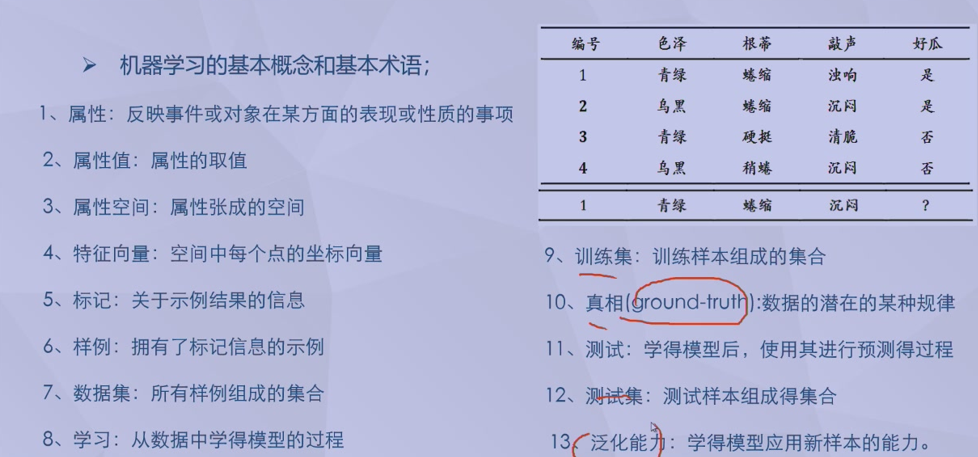

## 假设空间和版本空间的概念

### 假设空间

​	   **监督学习（supervised learning）**的任务是学习一个模型，使模型能够对任意给定的输入，对其相应的输出做出一个好的预测。模型属于由输入空间到输出空间的映射的集合，这个集合就是假设空间(hypothesis space)。 我们也可以将学习过程看作一个在所有假设组成的空间中进行搜索的过程，搜索目标是找到与训练集"匹配"的假设，即能够将训练集中的瓜判断正确的假设。假设的表示一旦确定，假设空间及其规模大小就确定了。
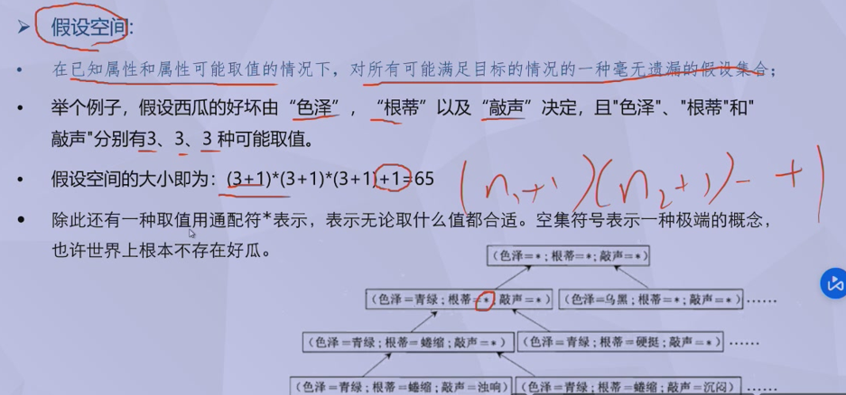

### 版本空间

​		**版本空间：** 与训练集一致的“假设集合”。


### 归纳偏好

​		机器学习算法在学习过程中对某种类型假设的偏好。

# 模型评估与选择

## 经验误差与过拟合

### 经验误差

​		模型在训练集上的误差称为“经验误差”或者“训练误差”。

### 过拟合

​		显然，我们希望得到的是在新样本上表现得很好的学习器，即泛化误差小的学习器。因此，我们应该让学习器尽可能地从训练集中学出普适性的“一般特征”，这样在遇到新样本时才能做出正确的判别。然而，当学习器把训练集学得“太好”的时候，即把一些训练样本的自身特点当做了普遍特征；同时也有学习能力不足的情况，即训练集的基本特征都没有学习出来。我们定义：

- 学习能力过强，以至于把训练样本所包含的不太一般的特性都学到了，称为：**过拟合（overfitting）。**
- 学习能太差，训练样本的一般性质尚未学好，称为：**欠拟合（underfitting）**。

​	可以得知：在过拟合问题中，训练误差十分小，但测试误差教大；在欠拟合问题中，训练误差和测试误差都比较大。目前，欠拟合问题比较容易克服，例如增加迭代次数等，但过拟合问题还没有十分好的解决方案，过拟合是机器学习面临的关键障碍。

### 解决过拟合问题的方法

1. 重新清洗数据，有可能是数据不纯导致的过拟合。
2. 增加训练样本数量。
3. 降低模型复杂程度。
4. 增大正则项系数。
5. 采用dropout方法，让神经元在训练的时候以一定的概率不工作。
6. early stopping
7. 减少迭代次数
8. 增大学习率
9. 添加噪声数据
10. 在树结构中对数进行剪枝。

## 监督学习算法的评估方法

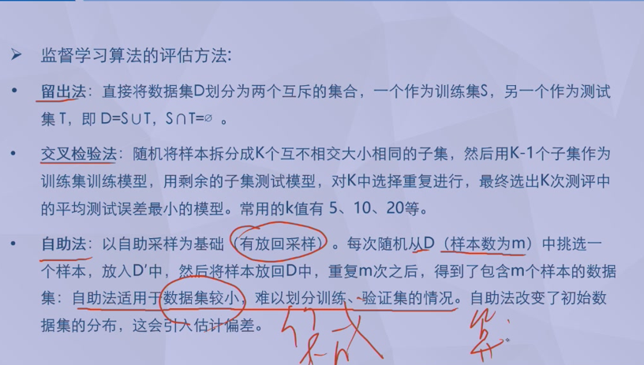

## 常用的性能度量

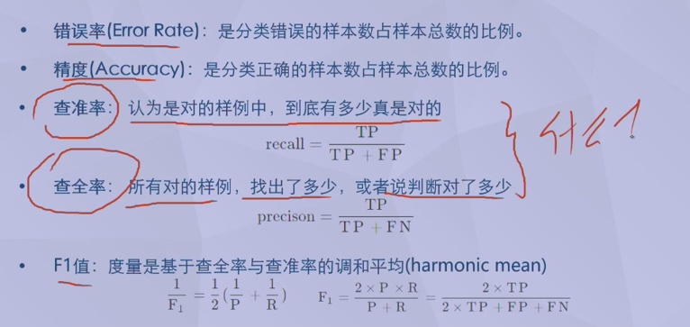

| 真实情况\预测情况 | 预测为正 | 预测为负 |
| ----------------- | -------- | -------- |
| 真实为正          | TP       | TN       |
| 真实为负          | FP       | FN       |

## 比较检验(大数据，小样本)

假设检验：二项检验、t检验（针对单个学习器性能的衡量）

交叉检验：t检验、5*2交叉验证法、McNemar检验（基于卡方）（针对两个学习器性能的衡量）

Friedman检验、Nemenyi检验（在同一组数据集上对多个算法进行比对的检验方法）


# 线性模型

## 线性回归

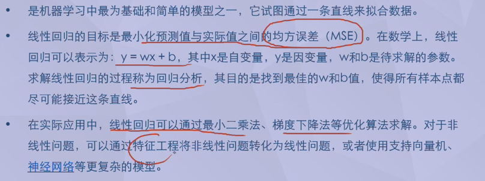

## 对数几率回归

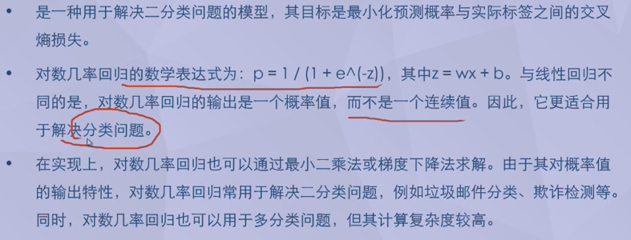

## 最小二乘法

​	最小二乘法就是一种思想，它可以拟合任意函数，线性回归是其中一个比较简单而且也很常用的函数


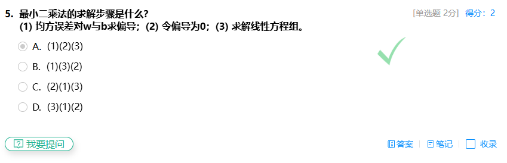

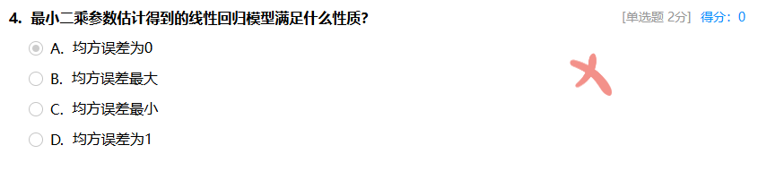

​	选C

## LDA线性判别分析公式推导

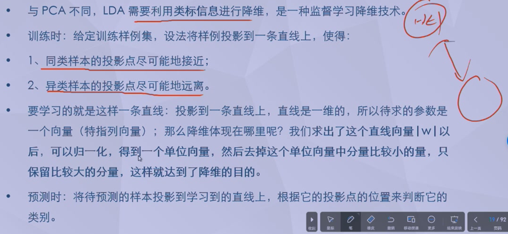

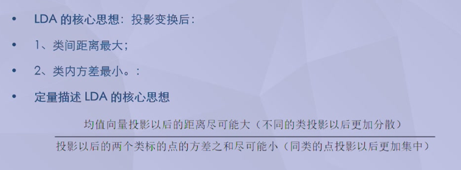

## 多分类问题的处理方法

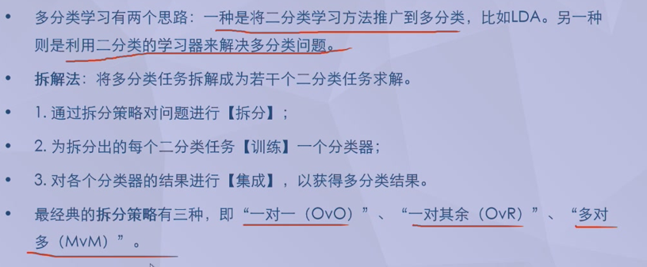

### 一对一（OVO）

​		给定数据集D，假定其中有N个真实类别，将这N个类别进行两两配对（一个正类/一个反类），从而产生N（N-1）/2个二分类学习器，在测试阶段，将新样本放入所有的二分类学习器中测试，得出N（N-1）个结果，最终通过投票产生最终的分类结果。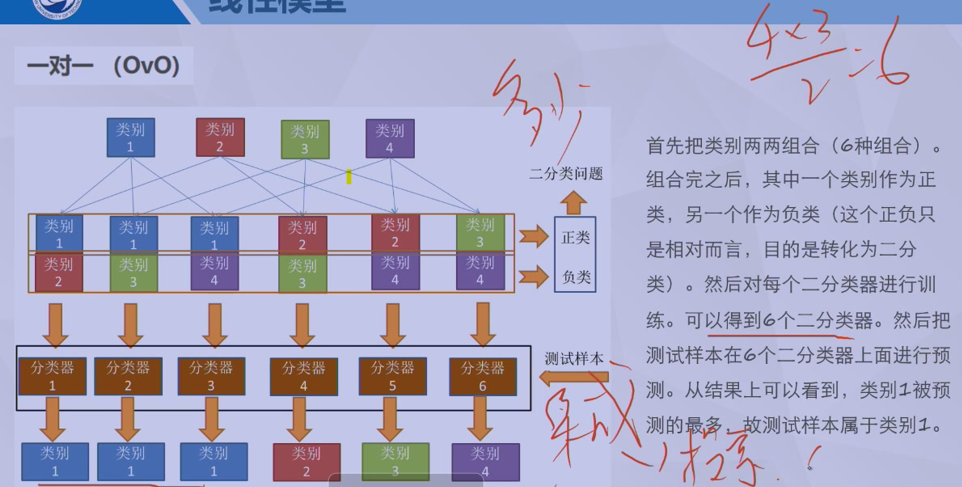

### 一对其余(OVR)

​		给定数据集D，假定其中有N个真实类别，每次取出一个类作为正类，剩余的所有类别作为一个新的反类，从而产生N个二分类学习器，在测试阶段，得出N个结果，若仅有一个学习器预测为正类，则对应的类标作为最终分类结果。

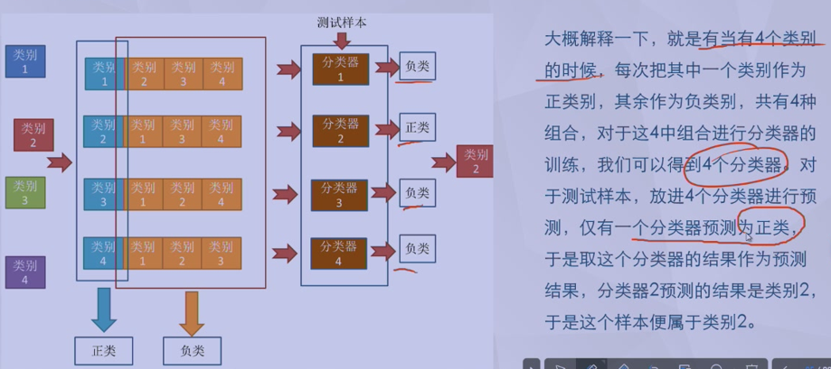

### **多对多（MVM)**

​		给定数据集D，假定其中有N个真实类别，每次取若干个类作为正类，若干个类作为反类（通过ECOC码给出，编码），若进行了M次划分，则生成了M个二分类学习器，在测试阶段（解码），得出M个结果组成一个新的码，最终通过计算海明/欧式距离选择距离最小的类别作为最终分类结果。

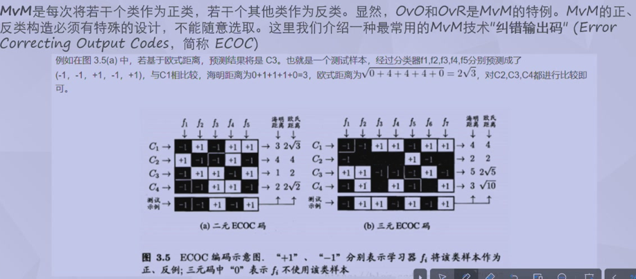

## 类别不平衡问题

​		**类别不平衡（class-imbanlance）**就是指分类问题中不同类别的训练样本相差悬殊的情况，例如正例有900个，而反例只有100个，这个时候我们就需要进行相应的处理来平衡这个问题。常见的做法有三种：

1. 在训练样本较多的类别中进行“**欠采样**”（undersampling）,比如从正例中采出100个，常见的算法有：EasyEnsemble。
2. 在训练样本较少的类别中进行“**过采样**”（oversampling）,例如通过对反例中的数据进行插值，来产生额外的反例，常见的算法有SMOTE。
3. 直接基于原数据集进行学习，对预测值进行“再缩放”处理。其中再缩放也是代价敏感学习的基础。

# 决策树

## 构建决策树的基本流程

- 决策树学习的算法通常是一个**递归地选择最优特征**，并根据该特征对训练数据进行分割，使得各个子数据集有一个最好的分类的过程。这一过程对应着对特征空间的划分，也对应着决策树的构建。

  1） 开始：构建`根节点`，将所有训练数据都放在`根节点`，**选择一个最优特征**，按着这一特征将训练数据集分割成子集，使得各个子集有一个在当前条件下最好的分类。

  2） 如果这些子集已经能够被基本正确分类，那么构建`叶节点`，并将这些子集分到所对应的`叶节点`去。

  3）如果还有子集不能够被正确的分类，那么就对这些子集选择新的最优特征，继续对其进行分割，构建相应的节点，如此**递归**进行，**直至所有训练数据子集被基本正确的分类，或者没有合适的特征为止**。

  4）**每个子集都被分到叶节点**上，即都有了明确的类，这样就生成了一颗决策树。

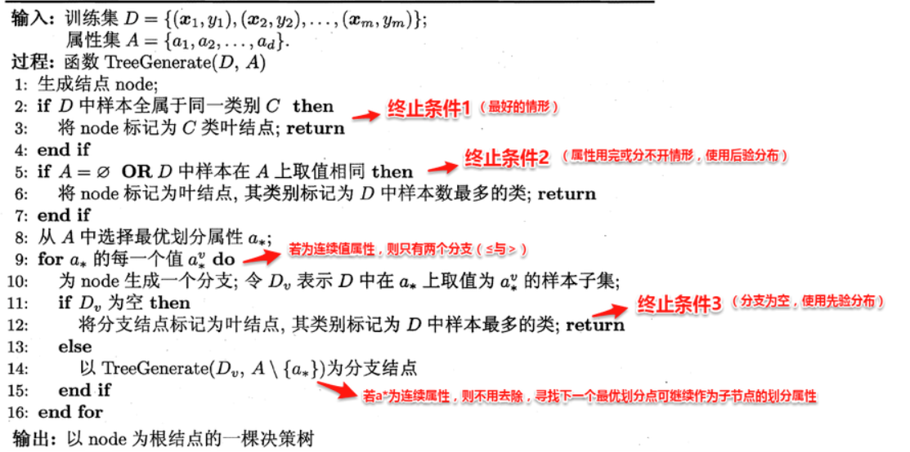

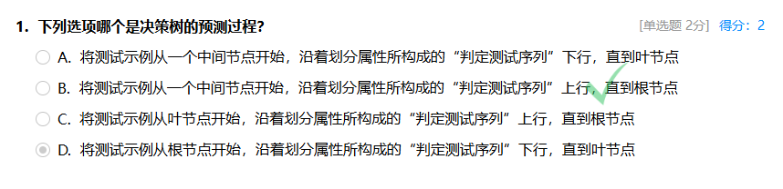		

可以看出：决策树学习的关键在于如何选择划分属性，不同的划分属性得出不同的分支结构，从而影响整颗决策树的性能。属性划分的目标是让各个划分出来的子节点尽可能地“纯”，即属于同一类别。因此下面便是介绍量化纯度的具体方法，决策树最常用的算法有三种：ID3，C4.5和CART。

## ID3算法

 ID3算法的核心是在决策树各个结点上对应信息增益准则选择特征，递归地构建决策树。信息熵越大，代表集合越混乱。

        具体方法是：从根结点(root node)开始，对结点计算所有可能的特征的信息增益，选择信息增益最大的特征作为结点的特征，由该特征的不同取值建立子节点；再对子结点递归地调用以上方法，构建决策树；直到所有特征的信息增益均很小或没有特征可以选择为止，最后得到一个决策树。ID3相当于用极大似然法进行概率模型的选择。
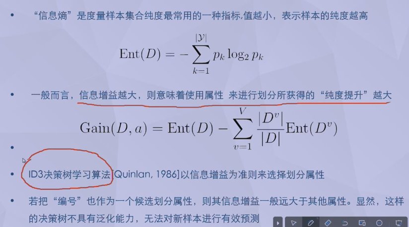

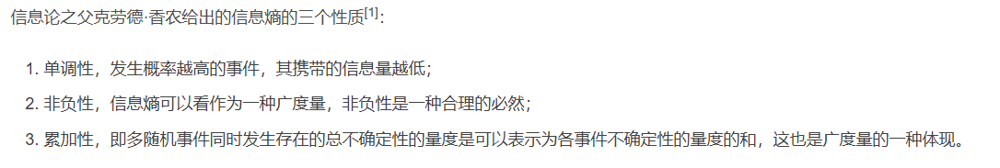

### 计算步骤：

1. 根据表格分别类别（是、否）和特征（年龄、是否有工作、是否有房子、信贷情况）
2. 根据类别计算样本`信息熵`
3. 计算每个特征的`信息增益`

### 示例：

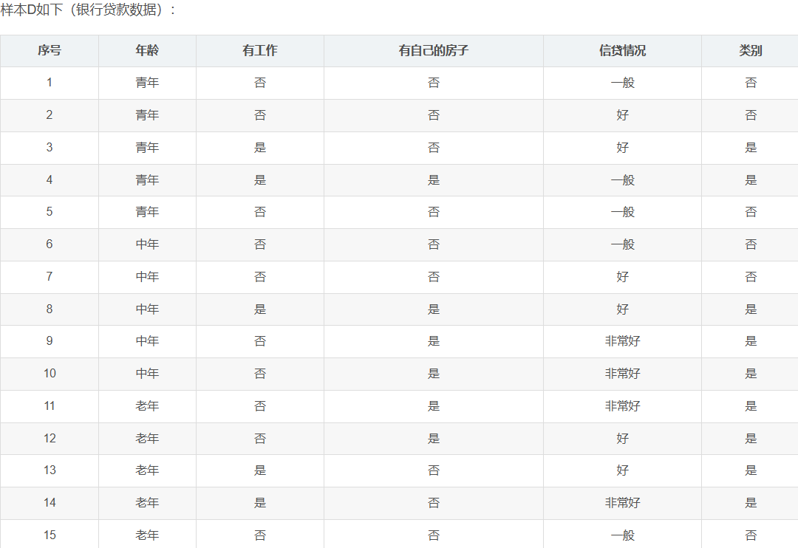

特征包含A年龄（5青年、5中年、5老年）、B工作（5有工作，10无工作）、

C是否有房子（6有房子，9无房子）、E信贷情况（5一般，6好，4非常好）

结果为（是、否），其中9人是，6人否，根据总结果可以得到样本信息熵：

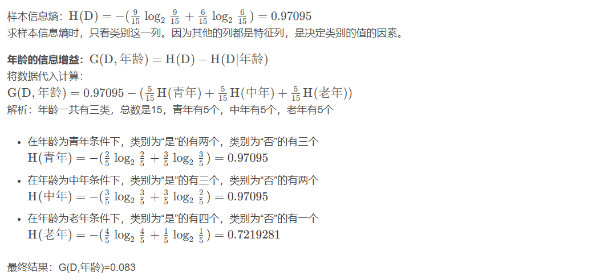

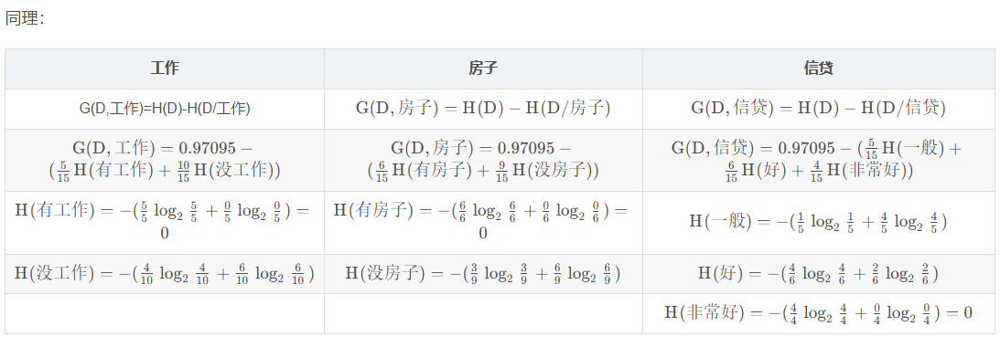

## C4.5算法

​		IC4.5算法与ID3相似，在ID3的基础上进行了改进，采用**信息增益比**来选择属性。ID3选择属性用的是子树的信息增益，ID3使用的是熵（entropy， 熵是一种不纯度度量准则），也就是熵的变化值，而C4.5用的是**信息增益率**。增益率定义为：

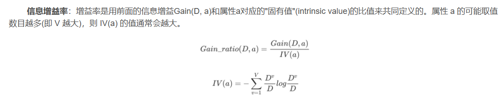

### 计算步骤：

1. 根据表格分出特征与类别。
2. 计算各个类别的数量（9进行，5取消）计算`信息熵`(同ID3）。
3. 根据每个特性（属性）的特征值计算`信息熵`（天气、温度、湿度、风速）
4. 计算`信息增益`，类比：信息熵－特性（属性）信息熵
5. 计算·`属性分裂信息度量`，上面的②式
6. 计算`信息增益率`，上面的①式，用4除以5得到结果，选择最大的信息增益率为分裂属性。

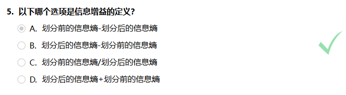

### 示例：

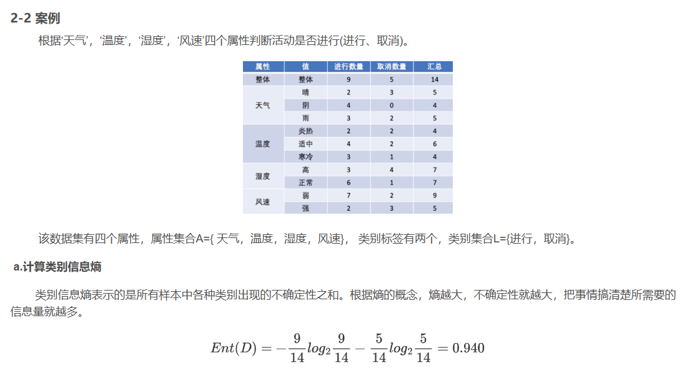

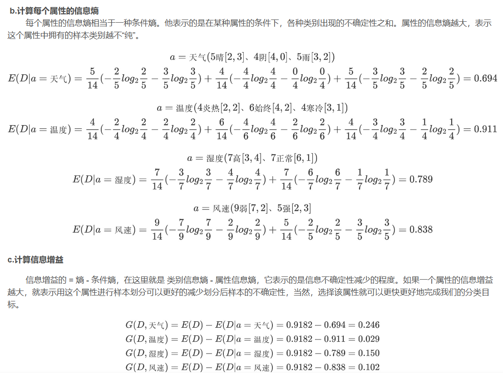


## CART算法

​		CART决策树使用“**基尼指数”（Gini index）**来选择划分属性，基尼指数反映的是从样本集D中随机抽取两个样本，其类别标记不一致的概率，**因此Gini(D)越小越好**，基尼指数定义如下：

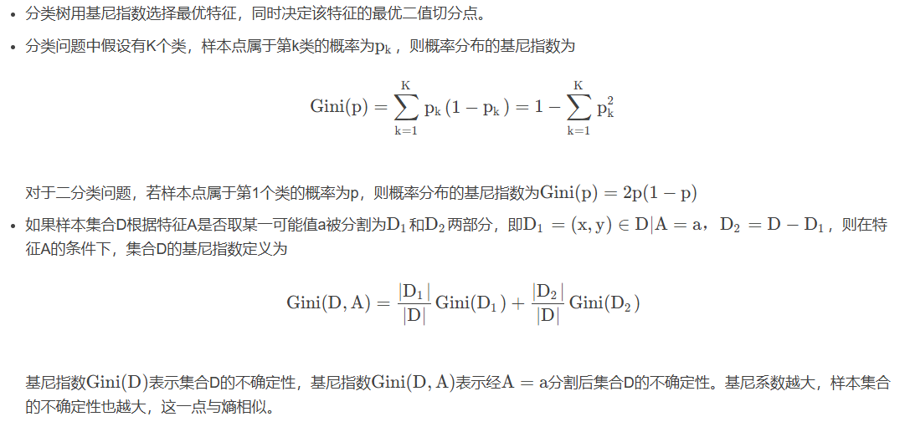

### 求解步骤：

1. 根据数据分别列出**类别**和**特征**
2. 按照特征分别求出数据集D的`基尼系数`，对于一个特征，若只有两种特征值，则只用计算一个基尼系数，若大于一个，则计算所有特征值的基尼系数，选用最小的那一个作为`最优切分点`，若有相等则都为最优切分点。
3. 比较所有特征的最优切分点，最小的那个为最优特征，对应的点为最优切分点。
4. 根据计算结果生成决策树。

### 实例：

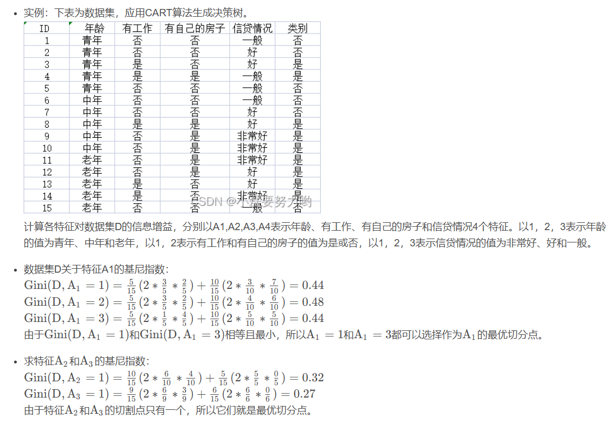

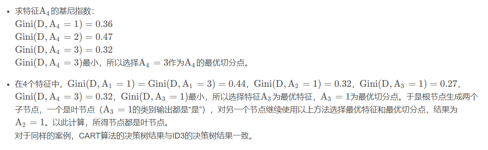

## 决策树剪枝方法

从决策树的构造流程中我们可以直观地看出：不管怎么样的训练集，决策树总是能很好地将各个类别分离开来，这时就会遇到之前提到过的问题：过拟合（overfitting），即太依赖于训练样本。剪枝（pruning）则是决策树算法对付过拟合的主要手段，剪枝的策略有两种如下：

```
* 预剪枝（prepruning）：在构造的过程中先评估，再考虑是否分支。  
* 后剪枝（post-pruning）：在构造好一颗完整的决策树后，自底向上，评估分支的必要性。 
```

### 预剪枝的优缺点

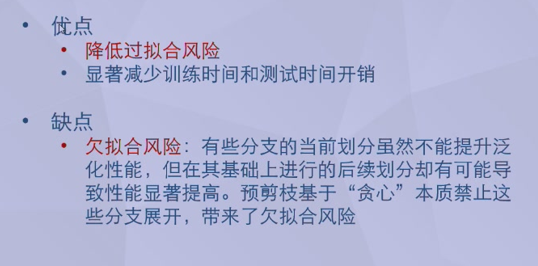

### 后剪枝的优缺点


## 处理连续值和缺失值的方法

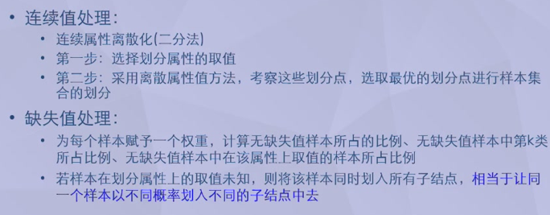

## 多变量决策树


# 神经网络

## 基本结构

​		一直沿用至今的“M-P神经元模型”正是对这一结构进行了抽象，也称“阈值逻辑单元“，其中树突对应于输入部分，每个神经元收到n个其他神经元传递过来的输入信号，这些信号通过带权重的连接传递给细胞体，这些权重又称为连接权（connection weight）。细胞体分为两部分，前一部分计算总输入值（即输入信号的加权和，或者说累积电平），后一部分先计算总输入值与该神经元阈值的差值，然后通过激活函数（activation function）的处理，产生输出从轴突传送给其它神经元。M-P神经元模型如下图所示：

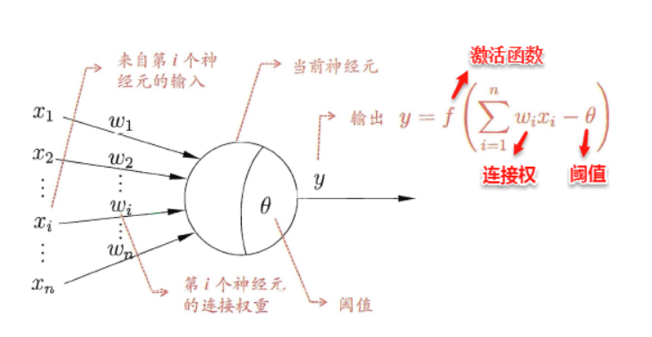

## 误差逆传播算法（BP）

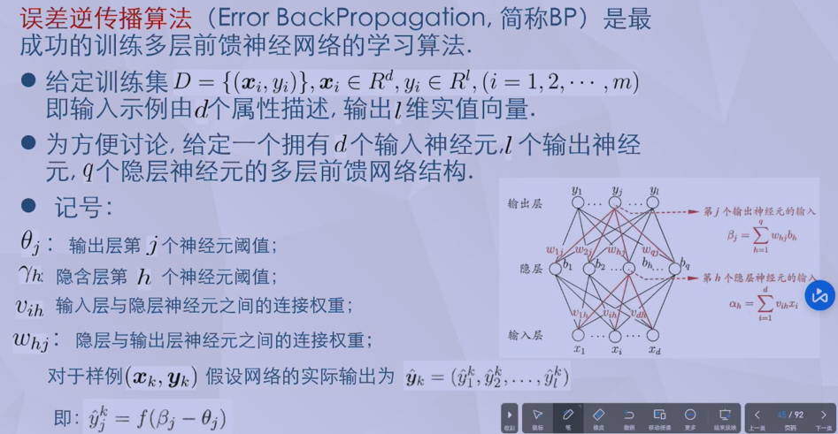

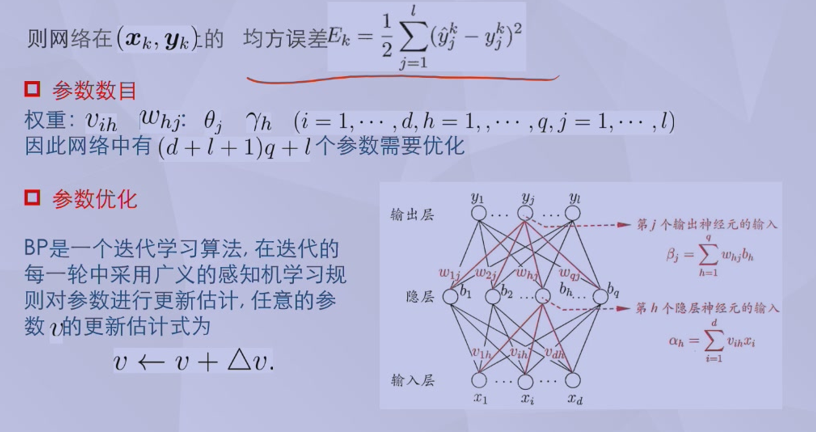


## 全局极小和局部极小

模型学习的过程实质上就是一个寻找最优参数的过程，例如BP算法试图通过最速下降来寻找使得累积经验误差最小的权值与阈值，在谈到最优时，一般会提到局部极小（local minimum）和全局最小（global minimum）。

```
* 局部极小解：参数空间中的某个点，其邻域点的误差函数值均不小于该点的误差函数值。  
* 全局最小解：参数空间中的某个点，所有其他点的误差函数值均不小于该点的误差函数值。  
```

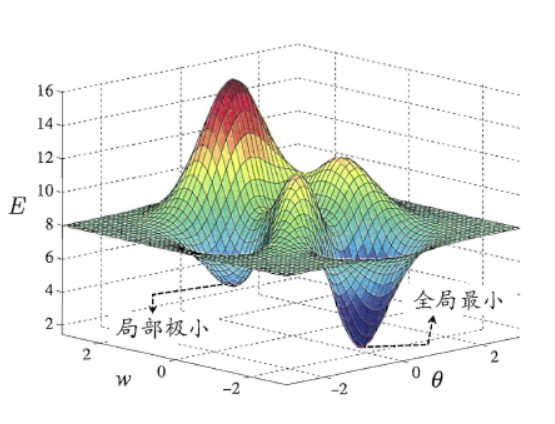

​		要成为局部极小点，只要满足该点在参数空间中的梯度为零。局部极小可以有多个，而全局最小只有一个。全局最小一定是局部极小，但局部最小却不一定是全局最小。


## sigmoid函数


## 深度学习-特征工程

​		特征工程是数据分析中最耗时间和精力的一部分工作。数据和特征决定了机器学习的上限，而模型和算法则是逼近这个上限。因此，特征工程就变得尤为重要了。特征工程的主要工作就是对特征的处理，包括数据的采集，**数据预处理**，特征选择，甚至降维技术等跟特征有关的工作。

### 特征工程的意义

（1）特征工程是将原始数据转化为特征，能更好表示预测模型处理的实际问题，提升对于未知数据预测的准确性。

（2）更好的特征意味着更强的灵活度、更好的特征意味着只需要用简单模型、更好的特征意味着更好的结果。

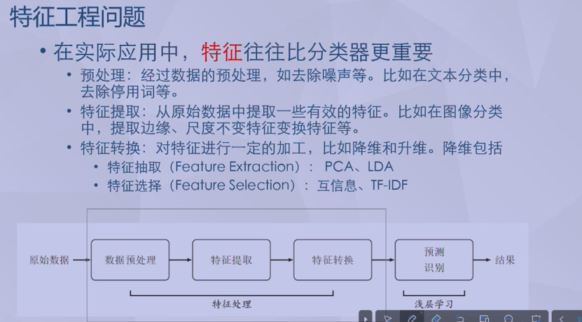


------


# 支持向量机(SVM)

​		支持向量机是一种经典的二分类模型，基本模型定义为特征空间中最大间隔的线性分类器，其学习的优化目标便是间隔最大化，因此支持向量机本身可以转化为一个凸二次规划求解的问题。

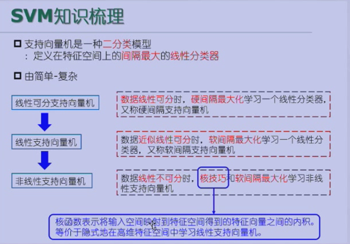

​		根据数据的可分性，选择不同的向量机。

- 数据线性可分---->硬间隔最大化----->线性可分支持向量机
- 数据近似线性可分---->软间隔最大化----->线性支持向量机
- 数据线性不可分----->核技巧和软间隔最大化----->非线性支持向量机

## 支持向量机的基本原理

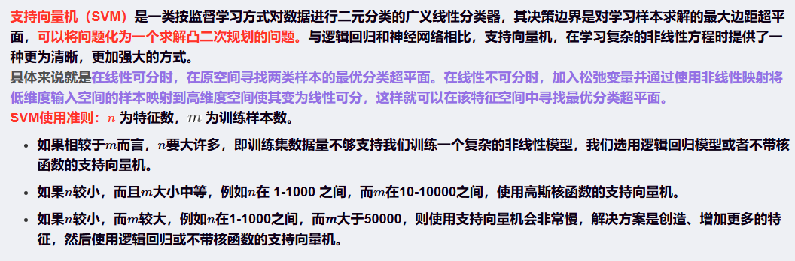

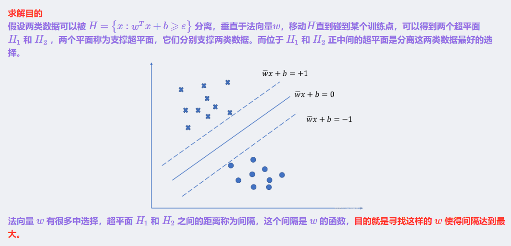

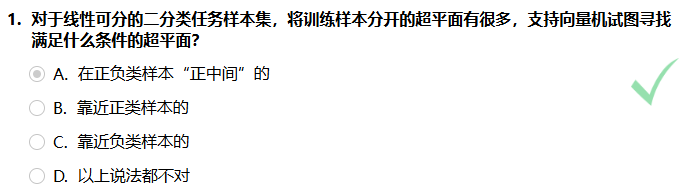

## 支持向量机优化问题的求解


## 软间隔

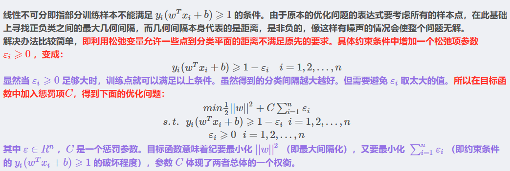

## 正则化

在这里，正则化就是说给`损失函数`加上一些限制，通过这种规则去规范他们再接下来的循环迭代中，不要自我膨胀。

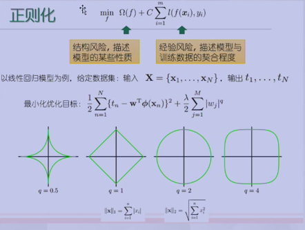


## 支持向量回归(SVR)

​		支持向量机回归的核心原理是通过最小化预测误差来拟合数据，并且在拟合过程中保持一个边界（间隔），使得大部分数据点都落在这个边界之内。SVR与分类问题中的支持向量机（SVM）有些相似，但其目标是`拟合数据`而不是`分离数据`。

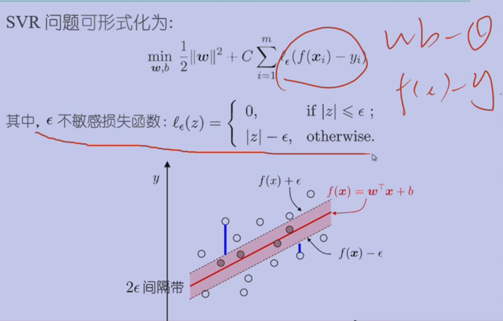

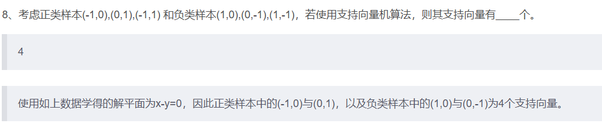

​		支持向量回归的根本是认为“宽带”内样本观测点的变动是微小可忽略的，此“宽带”被称为ε-带

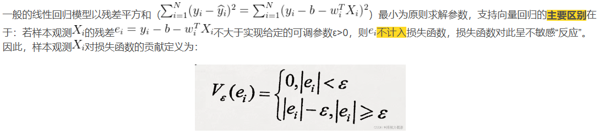

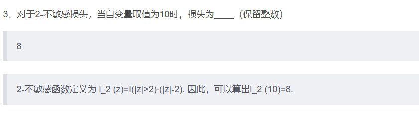

## 核方法

​		需要通过一个函数将原始数据映射到高维空间，从而使得数据在高维空间很容易区分，这样就达到数据分类或回归的目的，而实现这一目标的函数称为**核函数**。

### 工作原理：

​		当低维空间内线性不可分时，可以通过高位空间实现线性可分。但如果在高维空间内直接进行分类或回归时，则存在确定非线性映射函数的形式和参数问题，而最大的障碍就是高维空间的运算困难且结果不理想。通过核函数的方法，可以将高维空间内的点积运算，巧妙转化为低维输入空间内核函数的运算，从而有效解决这一问题。

### 常见的核函数：

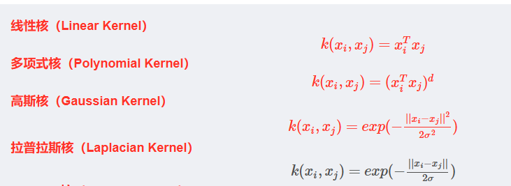


------


# 贝叶斯分类器

## 贝叶斯决策论和极大似然估计的数学原理

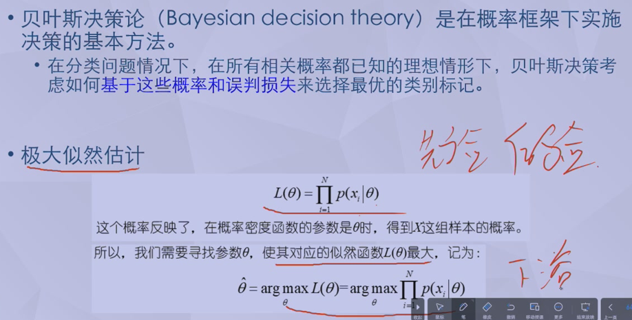

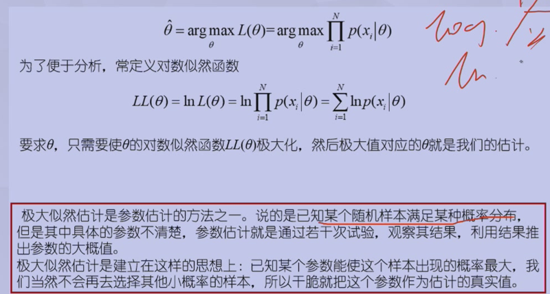

## 朴素贝叶斯分类器的原理和计算

​		朴素贝叶斯方法是基于贝叶斯定理的一组有监督学习算法，即“简单”地假设每对特征之间相互独立。 给定一个类别 y 和一个从 x_1 到 x_n 的相关的特征向量， 贝叶斯定理阐述了以下关系:

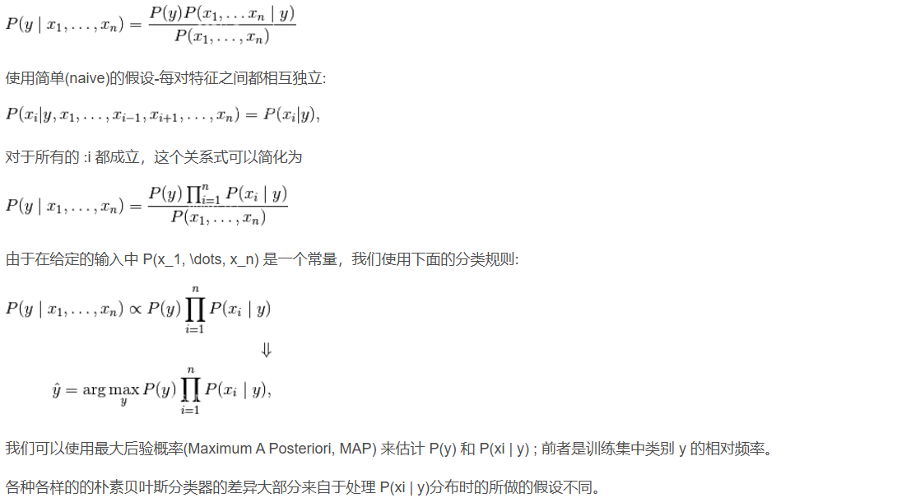

### 实例：

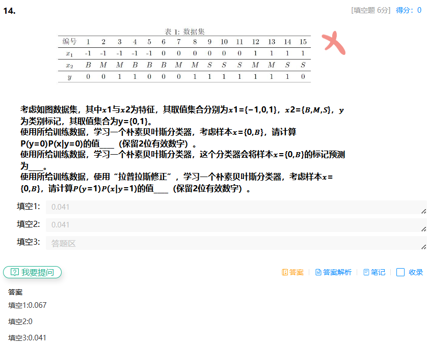

## 拉普拉斯修正 

​		需要注意的是，若某个属性值在训练集中没有与某个类同时出现过，则直接基于下式进行会直接使得样本判断为该类别的概率为0

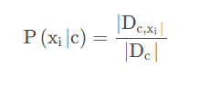

​		这显然不合理。为避免其它属性携带的信息被训练集中未出现的属性值“抹去”，在估计概率值是可以使用**拉普拉斯修正**进行平滑，其具体做法为：


1. 根据数据表判别属性与类别
2. 用拉普拉斯修正后的公式计算类别的先验概率P(c)，分子加一，分母加类别总数。
3. 计算每个属性的条件概率
4. 根据要预测的样本的属性进行概率相乘，正向用正类的先验概率和条件概率相乘，反向用反类的条件概型相乘。
5. 比较乘积，大的那一个为预测结果，乘积为概率

### 示例：

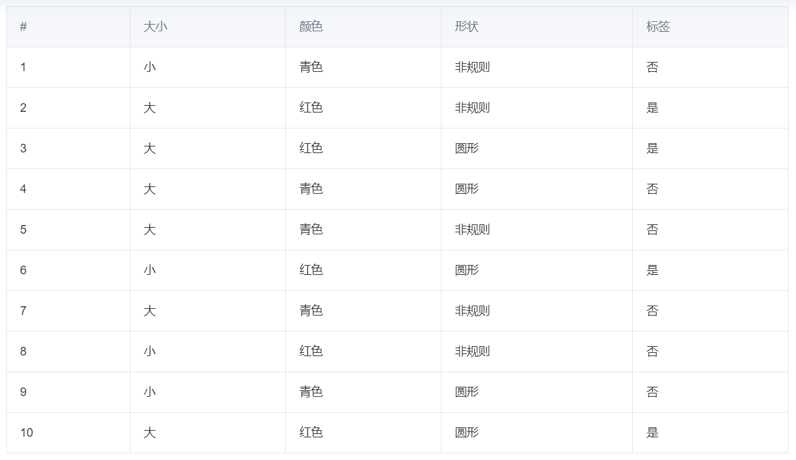

​		**测试集上要预测的某个样本如下：**

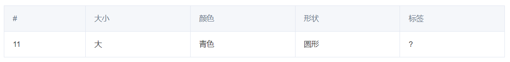

​		**请利用拉普拉斯修正法，判断其属于____（好果还是坏果），其中是好果的概率 ____（保留三位小数）。**

用拉普拉斯修正后的公式计算，先验概率 P(c) ，

P(c = 好果）=  (4+1) / (10+2) = 5/12

P(c = 坏果) = (6+1) / (10+2) = 7/12

每个属性的类条件概率：（大小、颜色、形状都有两种可能取值，Ni=2）（分子加一，分母有多少种加多少种）

P(大小=大 | c=好果) =   (3+1)/(4+2) = 4/6

P(颜色=青色 | c=好果) = (0+1）/(4+2) = 1/6

P(形状=圆形 | c=好果) = (3+1) / (4+2) = 4/6


P(大小=大 | c=坏果) =  (3+1) /( 6+2) = 4/8

P(颜色=青色 | c=坏果) = (5+1)/(6+2) = 6/8

P(形状=圆形 | c=坏果) =  (2+1)/(6+2) = 3/8


因此：

P(c=好果） * P(大小=大 | c=好果) * P(颜色=青色 | c=好果) * P(形状=圆形 | c=好果)

= 5/12 * 4/6 * 1/6 * 4/6

= 0.031

P(c=坏果） * P(大小=大 | c=坏果) * P(颜色=青色 | c=坏果) * P(形状=圆形 | c=坏果)

= 7/12 * 4/8 * 6/8 * 3/8

= 0.082

## 贝叶斯网络和EM算法的实现

最大期望算法（Expectation-maximization algorithm，又译为期望最大化算法），是在概率模型中寻找参数最大似然估计或者最大后验估计的算法，其中概率模型依赖于无法观测的隐性变量。

最大期望算法经过两个步骤交替进行计算

1. 第一步是计算期望（E），利用对隐藏变量的现有估计值，计算其最大似然估计值；
2. 第二步是最大化（M），最大化在E步上求得的最大似然值来计算参数的值。M步上找到的参数估计值被用于下一个E步计算中，这个过程不断交替进行。      

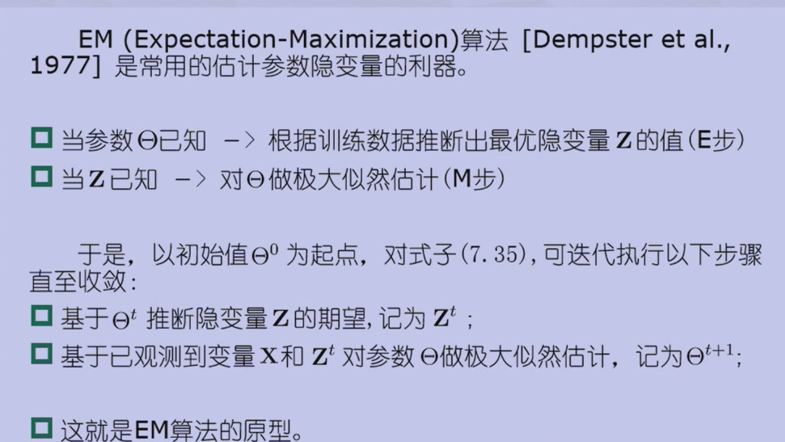


------


# 集成学习

## 通过集成学习提升学习器泛化性能的基本原理

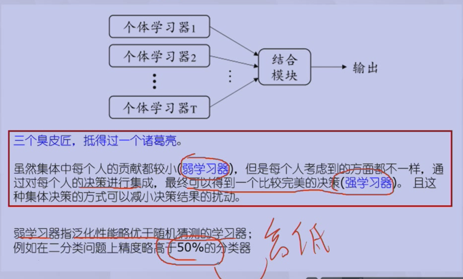

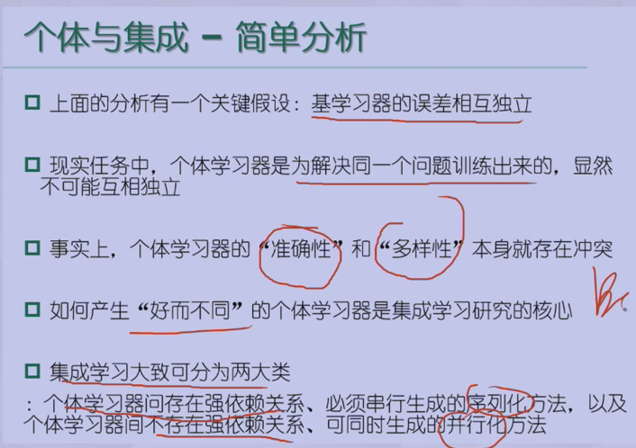

## Boosting、Bagging与随机森林

​	对于如何得到若干个个体学习器，这里有两种选择。

​	第一种是所有的个体学习器都是一个种类的，或者说是同质的。比如都是决策树个体学习器，或者都是神经网络个体学习器。比如bagging和boosting系列。

​	第二种是所有的个体学习器不全是一个种类的，或者说是异质的。比如我们有一个分类问题，对训练集采用支持向量机个体学习器，逻辑回归个体学习器和朴素贝叶斯个体学习器来学习，再通过某种结合策略来确定最终的分类强学习器。这种集成学习成为Stacking。

**同质个体学习器**按照个体学习器之间**是否存在依赖关系**可以分为两类。

​	第一种是个体学习器之间**存在强依赖关系**，一系列个体学习器基本都需要串行生成，代表算法是Boosting系列算法。

​	第二种是个体学习器之间**不存在强依赖关系**，一系列个体学习器可以并行生成，代表算法是Bagging系列算法

### Bagging

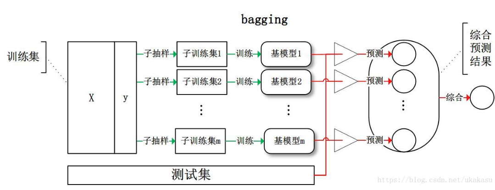

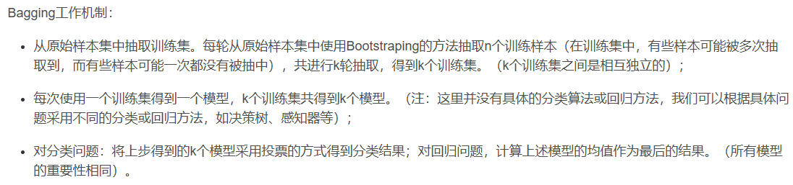

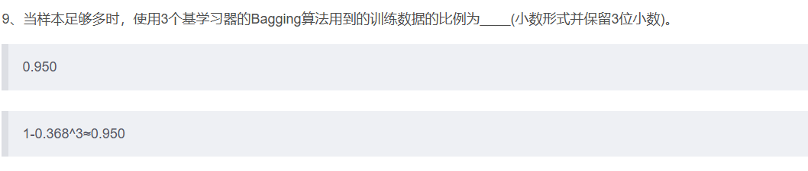

### boosting

Boosting(提升算法，从弱学习器开始加强，通过加权来进行训练)：训练过程为阶梯状，基模型按次序一一进行训练（实现上可以做到并行），基模型的训练集按照某种策略每次都进行一定的转化。如果某一个数据在这次分错了，那么在下一次我就会给它更大的权重。对所有基模型预测的结果进行线性综合产生最终的预测结果：

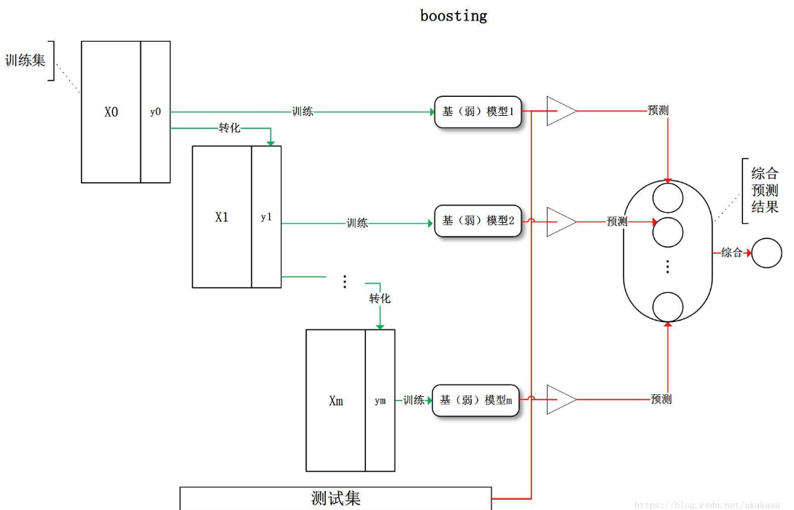


### 随机森林

Bagging架构最著名的算法就属随机森林了，随机森林是Bagging+决策树构成的，也就是我们每个基学习器使用cart决策树，根据上面所述，为了提高模型的泛化能力，我们要根据原始数据构造n棵不同的决策树

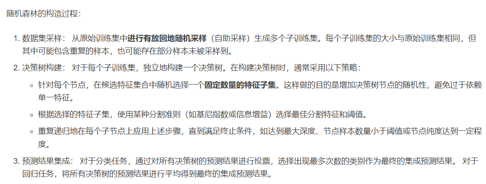

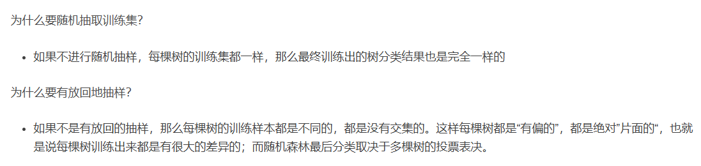

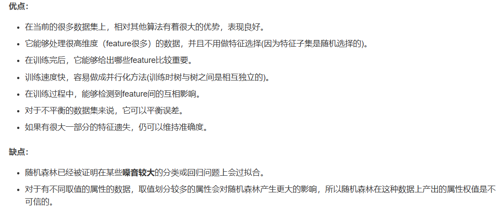

## 集成学习的经典结合策略：平均法、投票学习法；

### 平均法和投票法

**平均法**：简单平均、加权平均
适用范围：
规模大的集成，学习的权重较多，加权平均法易导致过拟合
个体学习器性能相差较大时宜使用加权平均法，相近用简单平均法。

**投票法**：
1.绝对多数投票法：某标记超过半数；
2.相对多数投票法：预测为得票最多的标记，若同时有多个标记的票最高，则从中随机选取一个。
3.加权投票法：**提供了预测结果**，与加权平均法类似。

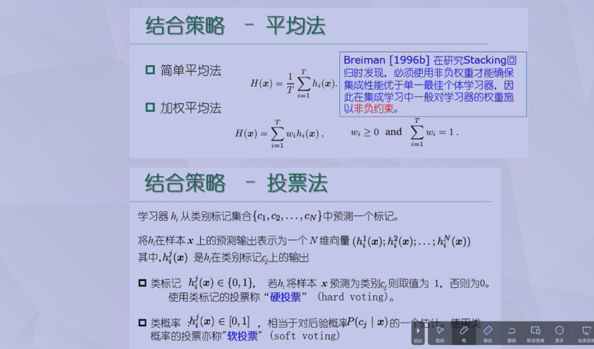

​	硬投票法只关注最终的类别预测结果，而软投票法则考虑了各个类别的概率信息，并通过平均概率来进行决策。通常情况下，软投票法比硬投票法更为灵活，因为它能够利用更多的信息进行预测。

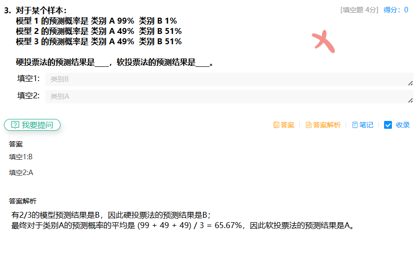

### 学习法

​		Stacking算法是一种集成学习方法，它使用多个不同的基学习器对数据进行预测，然后将预测结果作为新的特征输入到一个元学习器中，从而得到最终的分类或回归结果。Stacking算法可以利用不同的基学习器的优势，提高泛化性能，也可以使用交叉验证或留一法来防止过拟合。

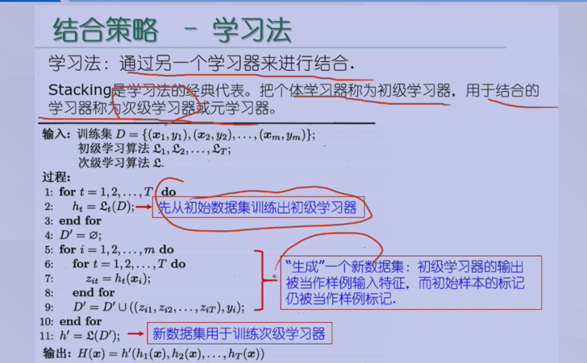

## 学习性能的多样性指标(了解内涵)


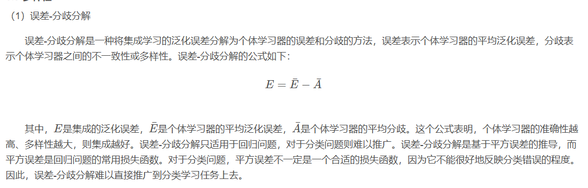

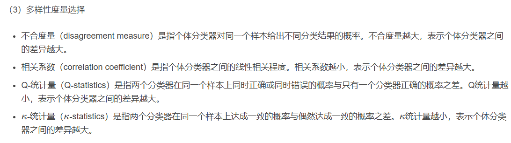

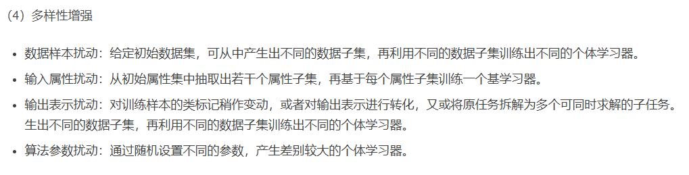

# 聚类

## 1.聚类的基本概念

​		聚类(Clustering)是按照某个特定标准(如距离)把一个数据集分割成不同的类或簇，使得同一个簇内的数据对象的相似性尽可能大，同时不在同一个簇中的数据对象的差异性也尽可能地大。也即聚类后同一类的数据尽可能聚集到一起，不同类数据尽量分离。

## 2.聚类和分类的区别

​		`聚类(Clustering)`：是指把相似的数据划分到一起，具体划分的时候并不关心这一类的标签，目标就是把相似的数据聚合到一起，**聚类是一种无监督学习(Unsupervised Learning)方法**。

​		`分类(Classification)`：是把不同的数据划分开，其过程是通过训练数据集获得一个分类器，再通过分类器去预测未知数据，**分类是一种监督学习(Supervised Learning)方法**。

## 性能度量指标

### 1.外部指标（专家、外部给出）

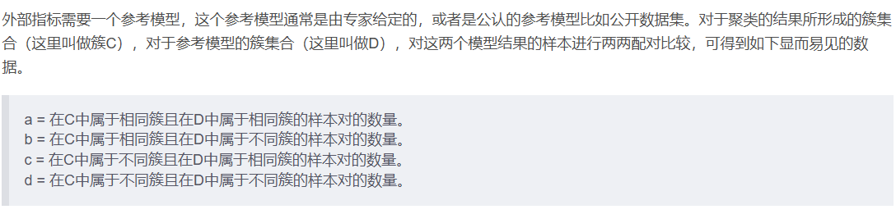

### 2.内部指标

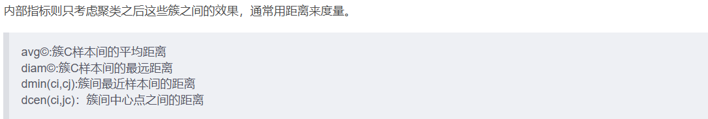


## 掌握度量距离的指标


## 掌握原型聚类算法

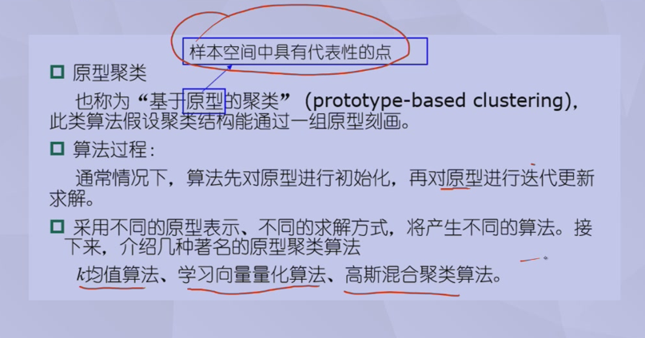


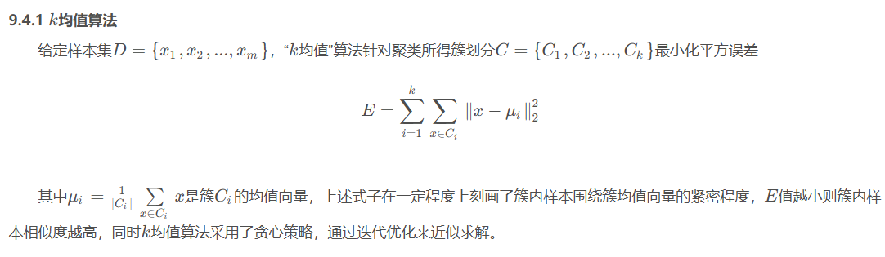

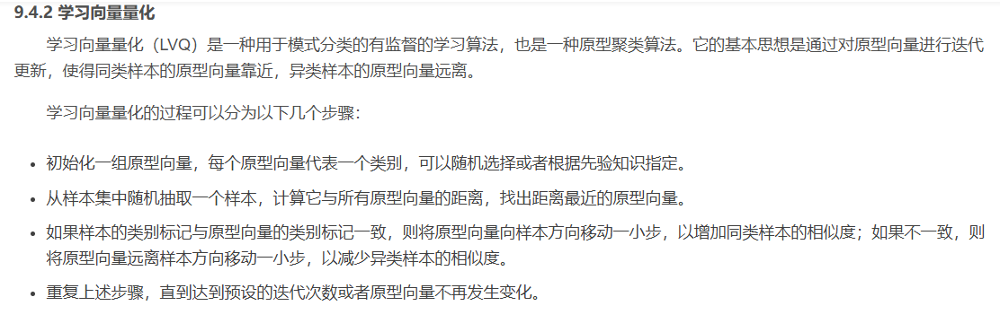

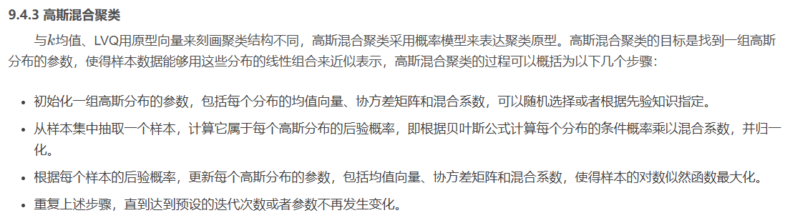

## 理解密度聚类和层次聚类算法

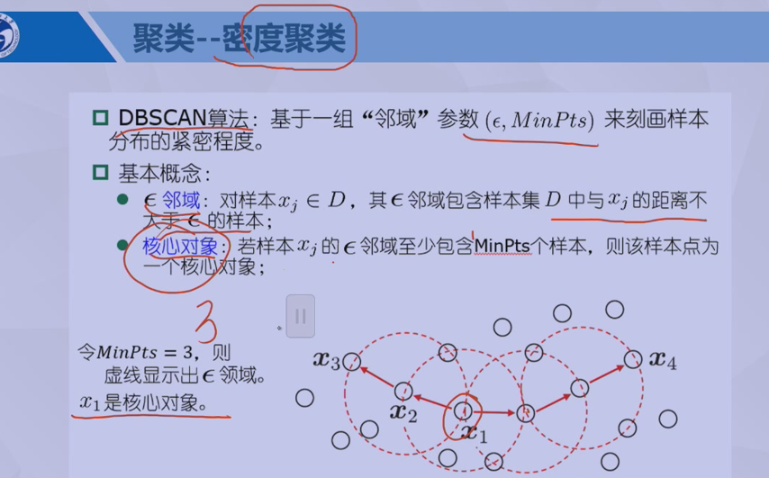

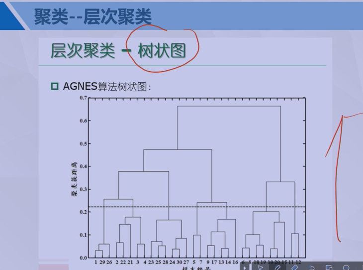


# 机器学习前沿

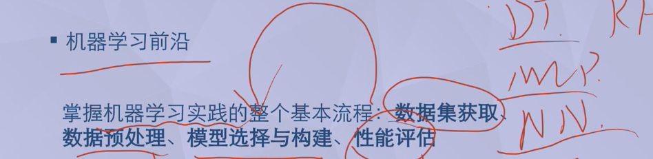


1.定义问题
确定你要解决的问题是什么。例如，分类、回归、聚类、推荐等。
定义你的目标变量和特征变量。

2.数据收集
收集与问题相关的数据。
确保数据的质量和完整性。
考虑数据的多样性、偏差和噪声。

3.数据预处理
数据清洗：处理缺失值、异常值、重复值等。
特征工程：提取有意义的特征，可能包括数值化、标准化、归一化、编码分类变量等。
数据拆分：通常将数据分为训练集、验证集和测试集。

4.选择模型
根据问题的性质选择合适的机器学习算法。
考虑模型的复杂性、可解释性、计算效率和准确性。

5.模型训练
使用训练数据来训练选择的模型。
调整模型的超参数以优化性能。

6.模型评估
使用验证集来评估模型的性能。
计算准确率、召回率、F1分数、AUC-ROC、均方误差等指标。
进行交叉验证以获取更稳健的性能估计。

7.模型优化
根据评估结果调整模型的参数和超参数。
尝试不同的模型或集成方法。
使用特征选择技术来减少特征数量。

8.模型部署
将训练好的模型部署到生产环境。
监控模型的性能，并定期重新训练和更新模型。

9.持续迭代
随着时间的推移和数据的积累，重复上述步骤来改进模型。
考虑使用自动化机器学习(AutoML)工具来简化流程。

------

# 考点猜测

假设空间的计算

过拟合和欠拟合的定义，如何解决过拟合

监督学习的三种方法

常用的性能度量：错误率、精度、查准率、查全率、F1值

比较检验中不同检验方式的区别

多分类问题的处理方法：一对多，一对其余，多对多

类别不平衡如何进行处理

构建决策树的过程

根据数据表使用ID3 C4.5 CART构建决策树

两种决策树裁剪方式的优缺点

BP算法的计算--参数个数的计算

三种向量机的区分

朴素贝叶斯的拉普拉斯修正

EM网络的实现步骤

Boosting和bagging的区别

