# 《强化学习的数学原理》 西湖大学 赵世钰

## Chapter 1 基本概念（8.7）

### A grid-world example

### State:

​	The status of the agent with respect to the environment.

​	$S_1,S_2,...,S_9$代表九个不同的State.

**State space**：the set of all states.

### Action:

​	For each state, there are five possible actions: $a_1,a_2,...,a_5$

- $a_1$：move upwards;
- $a_2$：move rightwards;
- $a_3$：move downwards;
- $a_4$：move leftwards;
- $a_5$：stay unchanged;

Action space of a state ：the set of all possible actions of a state.

### State transition:

When taking an action, the agent may move from one state to another. Such a process is called state transition.

​	             e.g:   $$S_1\stackrel{a_2}{\longrightarrow}S_2$$

​	**Forbidden area**: At state $s_5$,if we choose action 2 ,then 

​		Case 1 :the forbidden area is accessible but with penalty. move to $s_6$

​		Case 2: the forbidden area is inaccessible .Stay at $s_5$

​	Case 1 is more normal.

​	**State transition probability:** use probability to describe state transition

​	Intuition: At state $s_1$，if we choose action $a_2$,the next state is $s_2$.

​	Math: 

### Policy:

Tells the agent what actions to take at a state.

​	Mathematical representation: using conditional probability

​	For example ,for state $s_1$

​	It is a deterministic(确定性的) policy.

There are stochastic policies.

​	For example :

​	In this policy ,for $s_1$:

### Reward:

A real number we get after taking an action.

- A positive reward represents encouragement to take such actions.
- A negative reward  represents punishment to take such actions. 
- zero reward means no punishment, positive can also means punishment.

In the grid-world example , the rewards are designed as follows:

- If the agent attempts to get out of the boundary , let $r_{bound}=-1$.
- If the agent attempts to enter a forbidden cell，let $r_{forbid}=-1$.
- If the agent reaches the target cell, let $r_{target}= +1$ .
- Otherwise, the agent obtains a reward of $ r_{other}$ = 0.

Tabular representation:

notice: The reward depends on the state and action，but not the next state.

### Trajectory:

​	A *trajectory* is a state-action-reward chain.

​                                                        （a)    $$S_1\xrightarrow[r=0]{a_2}S_2\xrightarrow[r=0]{a_3}S_5\xrightarrow[r=0]{a_2}S_8\xrightarrow[r=1]{a_2}S_9$$

​														  (b)    $$S_1\xrightarrow[r=0]{a_3}S_4\xrightarrow[r=-1]{a_3}S_7\xrightarrow[r=0]{a_2}S_8\xrightarrow[r=1]{a_2}S_9$$

​															

### Return:

​	The return of this trajectory is defined as the sum of all rewards collected along the trajectory:

​		(a)return=0+0+0+1=1

​		(b)return=0-1+0+1=0

​	return could be used to evaluate whether a policy is good or not .

### Discounted return:

​	If the return is defined for a finite-length trajectory. Return can also be defined for infinitely long trajectories.

​	Then we introduce the discounted return concept for infinitely long trajectories. In particular, the discounted return is the sum of the discounted rewards:

​	                              		$$discounted return =0+\gamma0+\gamma^20+\gamma^31+\gamma^41+\gamma^51+...,=\gamma^3\frac{1}{1-\gamma}$$

​	where$\gamma\in(0,1)$is called the discount rate.

​	roles: 1)the sum becomes finite; 2)balance the far and near future rewards; 

- If $\gamma$ is close to 0 ,the value of the discounted return is dominated by the rewards obtained in the near future.
- If $\gamma$ is close to 1,the value of the discounted return is  dominated by the rewards obtained in the far future.

### Episode:

​	When interacting with the environment following a policy, the agent may stop at some **terminal states**. The resulting trajectory is called an **episode**.

​	An episode is usually assumed to be a **finite** trajectory. Tasks with episodes are called episodic tasks. Some tasks may have no terminal states, meaning the interaction with the environment will never end. Such tasks are called **continuing tasks**.

### Markov decision process (MDP)

Key elements of MDP:

- **Sets:**

  - State: the set of all states, denoted as *S*.
  - Action: a set of actions, denoted as *A*(*s*), associated with each state *s* *∈ S*.
  - Reward:   a set of rewards, denoted as *R*(*s, a*), associated with each state-action pair

- Probability distribution:

  - **State transition probability**: In state *s*, when taking action *a*, the probability of transitioning to state *s*’ is *p*(*s*‘ *|*s, a). It holds that $\sum_{s‘∈S} p(s’|s, a) = 1$ for any (s, a).
  - **Reward probability**: In state *s*, when taking action *a*, the probability of obtaining reward *r* is *p*(*r**|**s, a*). It holds that $\sum_{r∈R(s,a)}p(r|s,a) = 1$ for any (*s, a*).

- **Policy**:  In state *s*, the probability of choosing action *a* is *π*(*a**|**s*). It holds that $\sum_{a∈A(s)}π(a|s) = 1$ for any *s* *∈ S*.

- **Markov property**: memoryless property

  The *Markov property* refers to the memoryless property of a stochastic process. Mathematically, it means that
  $$
  p(s_{t+1}|s_t,a_t,s_{t-1},a_{t-1},...,s_0,a_0)=p(s_{t+1}|s_t,a_t)\\
  p(r_{t+1}|s_t,a_t,s_{t-1},a_{t-1},...,s_0,a_0)=p(r_{t+1}|s_t,a_t)
  $$
  

## Chapter 2: Bellman Equation

### Motivating examples 1: Why return is important?

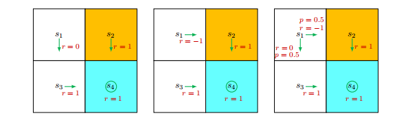

Q: Which policy is the best?

Intuition:The first is the best and the second is the worst, because of the forbidden area.

Q: Can we use mathmatics to describe such an intuition?

Answer: **Return** could be used to evaluate policies

Based on policy 1
$$
return_1 = 0 + γ1 + γ^2
1 + . . .= γ(1 + γ + γ
2 + . . .)=
\frac{γ}
{1 − γ}
,
$$
Based on policy 2
$$
return_2 = −1 + γ1 + γ
^2
1 + . . .
= −1 + γ(1 + γ + γ
^2 + . . .)
= −1 +
\frac{γ}
{1 − γ}
.
$$
Based on policy 3
$$
return_3 = 0.5
(−1 +
\frac{γ}{1-γ})
+ 0.5(\frac{γ}{1−γ})
= −0.5 +
\frac{γ}
{1 − γ}
$$

### Motivating examples 2 : How to calculate returns ?

Let $v_i$denote the return obtained starting from $$s_i(i=1,2,3,4)$$

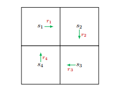

Method 1: by definition

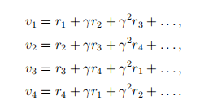

Method 2:

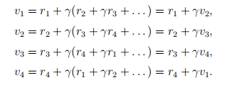

The return rely on each other Bootstrapping.

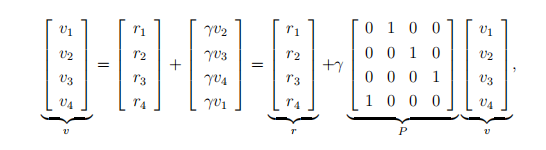

which can be written compactly as
$$
v=r+\gamma Pv\\
v=(I-\gamma P)^{-1}
$$
The value of one state relies on the values of other states. 

### State value

Consider the following multi-step trajectory:
$$
S_{t} \xrightarrow{A_{t}} S_{t+1}, R_{t+1} \xrightarrow{A_{t+1}} S_{t+2}, R_{t+2} \xrightarrow{A_{t+2}} S_{t+3}, R_{t+3} \ldots
$$
The discounted return is 
$$
G_t=R_{t+1}+\gamma R_{t+2}+\gamma^2R_{t+3}+...
$$
The **expectation** of $G_t$ is defined as the state-value function or simply state value:
$$
v_\pi(s)=E[G_t|S_t=s]
$$

- $v_π(s)$ depends on *s*. This is because its definition is a conditional expectation with the condition that the agent starts from$S_t$ = *s*.
- $v_π(s)$ depends on *π*. This is because the trajectories are generated by following the policy *π*. For a different policy, the state value may be different.
- $v_π(s)$ does not depend on *t*. If the agent moves in the state space, *t* represents the current time step. The value of $v_π(s)$ is determined once the policy is given.

### Bellman equation: Derivation

$G_t$ can be rewritten as 
$$
G_t=R_{t+1}+\gamma R_{t+2}+\gamma^2R_{t+3}+...=R_{t+1}+\gamma G_{t+1}
$$

The first term,$\mathbb{E}\left[G_{t} \mid S_{t}=s\right]$ is the expectation of the immediate rewards.
$$
\begin{aligned}
v_{\pi}(s) & =\mathbb{E}\left[G_{t} \mid S_{t}=s\right] \\
& =\mathbb{E}\left[R_{t+1}+\gamma G_{t+1} \mid S_{t}=s\right] \\
& =\mathbb{E}\left[R_{t+1} \mid S_{t}=s\right]+\gamma \mathbb{E}\left[G_{t+1} \mid S_{t}=s\right] .
\end{aligned}
$$
The second term,$\mathbb{E}\left[G_{t+1} \mid S_{t}=s\right]$ is the expectation of the future rewards.
$$
\begin{align*}
\mathbb{E}[G_{t+1} \mid S_t = s] &= \sum_{s' \in \mathcal{S}} \mathbb{E}[G_{t+1} \mid S_t = s, S_{t+1} = s'] p(s' \mid s) \\
&= \sum_{s' \in \mathcal{S}} \mathbb{E}[G_{t+1} \mid S_{t+1} = s'] p(s' \mid s) \quad \text{(due to the Markov property)} \\
&= \sum_{s' \in \mathcal{S}} v_{\pi}(s') p(s' \mid s) \\
&= \sum_{s' \in \mathcal{S}} v_{\pi}(s') \sum_{a \in \mathcal{A}} p(s' \mid s, a) \pi(a \mid s).
\end{align*}
$$
Substituting(2.5)-(2.6) into(2.4) yields
$$
\begin{align*}
v_{\pi}(s) &= \mathbb{E}[R_{t+1} \mid S_t = s] + \gamma \mathbb{E}[G_{t+1} \mid S_t = s] \\
&= \underbrace{\sum_{a \in \mathcal{A}} \pi(a \mid s) \sum_{r \in \mathcal{R}} p(r \mid s, a) r}_{\text{mean of immediate rewards}} + \gamma \underbrace{\sum_{a \in \mathcal{A}} \pi(a \mid s) \sum_{s' \in \mathcal{S}} p(s' \mid s, a) v_{\pi}(s')}_{\text{mean of future rewards}} \\
&= \sum_{a \in \mathcal{A}} \pi(a \mid s) \left[ \sum_{r \in \mathcal{R}} p(r \mid s, a) r + \gamma \sum_{s' \in \mathcal{S}} p(s' \mid s, a) v_{\pi}(s') \right], \quad \text{for all } s \in \mathcal{S}.
\end{align*}
$$

- The above equation is called the Bellman equation ,which characterizes the relationship among the state-value functions of different states.
- It consists of two terms: the immediate reward term and the future reward term.
- A set of equations: every state has an equation like this!!

Some symbols in this equation

- $v_\pi(s)$ and $v_\pi(s’)$  are state values to be calculated.Bootstrapping !
- $\pi(a|s)$ is a given policy . Solving the euqation is called policy evaluation.
- $p(r|s,a)$ and $p(s'|s, a)$ represent the dynamic model .The model can be known or unknown.

#### An illustracive example

chapter 2.5 example for illustating the Bellman equation

### Bellman equation: Matrix-vector form

To derive the matrix-vector form, we first rewrite the Bellman equation in (2.7) as
$$
v_{\pi}(s) = r_{\pi}(s) + \gamma \sum_{s' \in \mathcal{S}} p_{\pi}(s' \mid s) v_{\pi}(s')
$$
where $r_\pi(s)$ denotes the mean of the immediate rewards, and $p_\pi(s’|s)$ is the probability of transision from $s$ to $s’$ 
$$
\begin{align*}
r_{\pi}(s) &\triangleq \sum_{a \in \mathcal{A}} \pi(a \mid s) \sum_{r \in \mathcal{R}} p(r \mid s, a) r, \\
p_{\pi}(s' \mid s) &\triangleq \sum_{a \in \mathcal{A}} \pi(a \mid s) p(s' \mid s, a).
\end{align*}
$$
Suppose that the states are indexed as $s_i$ with *i* = 1*, . . . , n*, where $n = |S|$. For state $s_i$ , (2.8) can be written as
$$
v_{\pi}(s_i) = r_{\pi}(s_i) + \gamma \sum_{s_j \in \mathcal{S}} p_{\pi}(s_j \mid s_i) v_{\pi}(s_j)
$$
Put all these equations for all the states together and rewrite to a matrix-vector form
$$
v_\pi=r_\pi+\gamma P_{\pi}v_\pi
$$
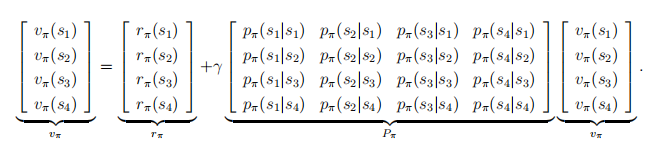

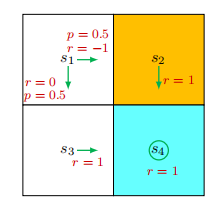

Substituting the specific values into the above equation gives

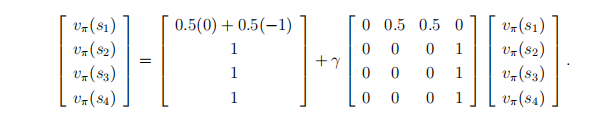

### Bellman equation: Solve the state values

**Why to solve state values?**

- Given a policy ,finding out the corresponding state values is called ***policy evaluation***. It is a fundamental problem in RL .It is the foundation to find better policies.
- It is important to understand how to solve the Bellman equation.

The Bellman equation in matrix-vector form is 
$$
v_\pi=r_\pi+\gamma P_{\pi}v_\pi
$$

- The closed-form solution is :

$$
v_\pi =(I-\gamma P_\pi)^{-1}r_\pi
$$

- An iterative solution is :

$$
v_{k+1}=r_\pi+\gamma P_\pi v_k \quad k=0,1,2,..
$$

#### Illustrative example

chapter 2.7.3

### Action value

- State value : the average return the agent can get starting from a state.
- Action value: the average return the agent can get starting from a state and **taking an action**.

Why do we care action value ?

Because we want to know which action is better . This point will be clearer in the following lectures.

Definition :
$$
q_\pi(s,a)=\mathbb E[G_t|S_t=s,A_t=a]
$$

- $q_\pi(s,a)$ is a function of the state-action pair $(s,a)$
- $q_\pi(s,a)$ depends on $\pi$

it follows from the properties of conditional expectation that
$$
\underbrace{\mathbb{E}[G_t \mid S_t = s]}_{v_{\pi}(s)} = \sum_{a \in \mathcal{A}} \underbrace{\mathbb{E}[G_t \mid S_t = s, A_t = a]}_{q_{\pi}(s, a)} \pi(a \mid s)
$$
Hence, 
$$
v_{\pi}(s) = \sum_{a \in \mathcal{A}} \pi(a \mid s) q_{\pi}(s, a)\tag{2.13}
$$
Recall that the state value is given by 
$$
v_{\pi}(s) = \sum_{a \in \mathcal{A}} \pi(a \mid s) \left[ \sum_{r \in \mathcal{R}} p(r \mid s, a) r + \gamma \sum_{s' \in \mathcal{S}} p(s' \mid s, a) v_{\pi}(s') \right] \tag{2.14}
$$
comparing it with (2.13) leads to
$$
q_{\pi}(s, a) = \sum_{r \in \mathcal{R}} p(r \mid s, a) r + \gamma \sum_{s' \in \mathcal{S}} p(s' \mid s, a) v_{\pi}(s') \tag{2.15}
$$
(2.14) and (2.15) are the two sides of the same coin :

- (2.14) shows how to obtain state values from action values.
- (2.15) shows how to obtain action values from state values.

### Summary

Key concepts and results :

- State value : $v_{\pi}(s) =\mathbb{E}\left[G_{t} \mid S_{t}=s\right]$
- Action value : $q_{\pi}(s, a)=\mathbb{E}[G_t|S_t=s,A_t=a]$
- The Bellman equation (elementwise form): 

$$
\begin{align*}
v_{\pi}(s) &= \mathbb{E}[R_{t+1} \mid S_t = s] + \gamma \mathbb{E}[G_{t+1} \mid S_t = s] \\
&= \underbrace{\sum_{a \in \mathcal{A}} \pi(a \mid s) \sum_{r \in \mathcal{R}} p(r \mid s, a) r}_{\text{mean of immediate rewards}} + \gamma \underbrace{\sum_{a \in \mathcal{A}} \pi(a \mid s) \sum_{s' \in \mathcal{S}} p(s' \mid s, a) v_{\pi}(s')}_{\text{mean of future rewards}} \\
&= \sum_{a \in \mathcal{A}} \pi(a \mid s) \left[ \sum_{r \in \mathcal{R}} p(r \mid s, a) r + \gamma \sum_{s' \in \mathcal{S}} p(s' \mid s, a) v_{\pi}(s') \right], \quad \text{for all } s \in \mathcal{S}.
\end{align*}
$$

- The Bellman equation (matrix-vector form):

$$
v_\pi=r_\pi+\gamma P_{\pi}v_\pi
$$

- How to solve Bellman equation: closed-form solution ; iterative solution

## Chapter 3 Optimal State Values and Bellman Optimality Equation

### Motivating example - how to improve policies?

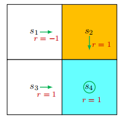

Bellman equation : 

Let $\gamma=0.9$. It can be easily solved that 

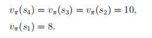

Second , we  calculate the action values for state $s_1$ :

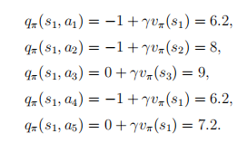

It is notable that action $a_3$ has the greatest action value .

## Definition of optimal policy

The state value could be used to evaluate if a policy is good or not :if
$$
v_{\pi_1}(s)≥v_{\pi_2}(s)\qquad for all s\in\mathcal{S}
$$
Then $\pi_1$ is better than $\pi_2$ .

**Definition 3.1** .

*A policy* $π^∗$is optimal if $v_{π^*}≥v_\pi(s)$ *for all* *s* *∈ S* *and for any other policy* $π^*$. The state values of $π^*$ are the ***optimal state values***.

### BOE : Introduction

For every $s\in \mathcal{S}$ , the elementwise expression of the BOE is
$$
\begin{align*}
v(s) &= \max_{\pi(s) \in \Pi(s)} \sum_{a \in \mathcal{A}} \pi(a|s) \left( \sum_{r \in \mathcal{R}} p(r|s,a) r + \gamma \sum_{s' \in \mathcal{S}} p(s'|s,a) v(s') \right) \\
&= \max_{\pi(s) \in \Pi(s)} \sum_{a \in \mathcal{A}} \pi(a|s) q(s,a).
\end{align*}
$$
Remarks:

- $p(r|s,a),p(s’|s,a)$ are known.
- $v(s),v(s’)$ are unknown and to be calculated.
- Is $\pi(s)$ known or unknown?

Matrix-vector form:
$$
v=max(r_\pi+\gamma P_\pi v)
$$

- It descibes the optimal policy and optimal state value in an elegant way.
- There is a maximization on the right-hand side, which may not be straightforward to see how to compute.

### BOE : Maximization on the right-hand side

### BOE : Rewrite as v=f(v)

The BOE is $v=max_\pi(r_{\pi}+\gamma P_\pi v)$ Let
$$
f(v) \triangleq \max_{\pi \in \Pi} (r_{\pi} + \gamma P_{\pi} v)
$$
Then the Bellman optimality equation becomes
$$
v=f(v)
$$

### Constraction mapping theorem

Some concepts :

- Fixed point : $x\in X$ is a fixed point of $f : X\rightarrow X$  if $f(x) = x$
- Constracion mapping (or contractive function): $f$ is a contraction mapping if 

$$
||f(x1) − f(x2)|| ≤ γ||x_1−x_2||
$$

Theorem (Constraction Mapping Theorem)

For any equation that has the form of $x=f(x)$ , if $f$ is a contraction mapping , then

- Existence: there exisits a fixed point $x^*$ satisfying $f(x^*)=x^*$
- Uniqueness : The fixed point $x^*$ is unique.
- Algorithm: Consider a sequence {${x_k}$} where $x_{k+1} = f(x_k)$ , then $x_k \rightarrow x^*$ as $ k\rightarrow \infin$

### Analyzing optimal policies 

What factors determine the optimal policy ?

From the BOE :
$$
\begin{align*}
v(s) &= \max_{\pi(s) \in \Pi(s)} \sum_{a \in \mathcal{A}} \pi(a|s) \left( \sum_{r \in \mathcal{R}} p(r|s,a) r + \gamma \sum_{s' \in \mathcal{S}} p(s'|s,a) v(s') \right) \\
\end{align*}
$$
that there are three factors :

- Reward design : $r$
- System model : $p(r|s,a) r$ , $p(r|s,a)$
- Discount rate : $\gamma$
- $v(s),v(s’),\pi(a|s)$ are unknows to be calculate

The optimal policy and the corresponding optimal state value

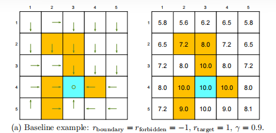

If we change $\gamma = 0.9$ to $\gamma = 0.5$

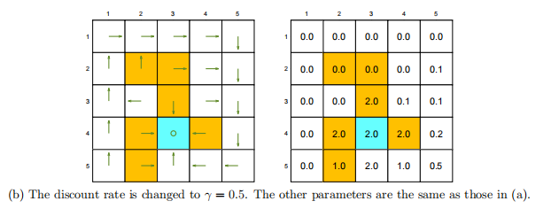

The optimal policy becomes shorted -signted.

If we change $\gamma=0$

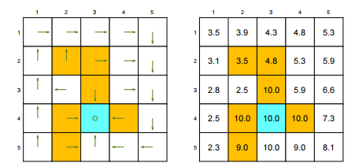

​	The optimal policy becomes extremely short-sighted !

What if change $r\rightarrow ar+b$ ?

For example ，$r_{boundary}=r_{forbidden}=0, r_{target}=2 ,r_{otherstep}=1$

The optimal policy remains the same !

## 第4课 值 迭代与迭代策略

## 第5课 蒙特卡洛方法

最简单也不需要模型的方法

## 第6课 随机近似与随机梯度下降

## 第7课 时序差分方法

## 第8课 值函数近似

## 第9课 策略梯度方法

## 第10课 Actor-Critic 方法

  