# 《强化学习的数学原理》 西湖大学 赵世钰

## Chapter 1 基本概念（8.7）

### A grid-world example

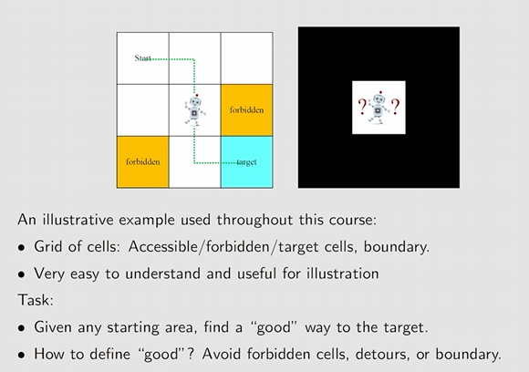

### State:

​	The status of the agent with respect to the environment.

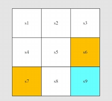

​	$S_1,S_2,...,S_9$代表九个不同的State.

**State space**：the set of all states.

### Action:

​	For each state, there are five possible actions: $a_1,a_2,...,a_5$

- $a_1$：move upwards;
- $a_2$：move rightwards;
- $a_3$：move downwards;
- $a_4$：move leftwards;
- $a_5$：stay unchanged;

Action space of a state ：the set of all possible actions of a state.

### State transition:

When taking an action, the agent may move from one state to another. Such a process is called state transition.

​	             e.g:   $$S_1\stackrel{a_2}{\longrightarrow}S_2$$

​	**Forbidden area**: At state $s_5$,if we choose action 2 ,then 

​		Case 1 :the forbidden area is accessible but with penalty. move to $s_6$

​		Case 2: the forbidden area is inaccessible .Stay at $s_5$

​	Case 1 is more normal.

​	**State transition probability:** use probability to describe state transition

​	Intuition: At state $s_1$，if we choose action $a_2$,the next state is $s_2$.

​	Math: 

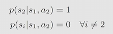

### Policy:

Tells the agent what actions to take at a state.

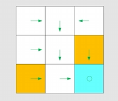

​	Mathematical representation: using conditional probability

​	For example ,for state $s_1$

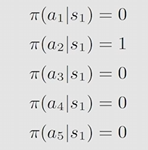

​	It is a deterministic(确定性的) policy.

There are stochastic policies.

​	For example :

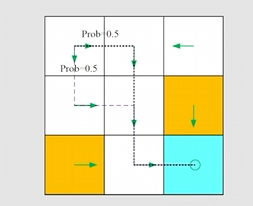

​	In this policy ,for $s_1$:

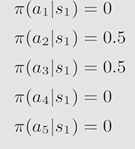

### Reward:

A real number we get after taking an action.

- A positive reward represents encouragement to take such actions.
- A negative reward  represents punishment to take such actions. 
- zero reward means no punishment, positive can also means punishment.

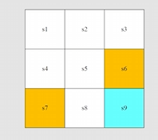

In the grid-world example , the rewards are designed as follows:

- If the agent attempts to get out of the boundary , let $r_{bound}=-1$.
- If the agent attempts to enter a forbidden cell，let $r_{forbid}=-1$.
- If the agent reaches the target cell, let $r_{target}= +1$ .
- Otherwise, the agent obtains a reward of $ r_{other}$ = 0.

Tabular representation:

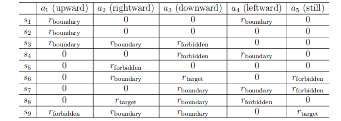

notice: The reward depends on the state and action，but not the next state.

### Trajectory:

​	A *trajectory* is a state-action-reward chain.

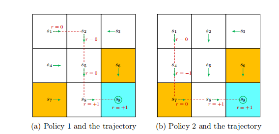

​                                                        （a)    $$S_1\xrightarrow[r=0]{a_2}S_2\xrightarrow[r=0]{a_3}S_5\xrightarrow[r=0]{a_2}S_8\xrightarrow[r=1]{a_2}S_9$$

​														  (b)    $$S_1\xrightarrow[r=0]{a_3}S_4\xrightarrow[r=-1]{a_3}S_7\xrightarrow[r=0]{a_2}S_8\xrightarrow[r=1]{a_2}S_9$$

​															

### Return:

​	The return of this trajectory is defined as the sum of all rewards collected along the trajectory:

​		(a)return=0+0+0+1=1

​		(b)return=0-1+0+1=0

​	return could be used to evaluate whether a policy is good or not .

### Discounted return:

​	If the return is defined for a finite-length trajectory. Return can also be defined for infinitely long trajectories.

​	Then we introduce the discounted return concept for infinitely long trajectories. In particular, the discounted return is the sum of the discounted rewards:

​	                              		$$discounted return =0+\gamma0+\gamma^20+\gamma^31+\gamma^41+\gamma^51+...,=\gamma^3\frac{1}{1-\gamma}$$

​	where$\gamma\in(0,1)$is called the discount rate.

​	roles: 1)the sum becomes finite; 2)balance the far and near future rewards; 

- If $\gamma$ is close to 0 ,the value of the discounted return is dominated by the rewards obtained in the near future.
- If $\gamma$ is close to 1,the value of the discounted return is  dominated by the rewards obtained in the far future.

### Episode:

​	When interacting with the environment following a policy, the agent may stop at some **terminal states**. The resulting trajectory is called an **episode**.

​	An episode is usually assumed to be a **finite** trajectory. Tasks with episodes are called episodic tasks. Some tasks may have no terminal states, meaning the interaction with the environment will never end. Such tasks are called **continuing tasks**.

### Markov decision process (MDP)

Key elements of MDP:

- **Sets:**

  - State: the set of all states, denoted as *S*.
  - Action: a set of actions, denoted as *A*(*s*), associated with each state *s* *∈ S*.
  - Reward:   a set of rewards, denoted as *R*(*s, a*), associated with each state-action pair

- Probability distribution:

  - **State transition probability**: In state *s*, when taking action *a*, the probability of transitioning to state *s*’ is *p*(*s*‘ *|*s, a). It holds that $\sum_{s‘∈S} p(s’|s, a) = 1$ for any (s, a).
  - **Reward probability**: In state *s*, when taking action *a*, the probability of obtaining reward *r* is *p*(*r**|**s, a*). It holds that $\sum_{r∈R(s,a)}p(r|s,a) = 1$ for any (*s, a*).

- **Policy**:  In state *s*, the probability of choosing action *a* is *π*(*a**|**s*). It holds that $\sum_{a∈A(s)}π(a|s) = 1$ for any *s* *∈ S*.

- **Markov property**: memoryless property

  The *Markov property* refers to the memoryless property of a stochastic process. Mathematically, it means that
  $$
  p(s_{t+1}|s_t,a_t,s_{t-1},a_{t-1},...,s_0,a_0)=p(s_{t+1}|s_t,a_t)\\
  p(r_{t+1}|s_t,a_t,s_{t-1},a_{t-1},...,s_0,a_0)=p(r_{t+1}|s_t,a_t)
  $$
  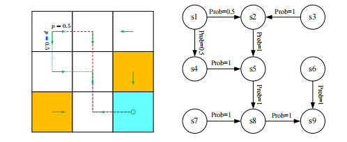

## Chapter 2: Bellman Equation

### Motivating examples:

### State value

### Bellman equation: Derivation

### Bellman equation: Matrix-vector form

### Bellman equation: Solve the state values

## 第3课 贝尔曼最优公式

## 第4课 值迭代与迭代策略

## 第5课 蒙特卡洛方法

最简单也不需要模型的方法

## 第6课 随机近似与随机梯度下降

## 第7课 时序差分方法

## 第8课 值函数近似

## 第9课 策略梯度方法

## 第10课 Actor-Critic 方法

  