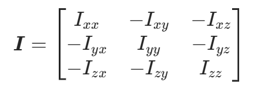

## 1.惯性矩阵

​		惯性矩阵（Inertia Matrix）是描述刚体转动惯量特性的一个重要数学工具，在多刚体系统动力学、机器人学、航空航天等众多领域有着广泛应用 

​		常见形式如下：

​	其中，$I_{xx}$，$I_{yy}$，$I_{zz}$分别是刚体绕 x 轴、y 轴、z 轴的转动惯量，反映了刚体绕相应轴转动时惯性的大小；$I_{xy}$ = $I_{yx}$，$I_{xz} = I_{zx}$，$I_{yz} = I_{zy}$ 被称为惯性积，描述了刚体质量分布相对于坐标轴的不对称程度。

​	对于形状规则、质量分布均匀的刚体，可以通过积分的方法来计算惯性矩阵。以计算绕 x 轴的转动惯量 $I_{xx}$ 为例，公式为 $I_{xx} = \int (y^2 + z^2)dm$ ，其中 $dm$ 是质量微元，$(y,z)$ 是质量微元在坐标系中的坐标。类似地，惯性积 $I_{xy} = \int xy dm$ 。

## 2.欧拉-拉格朗日定理

​		也称为拉格朗日方程，对于一个具有 n 个自由度的完整系统， 其拉格朗日函数 $L(q,\dot{q},t)$定义为系统的动能 T 减去势能 V，即 $L = T - V$，其中 $q=(q_1,q_2,\cdots,q_n)$ 是广义坐标，$\dot{q}=(\dot{q}_1,\dot{q}_2,\cdots,\dot{q}_n)$是广义速度，t 是时间。

​		欧拉拉格朗日方程的表达式为：$\frac{d}{dt}\left(\frac{\partial L}{\partial \dot{q}_i}\right) - \frac{\partial L}{\partial q_i} = Q_i$，其中 $i = 1,2,\cdots,n$ ，$Q_i$ 是对应于广义坐标 $q_i$的广义力。在保守系统中，广义力 $Q_i$可以由势能函数 V 表示，此时 $Q_i = -\frac{\partial V}{\partial q_i}$，方程可写成 $\frac{d}{dt}\left(\frac{\partial L}{\partial \dot{q}_i}\right) - \frac{\partial L}{\partial q_i} = 0$ 。

​		它以能量（动能和势能）的形式来描述系统的运动，而不是像牛顿第二定律那样从力和加速度的角度出发。相比牛顿力学，欧拉拉格朗日原理在处理具有复杂约束的系统时优势明显，因为它不需要直接考虑约束反力，只需关注系统的能量变化，简化了动力学问题的分析过程。