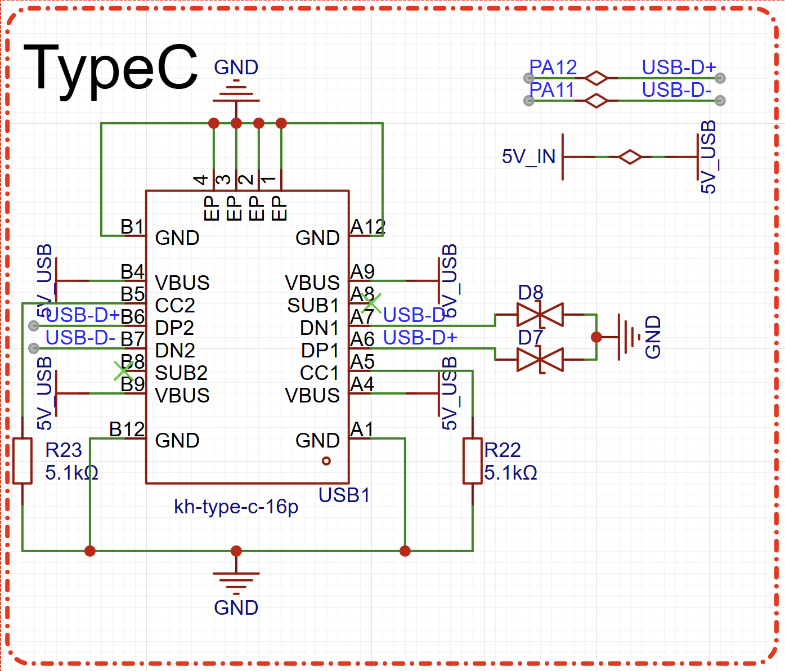
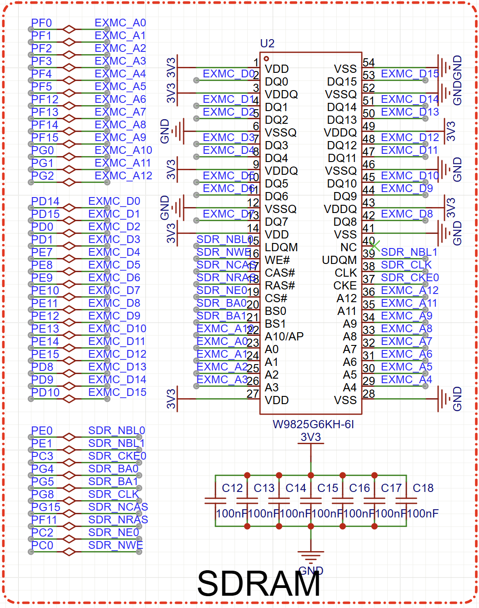
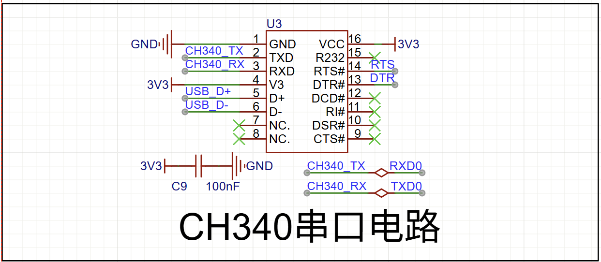
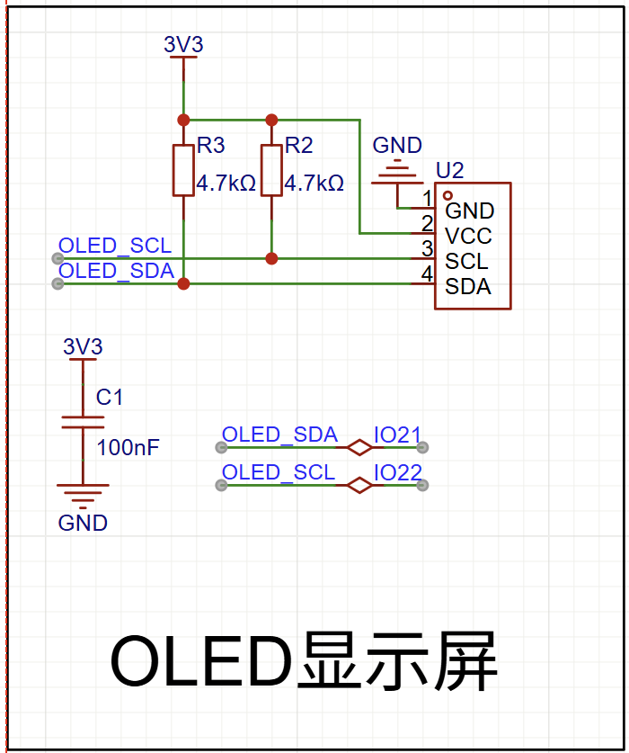
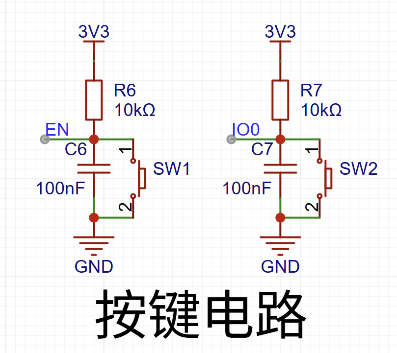
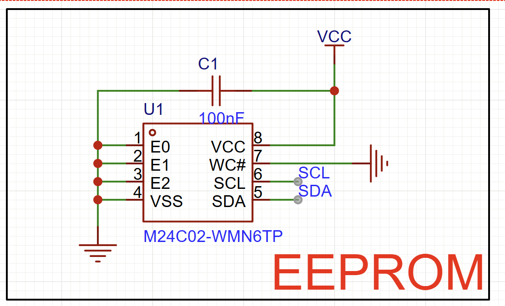
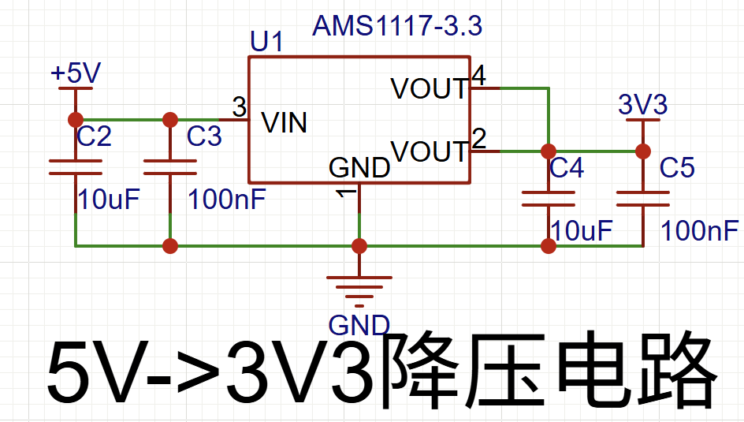

## 基本功能电路

#### 1.TyepeC电路

#### **2.SDRAM电路**

- 时钟信号：
  - `CLK`与`CLK#`为差分信号，需严格满足 “等长、等距、平行”：差分对的线长差≤5mil（约 0.127mm），间距为线宽的 1-2 倍（如线宽 0.8mm，间距 0.8-1.6mm），且全程平行，避免交叉。
  - 差分对下方必须是完整地平面，且不与其他信号的地平面重叠，减少共模干扰。
- 地址 / 控制信号：
  - 同组信号（如行地址 A0-A12、列地址 BA0-BA2）需 “等长”：线长差≤10mil（约 0.254mm），确保同时到达 SDRAM，避免时序偏移。
  - 走线尽量短、直，避免不必要的过孔（每个过孔引入约 0.5-1ns 延迟），若需过孔，同组信号的过孔数量需一致。
- 数据信号（DQ）：
  - DQ 与 DQS（数据选通信号）需严格等长：DQS 为差分信号，每组 DQ（如 DQ0-DQ7 对应 DQS0）的线长需与对应的 DQS 线长差≤5mil，确保数据与选通信号同步。
  - 避免 DQ 信号穿过电源平面的割裂区域，防止阻抗突变。

#### 3.USB接口

**CH340 USB转串口电路**

#### OLED显示屏

#### 按键电路

#### EEPROM

#### CAN接口

### UART串口通信电路

**1.RS232基本电路**

- **信号传输方式**：**单端传输**（以 “地” 为参考点，通过两根线分别传输 “发送（TX）” 和 “接收（RX）” 信号），信号电压以 “地” 为基准，逻辑 “1” 为 - 3V~-15V，逻辑 “0” 为 + 3V~+15V（避免低压噪声干扰）。
- 通信能力：
  - 传输距离：最长**15 米**（因单端传输易受干扰，距离越长信号衰减越严重）；
  - 传输速率：最高**20kbps**（低速传输，适合数据量小的场景）；
  - 连接方式：**点对点**（1 个发送端只能连接 1 个接收端，无法多设备组网）；
  - 引脚定义：常见 9 针（DB-9）或 25 针（DB-25）接口，核心引脚仅 3 个（TX、RX、GND），其余为控制信号（如 RTS、CTS，多数简单场景可省略）。

**2.RS485基本电路**

#### 核心技术特性

- **信号传输方式**：**差分传输**（与 RS-422 一致，通过 A、B 两根双绞线传输差分信号，逻辑定义相同）。
- 通信能力：
  - 传输距离：最长**1200 米**（与 RS-422 相同，受线缆阻抗影响）；
  - 传输速率：最高**10Mbps**（1200 米时速率约 100kbps，与 RS-422 一致）；
  - 连接方式：**半双工多设备组网**（1 条总线可连接最多 32 个设备，支持所有设备双向通信，需通过 “总线仲裁” 避免数据冲突）；
  - 引脚定义：无固定接口（常见端子台、DB-9 或 RJ45），核心仅 2 根线（A、B，半双工通信无需单独发送 / 接收线，通过芯片切换 “发送 / 接收” 模式）；
  - 总线匹配：需在总线两端（最远的两个设备）并联**120Ω 终端电阻**（减少信号反射，避免传输干扰）。

**3.RS422基本电路**

- **信号传输方式**：**差分传输**（通过两根双绞线传输一对 “互补信号”，如 A 线和 B 线，信号电压为 “A-B 的差值”），逻辑 “1” 为 A-B≥+0.2V，逻辑 “0” 为 A-B≤-0.2V（抗干扰能力依赖 “差分信号抵消共模噪声”）。
- 通信能力：
  - 传输距离：最长**1200 米**（差分传输大幅降低信号衰减，距离是 RS-232 的 80 倍）；
  - 传输速率：最高**10Mbps**（速率与距离成反比，1200 米时速率约 100kbps）；
  - 连接方式：**点对点 / 点对多（单向）**（1 个 “主设备” 可连接最多 10 个 “从设备”，但仅支持 “主→从” 单向通信，无法双向多设备交互）；
  - 引脚定义：无固定接口（常见端子台或 DB-9），核心仅 4 根线（TX_P、TX_N、RX_P、RX_N，双向通信需单独的发送 / 接收差分对）。

### 晶振电路

​		是否需要晶振电路，本质是 “电路对频率稳定性的需求阈值”：

- 若需求是 “能工作即可”（如简单报警、开关控制），RC/LC 振荡器足够；
- 若需求是 “精准、稳定、可靠”（如同步运算、精准通信、精确计时、标准频率输出），**必须使用晶振电路**—— 它是解决 “频率误差大、时间不准、信号失步” 问题的核心方案，也是现代高精度电子设备（从消费电子到工业、航天领域）的必备电路模块。

​		有源晶振的精度则可以达到0.1ppm。精度越高，频率稳定性也更好。有源晶振在稳定性上要胜过无源晶振。有源晶振一般4个脚，一个电源，一个接地，一个信号输出端，一个NC（空脚）。有源晶振自身就能震动。

## 电源基本电路

5v-3.3v降压电路

